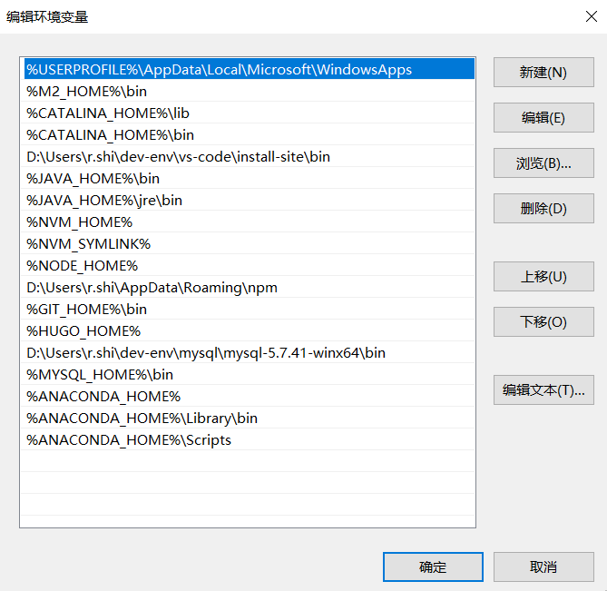

# PyTorch 环境搭建

## 推荐阅读

> - [PyTorch 环境搭建](https://geek-docs.com/pytorch/pytorch-tutorial/pytorch-environment-setup.html)
> - [如何在Windows Terminal中启用Anaconda命令](https://www.jianshu.com/p/ab1315000cd9)
> - [Command prompt won&#39;&#39;t change directory to another drive](https://stackoverflow.com/questions/11065421/command-prompt-wont-change-directory-to-another-drive)

## 前言

## 一、安装Python

直接去[官网](https://www.python.org/downloads/windows/)下载 Python安装包，然后勾选 `Add Python xx to PATH` 并一路安装即可。

到这里你就可以使用Python编程了。

## 二、安装Anaconda

Anaconda是Python的包管理器和环境管理器，其包含了conda、Python等180多个科学包及其依赖项。

先来解决一个初学者都会问的问题：我已经安装了Python，那么为什么还需要Anaconda呢？原因有以下几点：

- Anaconda附带了一大批常用数据科学包，它附带了conda、Python和 180 多个科学包及其依赖项，因此你可以用Anaconda立即开始处理数据。
- 包管理：Anaconda 是在 conda（一个包管理器和环境管理器）上发展出来的。在数据分析中，你会用到很多第三方的包，而conda（包管理器）可以很好的帮助你在计算机上安装和管理这些包，包括安装、卸载和更新包。
- 环境管理：为什么需要管理环境呢？比如你在A项目中用到了Python2，而新的项目要求使用Python3，而同时安装两个Python版本可能会造成许多混乱和错误。这时候conda就可以帮助你为不同的项目建立不同的运行环境。还有很多项目使用的包版本不同，比如不同的pandas版本，不可能同时安装两个pandas版本。你要做的应该是在项目对应的环境中创建对应的pandas版本。这时候conda就可以帮你做到。

### 1.下载安装

去[官网](https://www.anaconda.com/download/) 下载，或者去国内镜像源上下载（推荐，国内下载会快很多），比如[清华源](https://mirrors.tuna.tsinghua.edu.cn/anaconda/archive/)。

### 2.配置环境变量

```properties
ANACONDA_HOME=D:\Users\ray\dev-env\anaconda3\install-site
PATH=%ANACONDA_HOME%;%ANACONDA_HOME%\Library\bin;%ANACONDA_HOME%\Scripts;
```



### 3.验证是否安装成功

命令行执行如下命令，出现版本号，即说明安装成功

```bash
$ conda -V
conda 4.5.11
```

### 4.设置Anaconda镜像源

Anaconda 下载包时默认是从国外的官方仓库上下载，速度很慢，可以配置国内镜像源，来加快下载速度。

（1）查看源

```bash
# 显示自己的Anaconda使用的是什么镜像源
conda config --show 
```

（2）添加源

```bash
# 更换Anaconda清华源
conda config --add channels http://mirrors.tuna.tsinghua.edu.cn/anaconda/pkgs/free/win-64/
conda config --add channels http://mirrors.tuna.tsinghua.edu.cn/anaconda/pkgs/main/win-64/
conda config --set show_channel_urls yes
conda config --set ssl_verify true
```

（3）配置文件

Anaconda镜像源配置文件为 `~/.condarc`

```properties
ssl_verify: true
show_channel_urls: true

channels:
  - http://mirrors.tuna.tsinghua.edu.cn/anaconda/pkgs/free/win-64/
  - http://mirrors.tuna.tsinghua.edu.cn/anaconda/pkgs/main/win-64/
```

### 5.虚拟环境

```bash
# 创建环境
conda create -n envname python=3.10.6 

# 激活环境
conda activate envname

# 退出环境
conda deactivate envname

# 查看已有环境
conda env list


```

### 6.附录：conda 常用命令

conda 的包管理功能和pip 是一样的，当然你选择pip 来安装包也是没问题的。

```bash
# 安装包
conda install matplotlib

# 卸载包
conda remove matplotlib

# 更新包
conda update matplotlib

# 查看已经安装的包
conda list
```

## 三、安装 Jupyter notebook

### 1.安装

使用pip或conda安装

```bash
conda install jupyter notebook
# pip install jupyter notebook
```

注：如果pip版本过低，还需提前运行更新pip的指令

```bash
pip install --upgrade pip
```

### 2.运行

在终端输入以下命令，即可以当前文件夹，打开Jupyter Notebook

```bash
# 在终端输入以下命令，即可打开Jupyter Notebook
jupyter notebook
```

### 3.设置文件存放路径

我们首先需要查看配置文件，只需要在终端输入

```bash
$ jupyter notebook --generate-config
Writing default config to: D:\Users\ray\.jupyter\jupyter_notebook_config.py
```

打开 `~\.jupyter\jupyter_notebook_config.py` 文件，找到 `# c.NotebookApp.notebook_dir = ''`这个配置，改为你想要的目录即可。

### 4.使用虚拟环境

Anaconda安装的虚拟环境和Jupyter Notebook运行需要的Kernel并不互通，那么我们该如何解决这个问题，并且如果我们想要切换内核（Change Kernel），该如何操作呢？

（1）将在Anaconda中创建的虚拟环境添加 `ipykernel`

```bash
# 如果还没创建环境，在创建时要加上ipykernel
conda create -n chatgpt python=3.10.6 ipykernel

# 然后需要激活环境
conda activate chatgpt

# 如果已经创建环境，在环境中安装ipykernel
pip install ipykernel
```

（2）将虚拟环境写进Jupyter

```bash
python -m ipykernel install --user --name chatgpt --display-name chatgpt
```
