# 注册OpenAI官网账号

## 推荐阅读

- [**注册ChatGPT详细指南**](https://sms-activate.org/cn/info/ChatGPT)
- [ChatGPT常见问题及其解决方法汇总](https://blog.csdn.net/apple_51931783/article/details/130476452#comments_26368615)
- [ChatGPT怎么用国外手机号注册？解决中国国内无法验证OpenAI账号](https://www.chenweiliang.com/cwl-29546.html)
- [怎么申请英国虚拟手机号？国内注册免实名英国电话号码](https://www.chenweiliang.com/cwl-28676.html)
- [ChatGPT 验证手机时出现 Your account was flagged for potential abuse（您的帐户被标记为可能存在滥用行为）的原因和解决方法](https://laowangblog.com/chatgpt-your-account-was-flagged-for-potential-abuse.html)
- [2023 年好用的接码平台推荐，可接收短信验证码完成验证](https://laowangblog.com/recommended-sms-activate.html)
- [SMS-Activate 国外接码平台使用教程](https://www.11meigui.com/2023/sms-activate-usage.html)
-

## 一、环境准备

注册OpenAI账号，需要如下材料：

- 代理：[可以访问OpenAI的国家，目前支持156个国家和地区，OpenAI 不支持中国、香港和俄罗斯](https://uzbox.com/ai/not-available-openai.html)。IP需要在这些国家才可以注册。日韩、新加坡、印度尼西亚、美国这些国家都可以。
- 国外手机号：注册的时候需要填手机号并验证手机号，因此如果没有国外的手机号，则可以使用接码平台。推荐 <https://sms-activate.org/>

### 1.科学上网

### 2.国外手机号

前往 <https://sms-activate.org/> ，注册账号

打开接码平台 [sms-activate.org](https://sms-activate.org/?ref=2068197)，注册一个账号

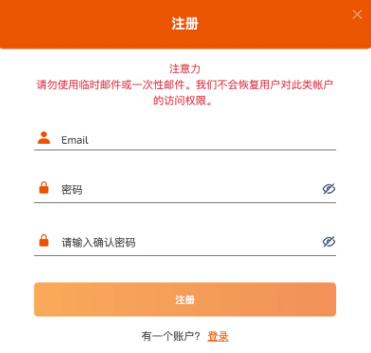

然后要充值余额

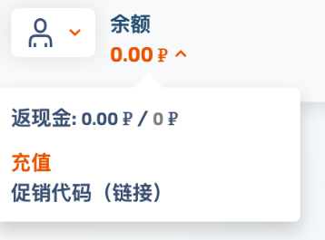

一次接码OpenAi的验证码费用是大概 23卢布，人民币来看差不多是2块钱，不过只能充美金，就先充直个1美金钱。可以选择对你方便的任何方式。支付宝也有

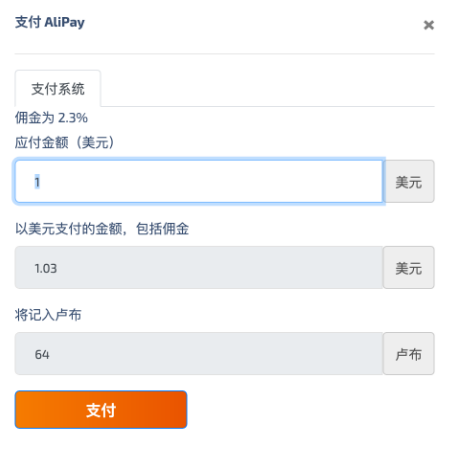

充值完成可能需要等一会，就会发现余额到账了。

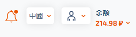

然后就可以在左边的服务里选择OpenAI，然后选择一个价格合适的服务（价格太低可能被太多人用过，可能会注册失败），

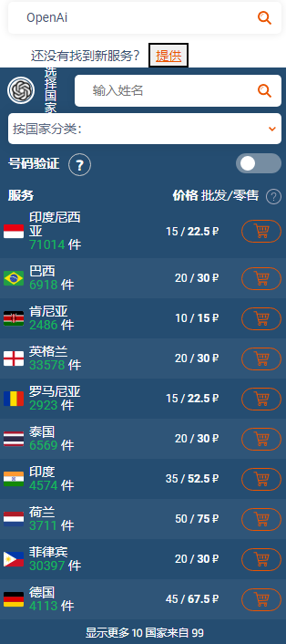

点击小黄车购买之后，就会有一条待激活的手机号，如下图所示。复制手机号，然后就可以使用这个手机号注册OpenAI账号了，后续如果要接受验证码，也会在这里显示验证码的。

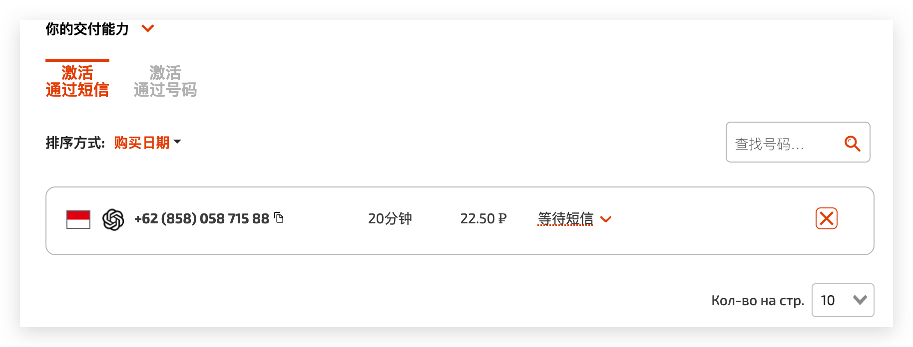

## 二、注册OpenAI账号

打开网址 <https://chat.openai.com/> ，然后使用使用Google账号或邮箱注册都可以，这里使用Google账号登录

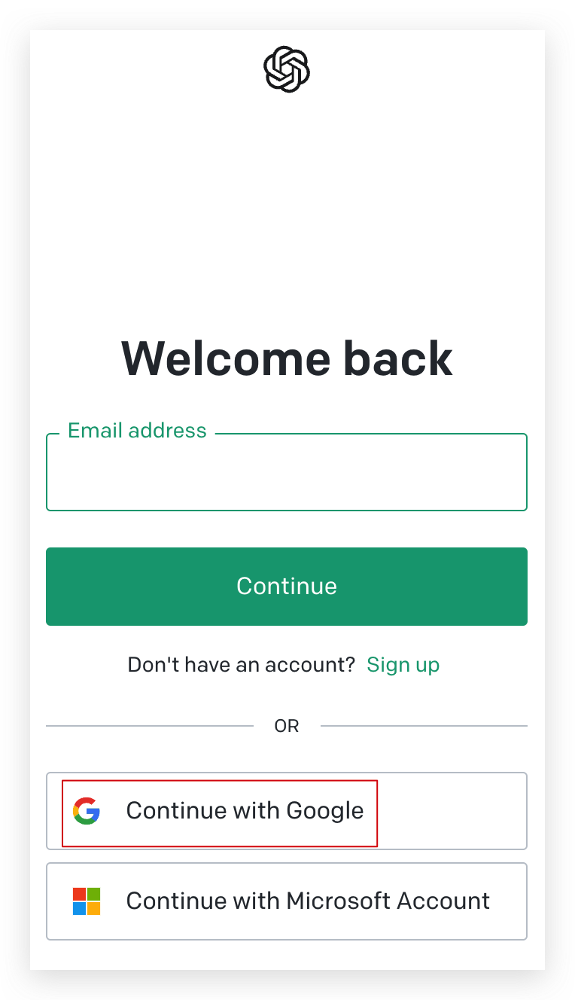

然后需要填写名字和生日

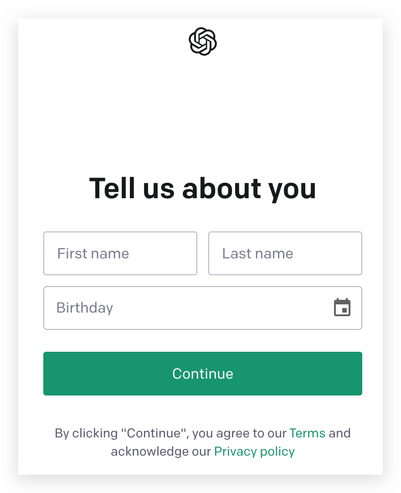

当然这一步，也有可能会报当前国家不支持，那么可以将代理的节点切换到任意OpenAI支持的国家，即可。

下面就是输入手机号了

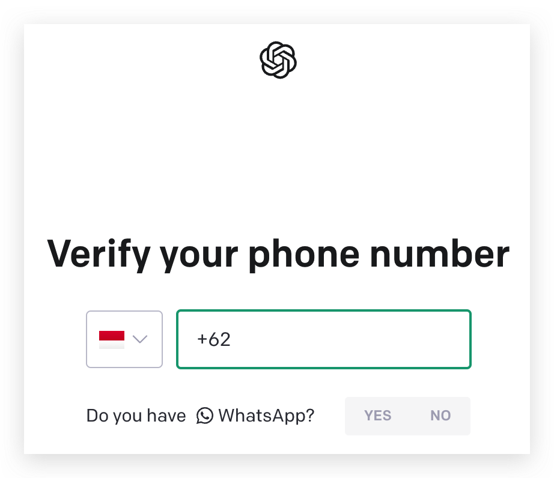

去 <https://sms-activate.org> 复制手机号并粘贴过来。

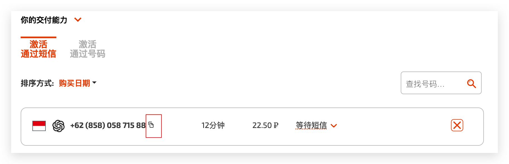

然后填写手机号，再发送验证码

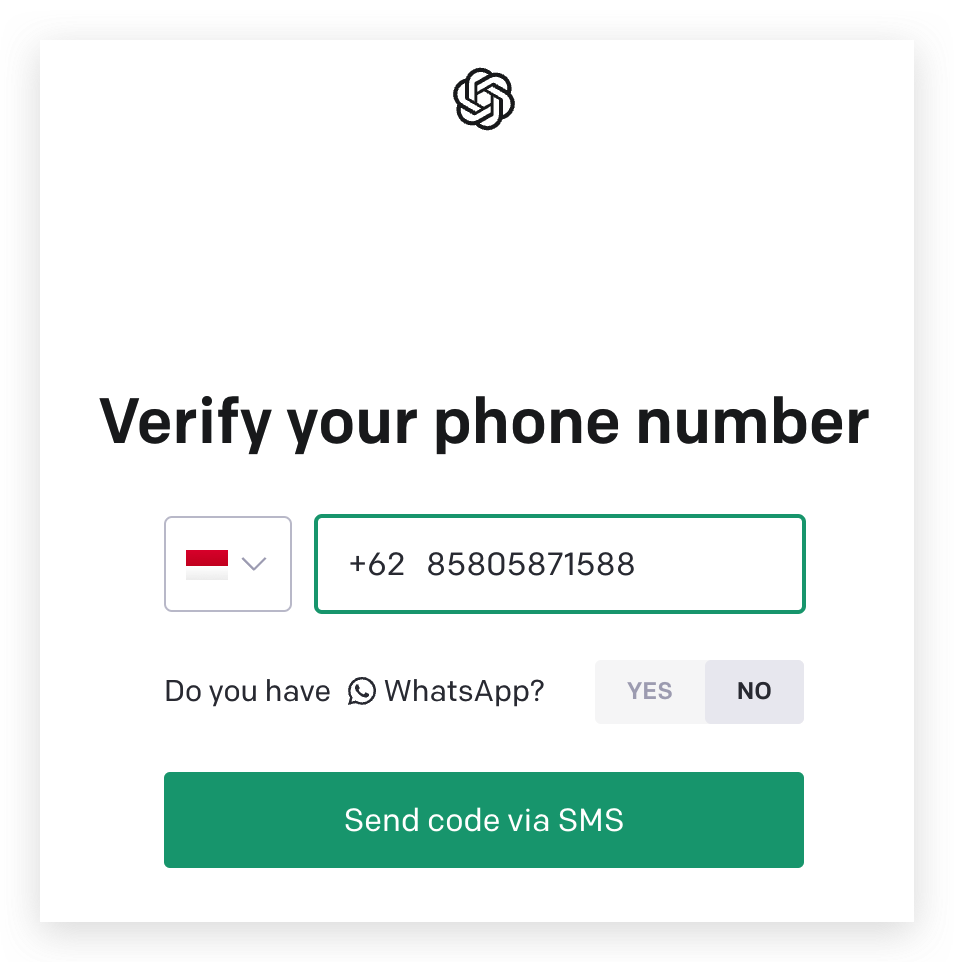

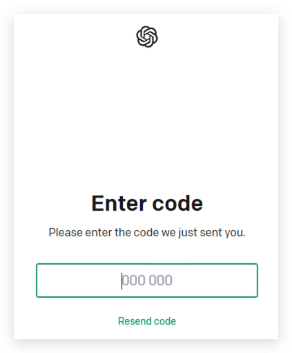

然后去 <https://sms-activate.org> 复制验证码，然后使用这个验证码激活手机号即可。

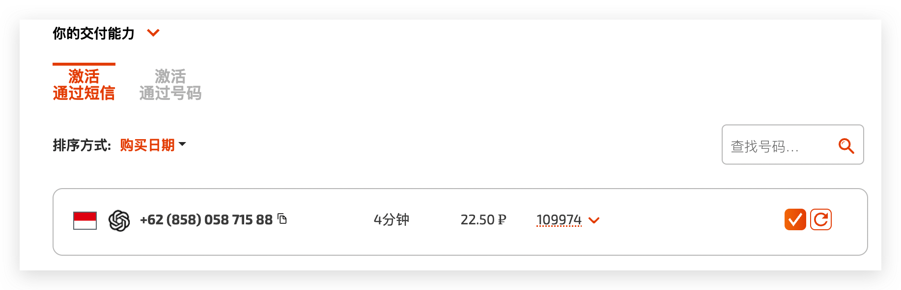

这样就注册完成了，可以开始ChatGPT 调教之旅了

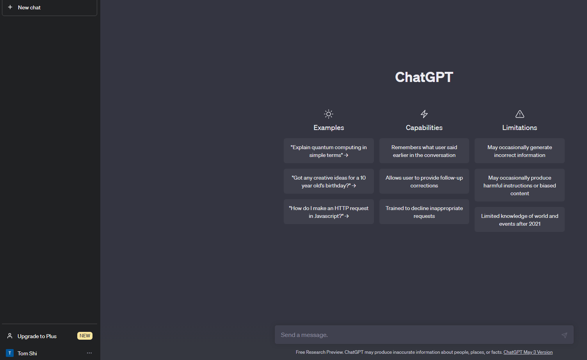

## 三、相关异常

### 1.Your account was flagged for potential abuse. If you feel this is an error, please contact us at help.openai.com

（1）异常信息

```bash
Your account was flagged for potential abuse. If you feel this is an error, please contact us at help.openai.com
```

（2）异常原因
参考：

- [注册Chatgpt手机号无法验证出现“Your account was flagged for potential abuse”提示账号被标记滥用的最新解决办法](https://blog.csdn.net/apple_51931783/article/details/130334758)
