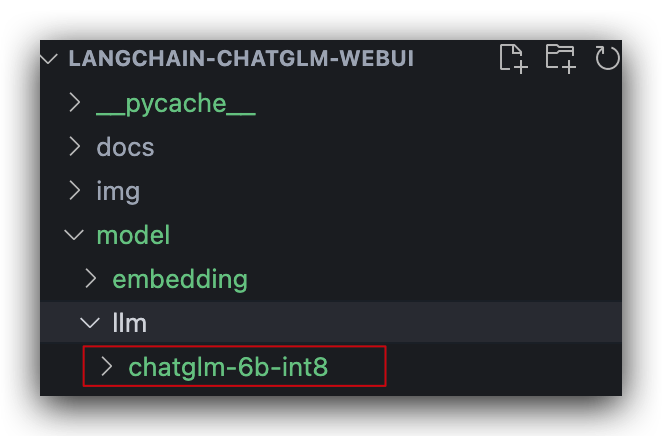

# LangChain-ChatGLM-Webui部署

## 推荐阅读

代码仓库：

> * [thomas-yanxin/LangChain-ChatGLM-Webui](https://github.com/thomas-yanxin/LangChain-ChatGLM-Webui)：基于LangChain和ChatGLM-6B等系列LLM的针对本地知识库的自动问答

推荐部署文章：

> * [手把手教你本地部署清华大学的ChatGLM-6B模型——Windows+6GB显卡本地部署](https://www.datalearner.com/blog/1051680925189690)
> * [ChatGLM-6B (介绍相关概念、基础环境搭建及部署](https://juejin.cn/post/7219530344062582842)

> - [THUDM/ChatGLM-6B](https://github.com/THUDM/ChatGLM-6B)
> - [Akegarasu/ChatGLM-webui](https://github.com/Akegarasu/ChatGLM-webui)
> - [ChatGLM-6B (介绍相关概念、基础环境搭建及部署)](https://juejin.cn/post/7219530344062582842)
> - [THUDM/GLM-130B](https://github.com/THUDM/GLM-130B)
> - [类ChatGPT模型ChatGLM-b6本地部署实践](https://www.modb.pro/db/622680)
> - 

## 部署

### 1.下载代码并安装依赖

```bash

# 创建虚拟环境
conda create -n langchain-chatglm python==3.10.11
conda activate langchain-chatglm

# 克隆代码
git clone https://github.com/thomas-yanxin/LangChain-ChatGLM-Webui.git
# 进入项目目录
cd LangChain-ChatGLM-Webui

# 安装gradio用于启动图形化web界面
pip install gradio

# 安装依赖
pip install -r requirements.txt
```

安装依赖的时候可能会出现  `ModuleNotFoundError: No module named 'torch' ` 的报错，执行如下命令安装 torch ，然后重试即可。

```bash
pip install torchvision 
```

### 2.验证pytorch是否为GPU版本

```python
import torch
torch.cuda.is_available()  ## 输出应该是True
```


### 3.下载模型

LLM 模型：


### 4.修改配置

#### 4.1 config.py

原内容：

```python
# model config
embedding_model_dict = {
  ...
    "text2vec-base": "GanymedeNil/text2vec-base-chinese",
  ...
}


llm_model_dict = {
    "chatglm": {
      ...
        "ChatGLM-6B-int8": "THUDM/chatglm-6b-int8",
      ...
    },
  ...
}
```

修改两个模型的路径，比如我将两个模型分别放到了项目的根目录下的`model/llm`和 `model/embedding` 目录下



因此需要将路径修改为：

```python

# model config
embedding_model_dict = {
  ...
    "text2vec-base": "./model/embedding/text2vec-base-chinese",
  ...
}


llm_model_dict = {
    "chatglm": {
      ...
        "ChatGLM-6B-int8": "./model/llm/chatglm-6b-int8",
      ...
    },
  ...
}
```


#### 4.2 app.py

将server_name由`0.0.0.0` 修改为 `localhost`

原内容：

```python
    # threads to consume the request
    demo.queue(concurrency_count=3) \
        .launch(server_name='0.0.0.0', # ip for listening, 0.0.0.0 for every inbound traffic, 127.0.0.1 for local inbound
                server_port=7860, # the port for listening
                show_api=False, # if display the api document
                share=False, # if register a public url
                inbrowser=False) # if browser would be open automatically

```

修改后内容：

```python
    # threads to consume the request
    demo.queue(concurrency_count=3) \
        .launch(server_name='localhost', # ip for listening, localhost for every inbound traffic, 127.0.0.1 for local inbound
                server_port=7860, # the port for listening
                show_api=False, # if display the api document
                share=False, # if register a public url
                inbrowser=False) # if browser would be open automatically

```


### 4.启动项目

在项目根目录下执行命令 `python app.py`即可运行项目，启动成功后，会在控制台打印前端界面地址：[http://localhost:7860/](http://localhost:7860/)


