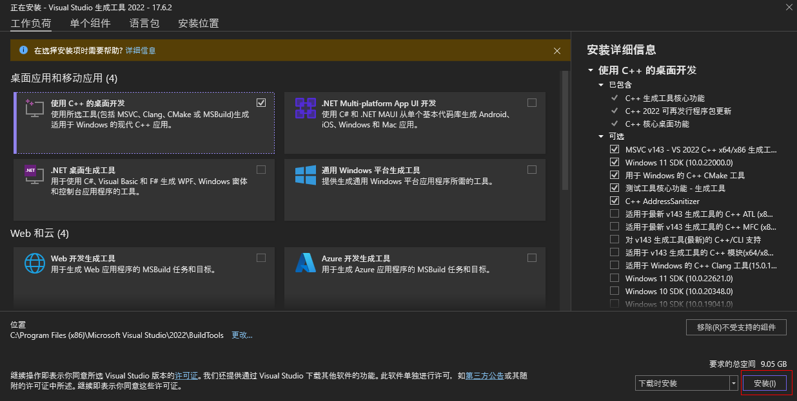
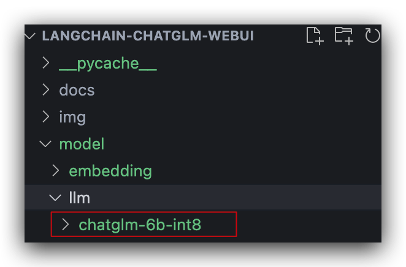
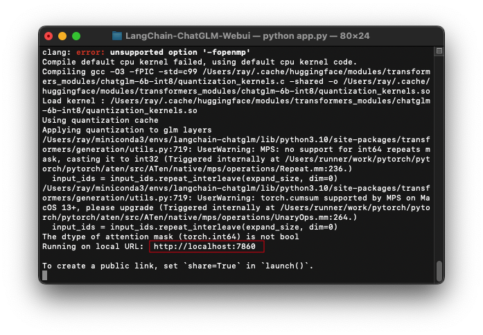
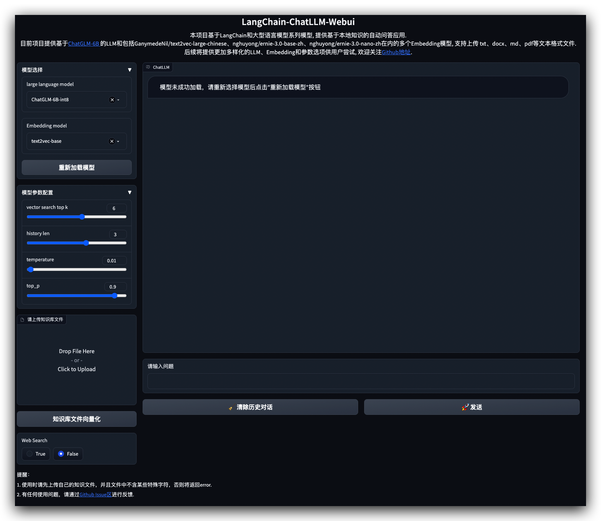
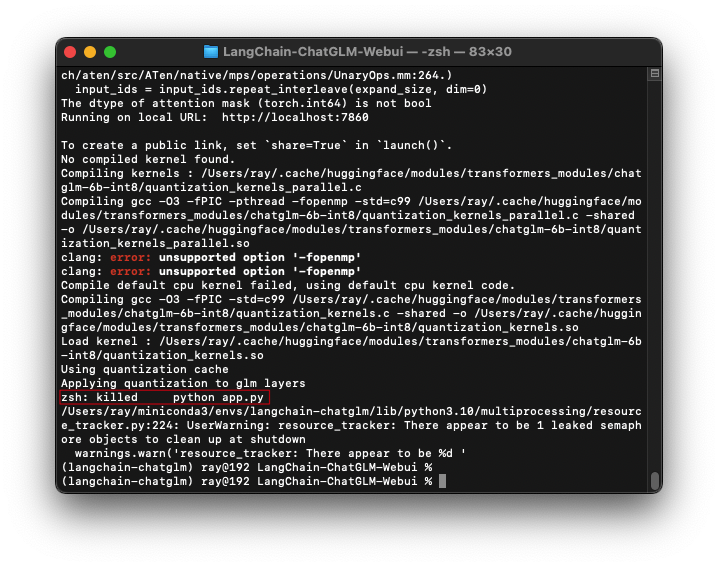

# 本地部署LangChain-ChatGLM-Webui

## 推荐阅读

代码仓库：

> * [thomas-yanxin/LangChain-ChatGLM-Webui](https://github.com/thomas-yanxin/LangChain-ChatGLM-Webui)：基于LangChain和ChatGLM-6B等系列LLM的针对本地知识库的自动问答

推荐部署文章：

> * [手把手教你本地部署清华大学的ChatGLM-6B模型——Windows+6GB显卡本地部署](https://www.datalearner.com/blog/1051680925189690)
> * [ChatGLM-6B (介绍相关概念、基础环境搭建及部署](https://juejin.cn/post/7219530344062582842)

云端部署：[colab_PDF_Query_LLM.ipynb](https://colab.research.google.com/drive/1I84-fAAsb3_lRzQB-SDq9xit_0qWk2da)

## 部署

### 1.下载代码并安装依赖

```bash

# 创建虚拟环境
conda create -n langchain-chatglm python==3.10.11
conda activate langchain-chatglm

# 克隆代码
git clone https://github.com/thomas-yanxin/LangChain-ChatGLM-Webui.git
# 进入项目目录
cd LangChain-ChatGLM-Webui

# 安装gradio用于启动图形化web界面
pip install gradio

# 安装依赖
pip install -r requirements.txt
```

安装依赖的时候可能会出现如下问题：

（1）  `ModuleNotFoundError: No module named 'torch' ` 的报错，执行如下命令安装 torch ，然后重试即可。

```bash
pip install torchvision 
```

(2) UnicodeDecodeError: 'gbk' codec can't decode byte 0x80 in position 76: illegal multibyte sequence

```
ERROR: Exception:
Traceback (most recent call last):
  File "D:\Users\r.shi\dev-env\python\lib\site-packages\pip\_internal\cli\base_command.py", line 169, in exc_logging_wrapper
    status = run_func(*args)
  File "D:\Users\r.shi\dev-env\python\lib\site-packages\pip\_internal\cli\req_command.py", line 248, in wrapper
    return func(self, options, args)
  File "D:\Users\r.shi\dev-env\python\lib\site-packages\pip\_internal\commands\install.py", line 342, in run
    reqs = self.get_requirements(args, options, finder, session)
  File "D:\Users\r.shi\dev-env\python\lib\site-packages\pip\_internal\cli\req_command.py", line 433, in get_requirements
    for parsed_req in parse_requirements(
  File "D:\Users\r.shi\dev-env\python\lib\site-packages\pip\_internal\req\req_file.py", line 148, in parse_requirements
    for parsed_line in parser.parse(filename, constraint):
  File "D:\Users\r.shi\dev-env\python\lib\site-packages\pip\_internal\req\req_file.py", line 335, in parse
    yield from self._parse_and_recurse(filename, constraint)
  File "D:\Users\r.shi\dev-env\python\lib\site-packages\pip\_internal\req\req_file.py", line 340, in _parse_and_recurse
    for line in self._parse_file(filename, constraint):
  File "D:\Users\r.shi\dev-env\python\lib\site-packages\pip\_internal\req\req_file.py", line 371, in _parse_file
    _, content = get_file_content(filename, self._session)
  File "D:\Users\r.shi\dev-env\python\lib\site-packages\pip\_internal\req\req_file.py", line 549, in get_file_content
    content = auto_decode(f.read())
  File "D:\Users\r.shi\dev-env\python\lib\site-packages\pip\_internal\utils\encoding.py", line 34, in auto_decode
    return data.decode(
UnicodeDecodeError: 'gbk' codec can't decode byte 0x80 in position 76: illegal multibyte sequence
```

按提示修改 `encoding.py` 代码

将

```
def auto_decode(data: bytes) -> str:
    """Check a bytes string for a BOM to correctly detect the encoding

    Fallback to locale.getpreferredencoding(False) like open() on Python3"""
    for bom, encoding in BOMS:
        if data.startswith(bom):
            return data[len(bom) :].decode(encoding)
    # Lets check the first two lines as in PEP263
    for line in data.split(b"\n")[:2]:
        if line[0:1] == b"#" and ENCODING_RE.search(line):
            result = ENCODING_RE.search(line)
            assert result is not None
            encoding = result.groups()[0].decode("ascii")
            return data.decode(encoding)
    return data.decode(locale.getpreferredencoding(False) or sys.getdefaultencoding(),)
```

修改为：

```

def auto_decode(data: bytes) -> str:
    """Check a bytes string for a BOM to correctly detect the encoding

    Fallback to locale.getpreferredencoding(False) like open() on Python3"""
    for bom, encoding in BOMS:
        if data.startswith(bom):
            return data[len(bom) :].decode(encoding)
    # Lets check the first two lines as in PEP263
    for line in data.split(b"\n")[:2]:
        if line[0:1] == b"#" and ENCODING_RE.search(line):
            result = ENCODING_RE.search(line)
            assert result is not None
            encoding = result.groups()[0].decode("ascii")
            return data.decode(encoding)
    return data.decode("utf-8")
```

（3）ERROR: Failed building wheel for detectron2

```
 running build_ext
      D:\Users\r.shi\dev-env\python\lib\site-packages\torch\utils\cpp_extension.py:359: UserWarning: Error checking compiler version for cl: [WinError 2] 系统找不到指定的文件。
        warnings.warn(f'Error checking compiler version for {compiler}: {error}')
      building 'detectron2._C' extension
      error: Microsoft Visual C++ 14.0 or greater is required. Get it with "Microsoft C++ Build Tools": https://visualstudio.microsoft.com/visual-cpp-build-tools/
```

https://visualstudio.microsoft.com/zh-hans/visual-cpp-build-tools/



### 2.验证pytorch是否为GPU版本

```python
import torch
torch.cuda.is_available()  ## 输出应该是True
```

### 3.下载模型

[模型国内下载地址](https://openi.pcl.ac.cn/Learning-Develop-Union/LangChain-ChatGLM-Webui/datasets)

需要下载两个模型：

> * LLM：chatglm-6b-int8.zip
> * embedding：text2vec-base-chinese

### 4.修改配置

#### 4.1 config.py

原内容：

```python
# model config
embedding_model_dict = {
  ...
    "text2vec-base": "GanymedeNil/text2vec-base-chinese",
  ...
}


llm_model_dict = {
    "chatglm": {
      ...
        "ChatGLM-6B-int8": "THUDM/chatglm-6b-int8",
      ...
    },
  ...
}
```

修改两个模型的路径，比如我将两个模型分别放到了项目的根目录下的 `model/llm`和 `model/embedding` 目录下



因此需要将路径修改为：

```python

# model config
embedding_model_dict = {
  ...
    "text2vec-base": "./model/embedding/text2vec-base-chinese",
  ...
}


llm_model_dict = {
    "chatglm": {
      ...
        "ChatGLM-6B-int8": "./model/llm/chatglm-6b-int8",
      ...
    },
  ...
}
```

#### 4.2 app.py

将server_name由 `0.0.0.0` 修改为 `localhost`

原内容：

```python
    # threads to consume the request
    demo.queue(concurrency_count=3) \
        .launch(server_name='0.0.0.0', # ip for listening, 0.0.0.0 for every inbound traffic, 127.0.0.1 for local inbound
                server_port=7860, # the port for listening
                show_api=False, # if display the api document
                share=False, # if register a public url
                inbrowser=False) # if browser would be open automatically

```

修改后内容：

```python
    # threads to consume the request
    demo.queue(concurrency_count=3) \
        .launch(server_name='localhost', # ip for listening, localhost for every inbound traffic, 127.0.0.1 for local inbound
                server_port=7860, # the port for listening
                show_api=False, # if display the api document
                share=False, # if register a public url
                inbrowser=False) # if browser would be open automatically

```

### 5.启动项目

在项目根目录下执行命令 `python app.py`即可运行项目，启动成功后，会在控制台打印前端界面地址：[http://localhost:7860/](http://localhost:7860/)



前端界面如下，可以上传自己的知识库文件，支持txt、docx、md、pdf等文本格式文件。



在真正使用的时候可能会遇到如下问题：

(1) PDFInfoNotInstalledError

在上传PDF的时候，可能会出现如下 PDFInfoNotInstalledError 报错：

```
pdf2image.exceptions.PDFInfoNotInstalledError: Unable to get page count. Is poppler installed and in PATH?
```

这是因为没有安装 poppler 依赖原因导致的，执行如下命令即可安装依赖，问题得到解决。

```
conda install -c conda-forge poppler
```

(2) ModuleNotFoundError: No module named 'nltk'

```
ModuleNotFoundError: No module named 'nltk'
```

这是因为没有安装 nltk 依赖导致的

```bash
pip install nltk
```

(3) ModuleNotFoundError: No module named 'sentence_transformers'

```
ModuleNotFoundError: No module named 'sentence_transformers'
```

这是因为没有安装 sentence-transformers 依赖导致的

```
pip install sentence-transformers
```

(4)ModuleNotFoundError: No module named 'duckduckgo_search'

```
ModuleNotFoundError: No module named 'duckduckgo_search'
```

这是因为没有安装 duckduckgo_search 依赖导致的

```
 pip install duckduckgo
```

(5) Could not find a version that satisfies the requirement duckduckgo_search==2.9.5

```
ERROR: Could not find a version that satisfies the requirement duckduckgo_search==2.9.5 (from versions: 0.3, 0.4, 0.5, 0.6, 0.7, 0.8, 0.9, 0.9.5, 1.0, 1.1, 1.2, 1.3, 1.3.5, 1.4, 1.5, 1.5.1, 1.5.2, 1.6, 1.6.2, 1.7.1, 1.8, 1.8.1, 1.8.2, 2.0.2, 2.1.3, 2.2.0, 2.2.2, 2.3.0, 2.3.1, 2.4.0, 2.5.0, 2.6.0, 2.6.1, 2.7.0, 2.8.0, 2.8.1, 2.8.3, 2.8.4, 2.8.5, 2.8.6, 2.9.0, 2.9.1, 2.9.2, 2.9.3, 2.9.4)
ERROR: No matching distribution found for duckduckgo_search==2.9.5
```

没有这个版本的依赖，降低依赖即可

(3) 内存占用触及瓶颈，进程被系统杀掉



TODO：解决办法待研究
