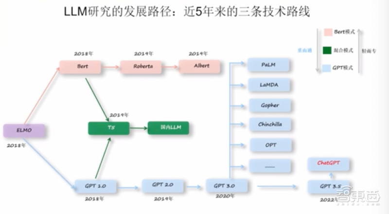
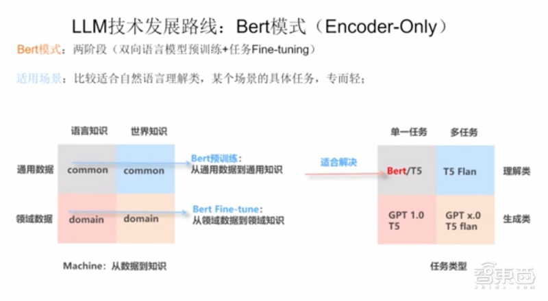
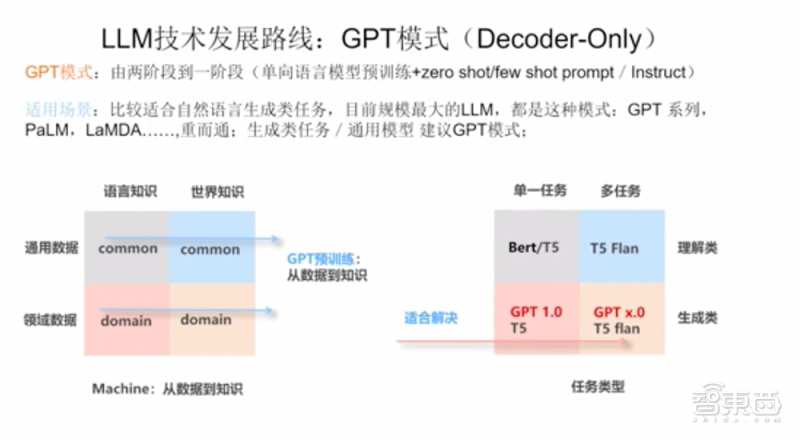
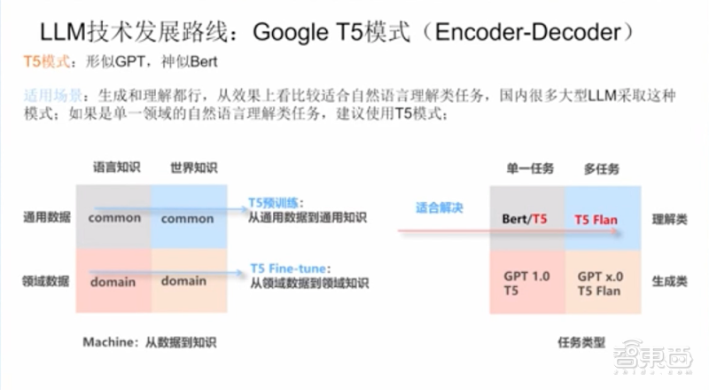
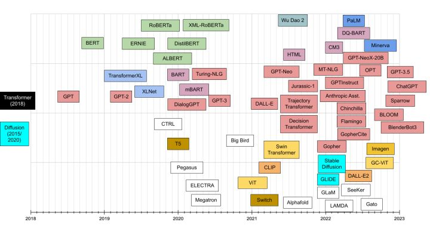
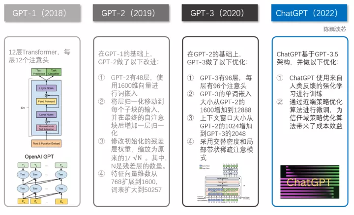
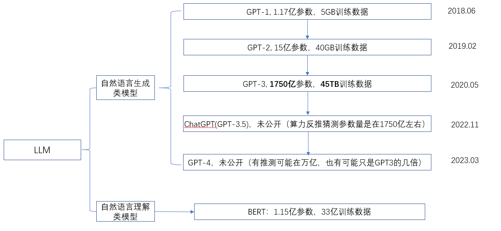
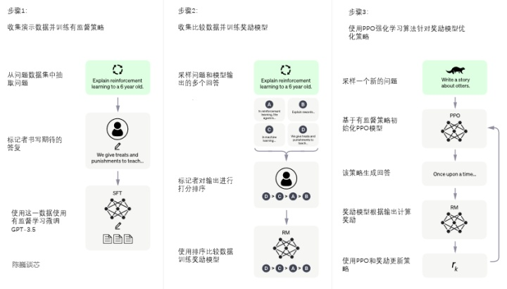
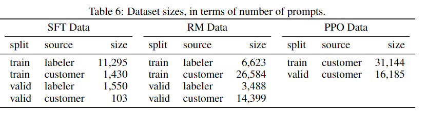

# 大语言模型原理

## 推荐阅读

会议：

> - [中国人民大学高瓴人工智能学院举办的AIGC研讨会：AIGC——从不存在到存在](https://www.bilibili.com/video/BV1JT411k7rQ/)

大语言模型的发展历程：

> - [GPT-4要来了！一文看尽大型语言模型的过去、现在、未来](https://zhidx.com/p/366514.html)
> - [MBA智库_大型语言模型](https://wiki.mbalib.com/wiki/%E5%A4%A7%E5%9E%8B%E8%AF%AD%E8%A8%80%E6%A8%A1%E5%9E%8B)
> - [ChatGPT“狂飙”，一个大模型的时代正在来临 ](https://www.sohu.com/a/665990783_120793217)
> - [中国人民大学高瓴人工智能学院AIGC 主题论坛，共话「从无到有」新范式](https://www.jiqizhixin.com/articles/2023-03-22-8)

ChatGPT发展历程与技术原理：

> - [陈巍：ChatGPT发展历程、原理、技术架构详解和产业未来 （收录于GPT-4/ChatGPT技术与产业分析）](https://zhuanlan.zhihu.com/p/590655677)
> - [Transformer 预训练模型分类](https://hub.baai.ac.cn/view/24272)

其他：

> * [oschina/awesome-llm](https://gitee.com/oschina/awesome-llm)
> * [Mooler0410/LLMsPracticalGuide](https://github.com/Mooler0410/LLMsPracticalGuide)
> * [大语言模型调研汇总](https://zhuanlan.zhihu.com/p/614766286)
> * [大语言模型的进化树，这是一份超详细ChatGPT“食用”指南](https://www.thepaper.cn/newsDetail_forward_22895577)
> * [大模型必读｜A16z精心整理的最全AI学习资料（全文中译+链接）](https://www.pingwest.com/a/282859)
> * [一文读懂大语言模型](https://mdnice.com/writing/3503851d21e149c7a96937cb836525b2)
> * [AI大语言模型原理、演进及算力测算](https://www.eet-china.com/mp/a219053.html)
> * [大语言模型技术原理](https://zhuanlan.zhihu.com/p/633269374)

大模型中使用到的技术：

> * PEFT研究
> * RLHF (Reinforcement Learning from Human Feedback)

## 一、大语言模型的发展历程

### 1.什么是大语言模型

大型语言模型，也叫大语言模型、大模型（Large Language Model，LLM；Large Language Models，LLMs）

**大型语言模型（LLM）**是指包含数千亿（或更多）参数的语言模型，这些参数是在大量[文本数据](https://wiki.mbalib.com/wiki/文本数据)上训练的，例如模型 GPT-3、PaLM、Galactica 和 LLaMA。具体来说，LLM 建立在 [Transformer](https://wiki.mbalib.com/wiki/Transformer) 架构之上，其中多头注意力层堆叠在一个非常深的[神经网络](https://wiki.mbalib.com/wiki/神经网络)中。现有的 LLM 主要采用与小语言模型类似的模型架构（即 Transformer）和预训练目标（即语言建模）。作为主要区别，LLM 在很大程度上扩展了模型大小、预训练数据和总计算量（扩大倍数）。他们可以更好地理解自然语言，并根据给定的上下文（例如 prompt）生成高质量的文本。这种容量改进可以用标度律进行部分地描述，其中性能大致遵循模型大小的大幅增加而增加。然而根据标度律，某些能力（例如，上下文学习）是不可预测的，只有当模型大小超过某个水平时才能观察到。

### 2.NLP到大型语言模型的进阶历程

新浪微博资深算法专家张俊林认为，要想探寻大型语言模型未来怎么走，需要先回顾此前是怎么一路变迁的。他将[自然语言处理](https://wiki.mbalib.com/wiki/自然语言处理)发展到大型语言模型的历程分为五个阶段：**规则、统计机器学习、[深度学习](https://wiki.mbalib.com/wiki/深度学习)、预训练、大型语言模型**。

机器翻译是NLP中难度最高、综合性最强的任务。因此张俊林以机器翻译任务为例来对比不同阶段的特点以及技术栈、数据的变化，以此展示NLP如何一步步演进。

> - **规则阶段**：大致从1956年到1992年，基于规则的机器翻译系统是在内部把各种功能的模块串到一起，由人先从数据中获取知识，归纳出规则，写出来教给机器，然后机器来执行这套规则，从而完成特定任务。
> - **统计机器学习阶段**：大致从1993年到2012年，机器翻译系统可拆成语言模型和翻译模型，这里的语言模型与现在的GPT-3/3.5的技术手段一模一样。该阶段相比上一阶段突变性较高，由人转述知识变成机器自动从数据中学习知识，主流技术包括SVM、HMM、MaxEnt、CRF、LM等，当时人工标注数据量在百万级左右。
> - **深度学习阶段**：大致从2013-2018年，相对上一阶段突变性较低，从离散匹配发展到embedding连续匹配，模型变得更大。该阶段典型技术栈包括Encoder-Decoder、LSTM、Attention、Embedding等，标注数据量提升到千万级。
> - **预训练阶段**：是从2018年到2022年，相比之前的最大变化是加入自监督学习，张俊林认为这是NLP领域最杰出的贡献，将可利用数据从标注数据拓展到了非标注数据。该阶段系统可分为预训练和微调两个阶段，将预训练数据量扩大3到5倍，典型技术栈包括Encoder-Decoder、[Transformer](https://wiki.mbalib.com/wiki/Transformer)、Attention等。
> - **大型语言模型阶段**：从2023年起，目的是让机器能听懂人的命令、遵循人的价值观。其特性是在第一个阶段把过去的两个阶段缩成一个预训练阶段，第二阶段转换成与人的价值观对齐，而不是向领域迁移。这个阶段的突变性是很高的，已经从专用任务转向通用任务，或是以自然语言[人机接口](https://wiki.mbalib.com/wiki/人机接口)的方式呈现。

### 3.大语言模型的三大技术路线

张俊林分享道，近5年来，大型语言模型研究的发展有三条技术路线：Bert模式、GPT模式、混合模式。其中国内大多采用混合模式，多数主流大型语言模型走的是GPT技术路线，直到2022年底在GPT-3.5的基础上产生了ChatGPT。

可以看到，到2019年后，Bert路线基本上就没有什么标志性的新模型出现了，而GPT技术路线趋于繁荣。从Bert往GPT走，模型越来越大，做的事越来越通用。

大型语言模型按照从数据到知识来划分，数据可分为通用数据和领域数据，知识分为语言知识和世界知识；从任务类型来划分，可以分为单一任务和多任务、理解类和生成类。

Bert模式有两阶段（双向语言模型预训练+任务Fine-tuning），适用于理解类、做理解类、某个场景的具体任务，专而轻。

**GPT模式**是由两阶段到一阶段（单向语言模型预训练+zero shot prompt/Instruct），比较适合生成类任务、多任务，重而通。

**T5模式**将两者的方法结合，有两阶段（单向语言模型预训练+Fine-tuning）。张俊林称这种模式“形似GPT，神似Bert”，生成和理解都行，从效果上看较适合理解类任务，国内很多大型语言模型采用这种模式。

目前的研究结论是，如果模型规模不是特别大，面向单一领域的理解类任务，适合用T5模式。做生成类任务时，用GPT模式效果最好。

如果单独考虑zero-shot，GPT模式效果最好；如果在预训练后引入多任务fine-tuning，则T5模式效果好。不过张俊林认为这个结论存疑，因为目前的实验Encoder-Decoder都是Decoder-only参数量的两倍。

综合来看，当前几乎所有参数规模超过千亿的大型语言模型都采取 GPT模式。张俊林分析可能的原因有三点：1、Encoder-Decoder里的双向attention，损害zero shot能力；2、Encoder-Decoder结构在生成Token时，只能对Encoder高层做attention，Decoder-only结构在生成Token时可以逐层Attention，信息更细粒度；3、Encoder-Decoder训练“中间填空”，生成最后单词Next Token，存在不一致性，Decoder-only结构训练和生成方式一致。

## 二、ChatGPT原理

一个理想的大型语言训练模型（large language model， LLM），应当是使用海量文本数据训练的语言模型，具有强大的自主学习能力，能够从上下文中学习到里面包含的所有知识点。

在GPT家族发布之前，业内先进的NLP模型多数都是使用监督学习，针对特定的垂直领域任务进行训练，这种方法的限制主要在：1.需要大量标注数据。2.现有模型无法泛化到训练集以外的任务。

现阶段NLP领域大都采取两阶段模式：模型预训练+微调（或者是zero/few-shot prompt），具体的研究方向大致有两条，一是**自然语言理解类**，以bert为代表的双向语言模型预训练+特定领域fine-tuning，二是**自然语言生成类**，以GPT家族为代表的从左到右的单向语言模型（自回归语言模型）+ zero/few shot模式。

AR（autoregressive，自回归）与AE（autoencoding，自编码）是无监督学习两大主要体系。其中AR类语言模型基于大量语料统计，从左往右学习，根据t - 1时刻和第t时刻的输入，预测第 t +1步的值，通常用于生成式任务，但缺点是只能用于前向或者后向建模，不能同时使用双向的上下文信息，GPT是代表作。前期因为训练数据不够，没有触发模型的涌现能力，所以GPT-1和GPT-2的影响力一直没有超过BERT。

AE类则是通过被mask的输入重建原始数据，比如一句完整的text，抹掉中间的单词，让模型学习根据前后内容学习重建抹掉的内容，通常用于自然语言理解任务效果较好，比如情感分析，提取式问答等，BERT是代表模型。

### 1.概述

**2018.06**，**GPT-1**发布，它属于典型的AR语言模型，模型训练主要使用booksCorpus数据集，大量无标注语料预训练，学习到文本和词汇间的隐含关系后，对预训练模型进行fine-tuning，迁移到各种有监督的NLP任务。

**2019.02，GPT-2**在结构上创新不大，但模型参数量相比GPT-1增长了10倍以上，训练数据集来自WebText数据，超过800万份文档的40GB文本数据。GPT-2团队在同一数据集上，比较了不同规模参数模型（117M、345M、762M、1.5B）的性能，结果显示模型性能随着参数数量的增加而提升。GPT-2的一个关键能力是**零样本学习（zero-shot learning）**，即在没有提供示例情况下，能够根据用户的指令理解特定任务。

**2020.05，GPT-3**的参数是GPT-2的**100倍**以上，并且在更大的文本数据集上训练（低质量的Common Crawl，高质量的Web Text2，Wikipedia和Books1，但质量高数据集会被赋予更大权重）。GPT-3编写的文章和人类撰写的在很多时候已经难以区分，它还可以执行从未明确训练过的即时任务，例如求和、编写SQL代码、解读句子中单词等。GPT-3的特出特点是**上下文学习（in-context learning）**，问答中出现少量提示信息时，语言模型会将示例的模式和其训练中的类似数据里学到的模式进行匹配。fine-tuning和in-context learning共同点都是提供了一些示例给LLM，但不同地方在于，fine-tuning用这些示例当做训练数据，利用结果去调整模型参数，而in-context leaning只是让LLM知道，并没有修改模型参数。

**2022.11，对于ChatGPT**，openAI的主要关注点在ChatGPT的**安全性**和**对齐能力**上。因为在以往的模型中，训练过程实际上是根据之前的单词推测下一步合理的单词的过程，换句话说它只关注如何输出合理的内容，而内容本身是否有害，是否真实，训练过程中并没有着重考虑这一点。除此之外模型的输出有时候会偏离用户实际关心的问题，即输出没有和用户的意图相对齐。为了解决这些问题，ChatGPT在高质量的监督数据集上对模型进行了RLHF微调，结果显示在对齐能力和输出安全方面模型的表现有显著提高，但在一些常规NLP任务上的性能相较GPT-3甚至有些许退步（对齐税）。

### 2. ChatGPT预训练过程

ChatGPT的预训练过程同其他GPT模型没有大的区别，同样是利用大量的语料数据集进行无监督预训练，它的突出表现主要是由于在fine-tuning过程选择了人工标记的数据集，同时利用人类反馈强化学习（reinforcement learning form human feedback，RLHF），对预训练模型进行了监督微调。

fine-tuning过程有三个阶段：

第一阶段：训练监督策略模型（**supervised fine-tuning， SFT**）。从用户在openAI之前公开的instructGPT模型API上提交的prompt数据集中抽取部分，雇佣专门的labeler编写这些prompt对应的回复，组成prompt+response数据（13K），这部分数据进行第一阶段的fine-tuning。

第二阶段：训练奖励模型（**reward model， RM**）。抽取一部分prompt，利用第一阶段的模型生成4~9个回答，labeler对这些回答进行打分，给出排序，response之间进行两两组合，得到多个数据对（约33K）。打分结果作为奖赏，训练模型使得模型偏好于输出打分高的回答。

第三阶段：采用近端策略优化（**proximal Policy Optimization，PPO**）强化学习更新策略。抽取prompt数据集，对生成的回答（31K），利用第二阶段模型对该回答打分，将打分作为强化学习中的奖赏，使用PPO算法更新策略。

### 3. fine-tuning数据集

prompt来源一是openAI开放的instructGPT模型（ChatGPT-3.5的姐妹模型）API接口上，用户提交的prompt，每个uid的prompt数限制在200，同时过滤掉含有敏感信息的prompt。

二是labeler人为扩充，要求prompt种类多样性，包括各种常见的NLP任务（生成内容、QA、对话、总结、提取等），还有和常见的用户需求相关的prompt。

下面左图是prompt类型分布，右图是fine-tuning三个阶段的prompt数量，训练prompt总计约13K+33k+31K=77K。

### 4. 总结

总结下来ChatGPT成功的原因有三点，也是和其他GPT模型的不同点：

1. 超大规模的预训练数据集，训练出了模型的涌现能力。
2. 高质量的fine-tuning监督数据集（人工编写prompt对应的response、尽可能扩充不同领域的prompt、对模型输出人工打分），尽可能涵盖常见的prompt使用场景。
3. 基于人类反馈的强化学习，使得模型输出和用户意图对齐，并且提高了模型输出的无害性、有用性。

