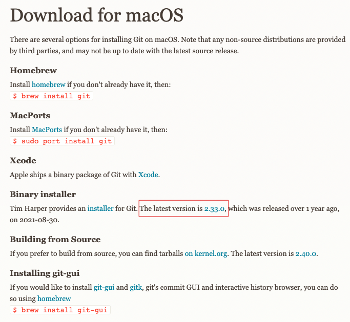
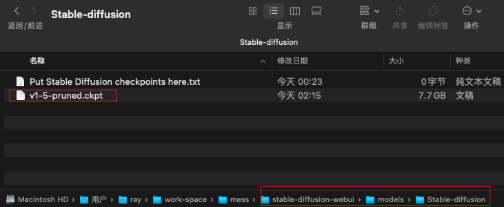
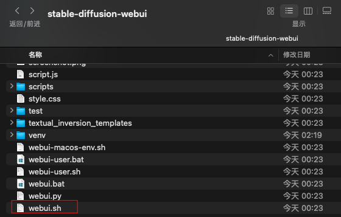
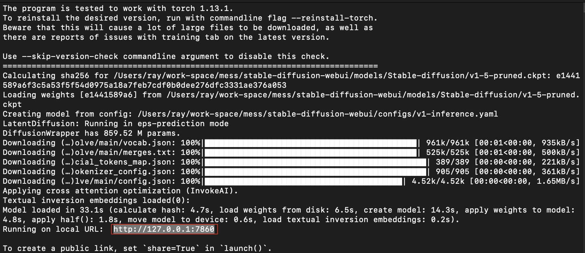
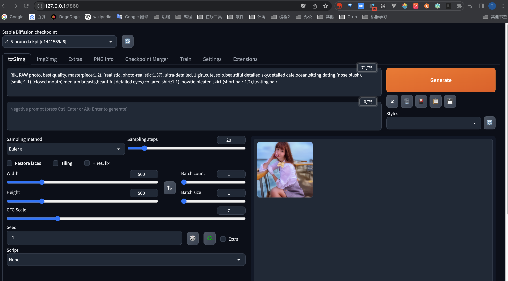

# Mac M1安装stable-diffusion-webui

## 推荐阅读

- [官方GitHub仓库](https://github.com/AUTOMATIC1111/stable-diffusion-webui)
- [mac m1安装stable-diffusion-webui](https://www.cnblogs.com/m-bianbian/p/17298753.html)
- [【AI绘画】Mac安装stable-diffusion-webui绘制AI妹子保姆级教程](https://longbig.github.io/2023/02/26/AI%E7%BB%98%E7%94%BB-MAC%E5%AE%89%E8%A3%85Stable-Diffusion-webUI%E4%BF%9D%E5%A7%86%E7%BA%A7%E6%95%99%E7%A8%8B/)

## 一、Mac M1安装stable-diffusion-webui

### 1. 环境准备

#### 1.1 安装Git

进入 [git官网](https://git-scm.com/download/mac), 下载并安装最新版本git并安装



#### 1.2 安装 HomeBrew

参考：

- [cunkai/HomebrewCN](https://gitee.com/cunkai/HomebrewCN)
- [Homebrew国内如何自动安装（国内地址）（Mac & Linux）](https://zhuanlan.zhihu.com/p/111014448)

直接执行如下脚本安装 HomeBrew并设置国内镜像软件源

```bash
/bin/zsh -c "$(curl -fsSL https://gitee.com/cunkai/HomebrewCN/raw/master/Homebrew.sh)"
```

#### 1.3 安装运行环境

执行如下命令，来安装 stable diffusion 运行所需的环境

```bash
brew update
brew install cmake protobuf rust python@3.10 git wget
```

注意：

> 执行 `brew update` 时，可能会出现如下告警：
>
> ```java
> Warning: No remote 'origin' in /opt/homebrew/Library/Taps/homebrew/homebrew-cask, skipping update!
> Warning: No remote 'origin' in /opt/homebrew/Library/Taps/homebrew/homebrew-core, skipping update!
> Warning: No remote 'origin' in /opt/homebrew/Library/Taps/homebrew/homebrew-services, skipping update!
> Already up-to-date.
> ```
>
> 这是因为这些目录不是git认为的安全的目录，需要手动添加这些目录，执行如下命令即可：
>
> ```bash
> git config --global --add safe.directory /opt/homebrew/Library/Taps/homebrew/homebrew-cask
> git config --global --add safe.directory /opt/homebrew/Library/Taps/homebrew/homebrew-core
> git config --global --add safe.directory /opt/homebrew/Library/Taps/homebrew/homebrew-services
> ```

#### 1.4 pip 设置国内软件源

pip默认使用的是国外的软件源，下载的时候会很慢，可以设置成国内的软件源来提升下载速度，比如使用清华源。

修改全局配置文件`~/.pip/pip.conf`（如果不存在则创建路径）

```bash
## 创建pip文件夹
mkdir ~/.pip
## 创建并编辑pip.conf文件
vim ~/.pip/pip.conf
```

文件内容如下：

```properties
[global]
index-url = https://pypi.tuna.tsinghua.edu.cn/simple
[install]
trusted-host = https://pypi.tuna.tsinghua.edu.cn
```

执行如下命令，可验证是否成功修改软件源：

```bash
$ pip3 config list   
global.index-url='https://pypi.tuna.tsinghua.edu.cn/simple'
install.trusted-host='https://pypi.tuna.tsinghua.edu.cn'
```

### 2. 下载stable-diffusion-webui

```bash
git clone https://github.com/AUTOMATIC1111/stable-diffusion-webui.git
```

### 3. 下载模型

可以从[Hugging Face](https://huggingface.co/models?pipeline_tag=text-to-image&sort=downloads)下载 Stable Diffusion 模型.

```bash
## 1. 以stable-diffusion-v1-5为例，点击下面链接去往模型首页
https://huggingface.co/runwayml/stable-diffusion-v1-5/tree/main

## 2. 单击标题 Files and versions
Files and versions

## 3. 下载扩展名为“.ckpt”或“.safetensors”的文件
v1-5-pruned.ckpt
```


### 4. 将下载的模型放入指定目录

模型目录：stable-diffusion-webui/models/Stable-diffusion/

如下图所示，将下载的模型放入模型目录



### 5. 运行

在`stable-diffusion-webui`目录下，运行如下命令，即可启动 stable-diffusion

```bash
./webui.sh
```



注意，这一步可能会出现如下异常，导致失败，可按下面的操作解决异常，然后重新执行`./webui.sh`即可：

> （1）出现关于 HTTP/2  的异常，原因是git 默认使用的通信协议出现问题
>
> ```java
> HTTP/2 stream 1 was not closed cleanly before end of the underlying stream
> ```
>
> 可以通过将默认通信协议修改为 http/1.1 来解决该问题，执行如下命令即可
>
> ```bash
> git config --global http.version HTTP/1.1
> ```
>
> （2）gfpgan 安装失败
>
> 参考：venv/Lib/site-packages
>
> 在`stable-diffusion-webui/venv/lib/python3.10/site-packages` 这个目录下，执行 `pip install gfpgan` 即可成功安装 gfpgan
>
> （3） open_clip 安装失败
>
> 同 gfpgan ，手动安装即可。 在`stable-diffusion-webui/venv/lib/python3.10/site-packages` 这个目录下，执行 `pip install open_clip_torch`，即可成功安装 open_clip

### 6. 打开浏览器

启动成功后，日志中会打印前端页面的访问地址：



将此地址输入到浏览器中进行访问

> [http://127.0.0.1:7860/](http://127.0.0.1:7860/)

出现下图页面，然后就可以输入提示词进行图片生成了


