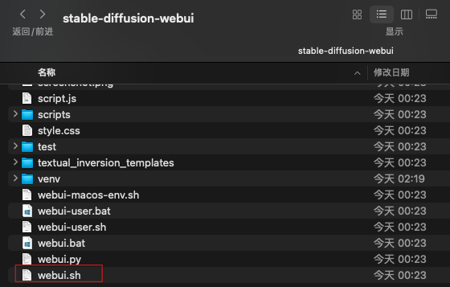
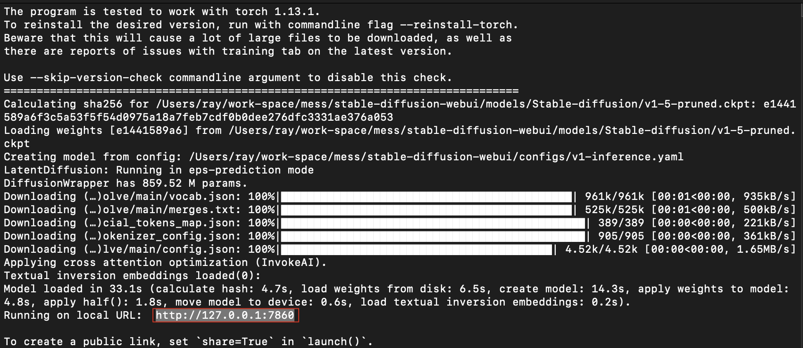
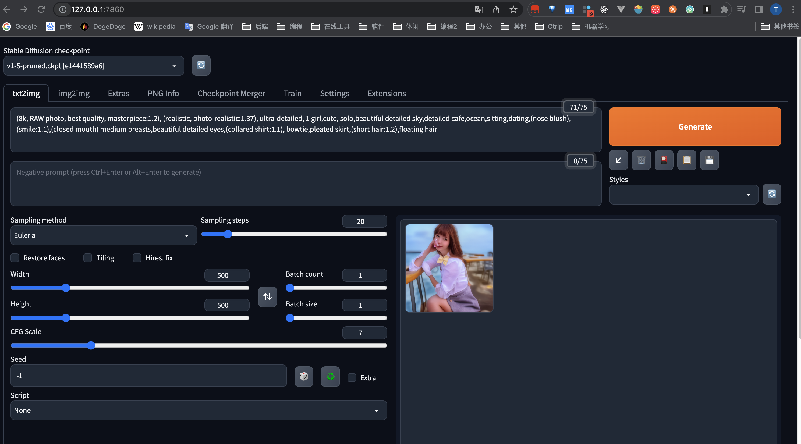

# Mac M1安装stable-diffusion-webui

## 推荐阅读

- [官方GitHub仓库](https://github.com/AUTOMATIC1111/stable-diffusion-webui)
- [mac m1安装stable-diffusion-webui](https://www.cnblogs.com/m-bianbian/p/17298753.html)
- [【AI绘画】Mac安装stable-diffusion-webui绘制AI妹子保姆级教程](https://longbig.github.io/2023/02/26/AI%E7%BB%98%E7%94%BB-MAC%E5%AE%89%E8%A3%85Stable-Diffusion-webUI%E4%BF%9D%E5%A7%86%E7%BA%A7%E6%95%99%E7%A8%8B/)

## 一、Mac M1安装stable-diffusion-webui

### 1. 环境准备

执行如下命令，来安装运行环境

```bash
brew update
brew install cmake protobuf rust python@3.10 git wget
```

如果提示没有安装 brew， 则执行如下命令安装即可

```bash
/bin/bash -c "$(curl -fsSL https://raw.githubusercontent.com/Homebrew/install/HEAD/install.sh)"
```

如果是第一次安装，或者之前没有设置过国内源，则可以使用如下命令设置为国内源：

```bash
# 替换brew.git
cd "$(brew --repo)"
git remote set-url origin https://mirrors.tuna.tsinghua.edu.cn/git/homebrew/brew.git

# 替换homebrew-core.git
cd "$(brew --repo)/Library/Taps/homebrew/homebrew-core"
git remote set-url origin https://mirrors.tuna.tsinghua.edu.cn/git/homebrew/homebrew-core.git

# 刷新源
brew update
```

### 2. 下载stable-diffusion-webui

```bash
git clone https://github.com/AUTOMATIC1111/stable-diffusion-webui.git
```

### 3. 下载模型

可以从[Hugging Face](https://huggingface.co/models?pipeline_tag=text-to-image&sort=downloads)下载 Stable Diffusion 模型.

```bash
## 1. 以stable-diffusion-v1-5为例，点击下面链接去往模型首页
https://huggingface.co/runwayml/stable-diffusion-v1-5/tree/main

## 2. 单击标题 Files and versions
Files and versions

## 3. 下载扩展名为“.ckpt”或“.safetensors”的文件
v1-5-pruned.ckpt
```


### 4. 将下载的模型放入指定目录

模型目录：stable-diffusion-webui/models/Stable-diffusion/

如下图所示，将下载的模型放入模型目录


### 5. 运行

运行如下命令，即可启动 stable-diffusion

```bash
./webui.sh
```



### 6. 打开浏览器

启动成功后，日志中会打印前端页面的访问地址：



将此地址输入到浏览器中进行访问

> [http://127.0.0.1:7860/](http://127.0.0.1:7860/)

出现下图页面，然后就可以输入提示词进行图片生成了



