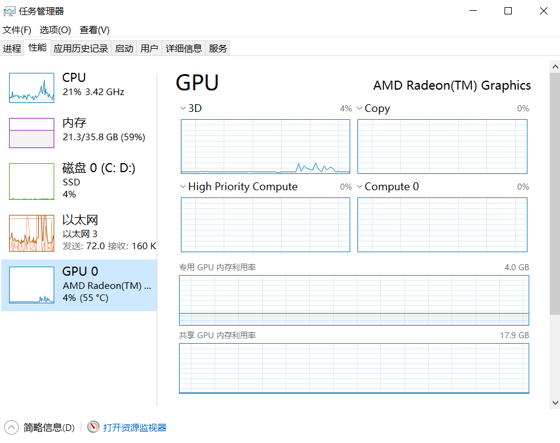
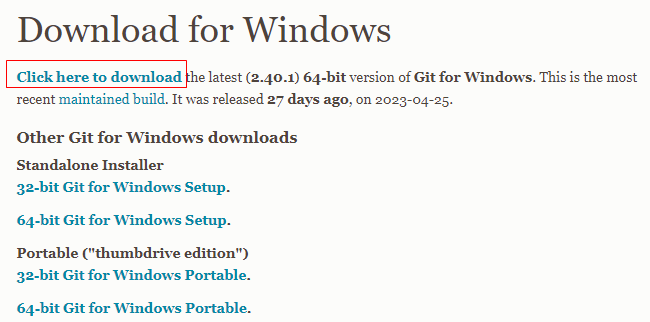
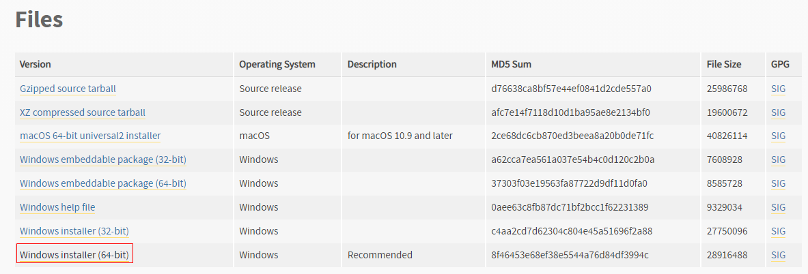
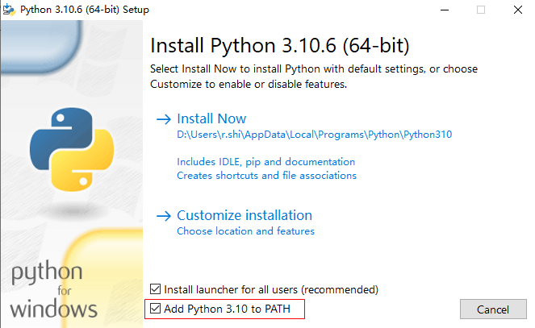
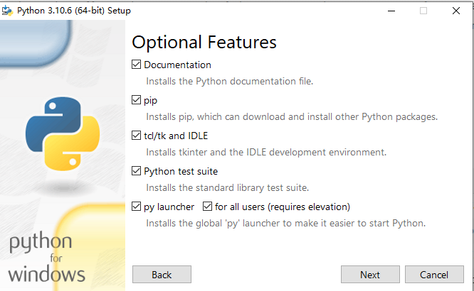
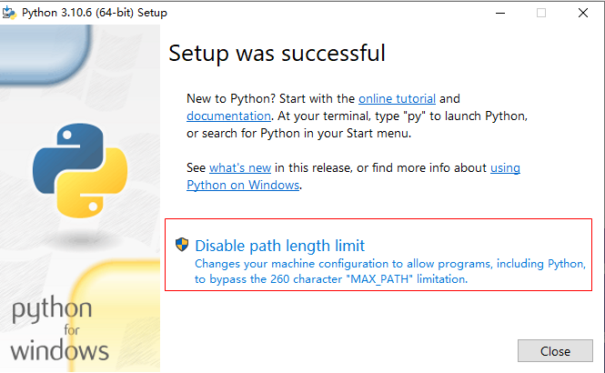
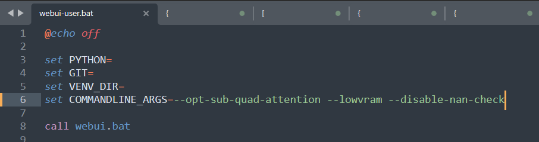

# Windows安装stable-diffusion-webui

## 推荐阅读

- [官方GitHub仓库](https://github.com/AUTOMATIC1111/stable-diffusion-webui)
- [官方文档：Install and Run on AMD GPUs](https://github.com/AUTOMATIC1111/stable-diffusion-webui/wiki/Install-and-Run-on-AMD-GPUs)

## 前言

在安装之前，得先分清你的显卡是AMD的还是Nvida的，快捷键 `ctrl+shift+Esc` 打开任务管理器，在 性能-> GPU 这里，可以看到显卡类型，如下图所示，我的显卡是GPU的。



对于不同显卡，安装 stable-diffusion的方式是不同的，参加官方文档：

> - [官方文档：Install and Run on AMD GPUs](https://github.com/AUTOMATIC1111/stable-diffusion-webui/wiki/Install-and-Run-on-AMD-GPUs)
> - [官方文档：Install and Run on NVidia GPUs](https://github.com/AUTOMATIC1111/stable-diffusion-webui/wiki/Install-and-Run-on-NVidia-GPUs)


## 一、Windows安装stable-diffusion-webui

### 1. 环境准备

#### 1.1 安装Git

进入 [git官网](https://git-scm.com/download/win), 下载并安装最新版本git。



#### 1.2 安装 Python

（1）打开官网链接  [Python 3.10.6](https://www.python.org/downloads/release/python-3106/)（较新版本的 Python 不支持 torch），下载Python安装包



（2）运行安装包，勾选“Add Python to PATH”，然后一路Next即可。







在最后一步有个`disable path length limit`，是指禁用系统Path长度限制，禁用后可以给我们避免很多麻烦，这里我们点击它，然后点击close。

（3）验证是否安装成功

```bash
python --version
```

（4）pip设置国内镜像源

打开配置文件  `~/pip/pip.ini` （如果不存在则创建改路径），修改内容为：

```properties
[global]
index-url = https://pypi.tuna.tsinghua.edu.cn/simple
[install]
trusted-host = https://pypi.tuna.tsinghua.edu.cn
```


### 2. 克隆stable-diffusion-webui代码库

对于AMD显卡用户，需要执行如下代码：

```bash
git clone https://github.com/lshqqytiger/stable-diffusion-webui-directml && cd stable-diffusion-webui-directml && git submodule init && git submodule update
```

如果机器有 4~6G的显存，则可以在 `webui-user.bat` 中添加启动参数 `--opt-sub-quad-attention --lowvram --disable-nan-check`，如下图所示：



### 3. 添加模型

（1）下载模型

可以从 [Hugging Face](https://huggingface.co/models?pipeline_tag=text-to-image&sort=downloads)下载 Stable Diffusion 模型.

```bash
## 1. 以stable-diffusion-v1-5为例，点击下面链接去往模型首页
https://huggingface.co/runwayml/stable-diffusion-v1-5/tree/main

## 2. 单击标题 Files and versions
Files and versions

## 3. 下载扩展名为“.ckpt”或“.safetensors”的文件
v1-5-pruned.ckpt
```


（2）将下载的模型放入指定目录

模型目录：stable-diffusion-webui/models/Stable-diffusion/

如下图所示，将下载的模型放入模型目录


### 4. 运行

在`stable-diffusion-webui`目录下，直接双击 `webui-user.bat`，即可初始化并启动sd。

注意，这一步可能会出现如下异常，导致失败，可按下面的操作解决异常，然后重新执行 `webui-user.bat`即可：

> （1）出现关于 HTTP/2  的异常，原因是git 默认使用的通信协议出现问题
>
> ```java
> HTTP/2 stream 1 was not closed cleanly before end of the underlying stream
> ```
>
> 可以通过将默认通信协议修改为 http/1.1 来解决该问题，执行如下命令即可
>
> ```bash
> git config --global http.version HTTP/1.1
> ```
>
> （2）gfpgan 安装失败
>
> 参考：venv/Lib/site-packages
>
> 在`stable-diffusion-webui/venv/lib/python3.10/site-packages` 这个目录下，执行 `pip install gfpgan` 即可成功安装 gfpgan
>
> （3） open_clip 安装失败
>
> 同 gfpgan ，手动安装即可。 在`stable-diffusion-webui/venv/lib/python3.10/site-packages` 这个目录下，执行 `pip install open_clip_torch`，即可成功安装 open_clip

### 6. 打开浏览器

启动成功后，日志中会打印前端页面的访问地址：


将此地址输入到浏览器中进行访问

> [http://127.0.0.1:7860/](http://127.0.0.1:7860/)

出现下图页面，然后就可以输入提示词进行图片生成了


