# Colab云端部署stable-diffusion

## 推荐阅读

视频：

> - [谷歌Colab云端部署Stable Diffusion 进行绘图](https://blog.csdn.net/weixin_43905975/article/details/130059104)
> - [BaaadMonkey_【AI制图】5分钟Colab云端部署stable diffusion教程](https://www.bilibili.com/video/BV15j411c7fE)
> - [Colab 快速部署Stable Diffusion](https://hesn0bipt0.feishu.cn/docx/VrTHdeIm5oKT9AxzI7CcRxqjnTh)
> - [用Colab免费部署自己的AI绘画云平台—— Stable Diffusion](https://www.qiufeng.blue/aipaint/ai-stable-diffusion-2.html)

## 前言

我试过如下有两种部署方式：

- fast-stable-diffusion：分阶段执行，所以断连之后，无需从头执行。
- stable-diffusion-webui-colab：一键执行整个阶段，不推荐这种方式，因为经常会有人机验证，导致断连，每次都要重头执行。

## 一、fast-stable-diffusion 部署流程

（1）点击[此链接](https://colab.research.google.com/github/TheLastBen/fast-stable-diffusion/blob/main/fast_stable_diffusion_AUTOMATIC1111.ipynb#scrollTo=Y9EBc437WDOs)启动Colab Notebook文件，进入Colab页面。

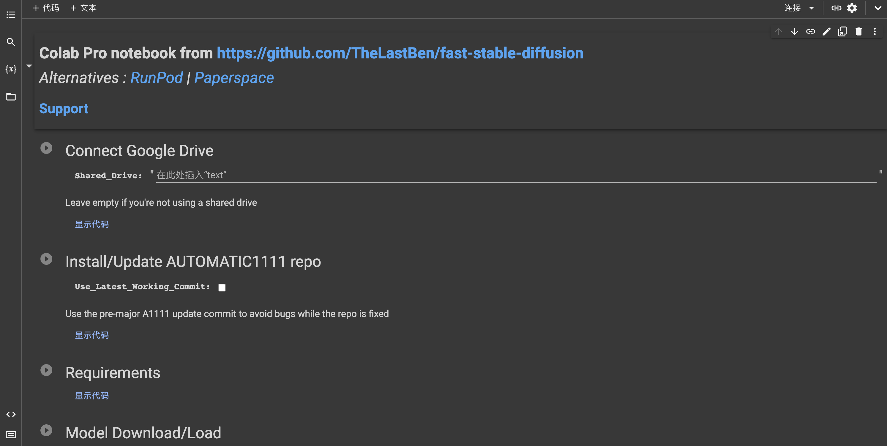

（2）进入【代码执行程序】->【更改进行时类型】，确保硬件加速器为GPU

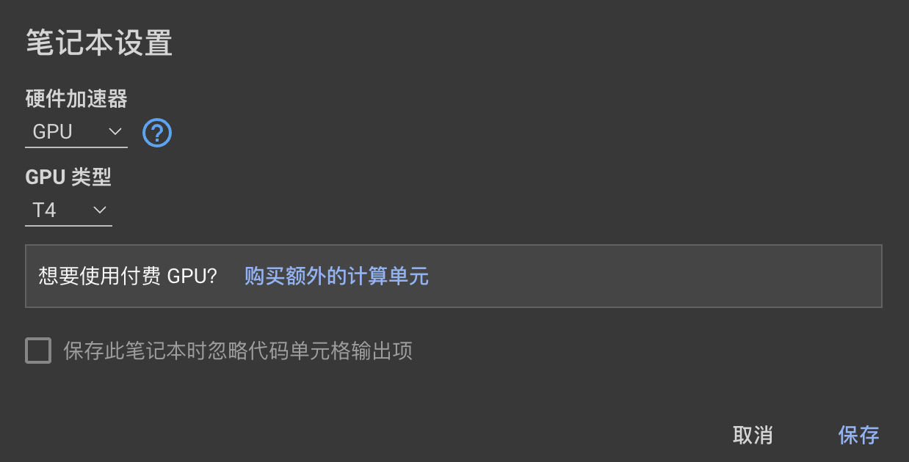

（3）接着从前往后，依次点击启动按钮去启动每个步骤，每个步骤执行完毕后会显示 【DONE】的状态，然后就可以执行下一个步骤了。

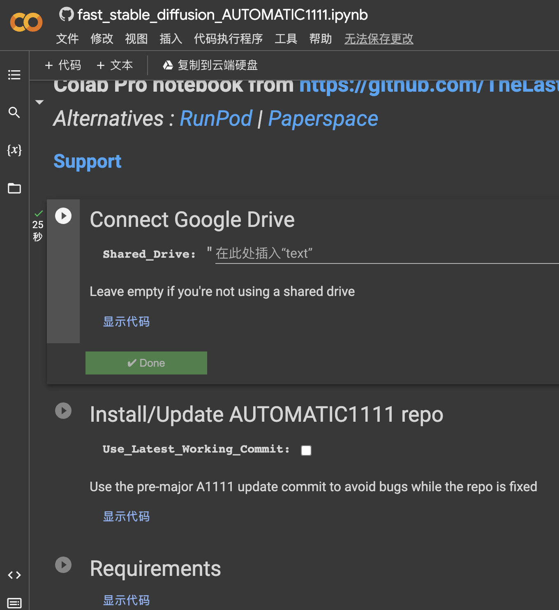

其中第一步，会需要连接Google硬盘，会提示我们进行授权，点击同意即可。

（4）所有步骤都完成后，会出现下图中的地址：

点击后即可进入web-ui的界面。

## 二、stable-diffusion-webui-colab 部署流程

### 1.找到对应的脚本

打开 [camenduru/stable-diffusion-webui-colab](https://github.com/camenduru/stable-diffusion-webui-colab) 这个github仓库

在README.md中找到如下 Colab区域

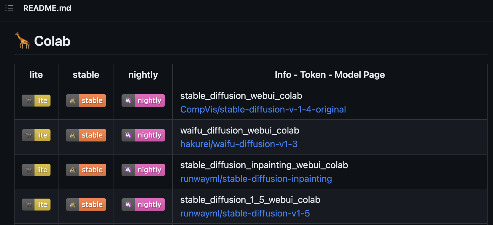

分为三种类型

> - lite：有一个稳定的WebUI和稳定安装的扩展。
> - stable：拥有ControlNet，一个稳定的WebUI，以及稳定安装的扩展。
> - nightly：拥有ControlNet v1.1、最新的WebUI和每日安装的扩展更新

笔者选择了CompVis/stable-diffusion-v-1-4-original的稳定版，点击橙色图标

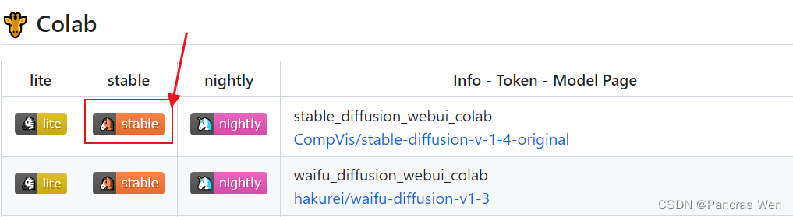

就会跳转到Google Colab的网页，登录谷歌账号后，可以将此脚本复制到自己的云端硬盘里。

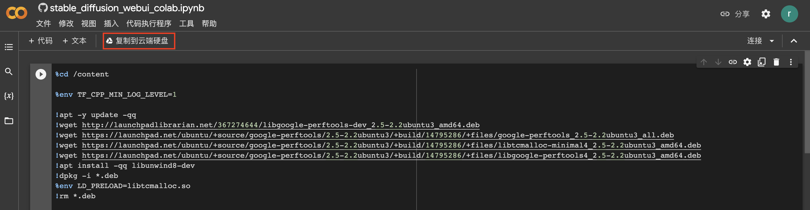

然后在云端硬盘里打开这个副本文件，也能进入 Colab的网页。

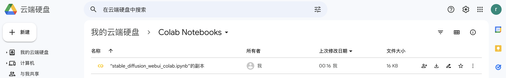

### 2.在谷歌Colab里执行脚本

刚刚的副本文件就是我们要运行的脚本。

（1）首先检查运行时类型

菜单栏依次点击 `代码执行程序` -> `更改运行时类型`

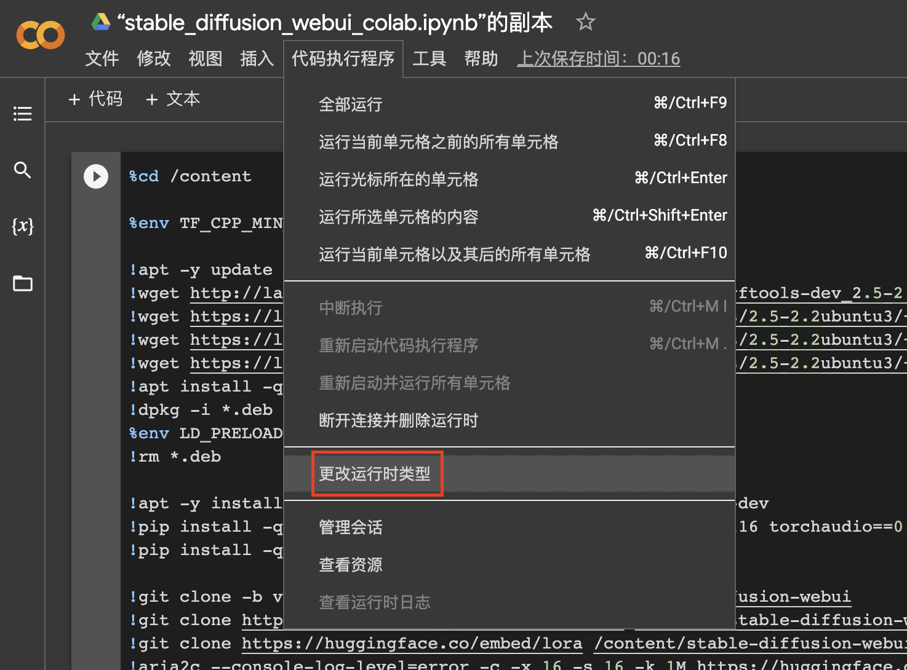

确认笔记本是GPU的。

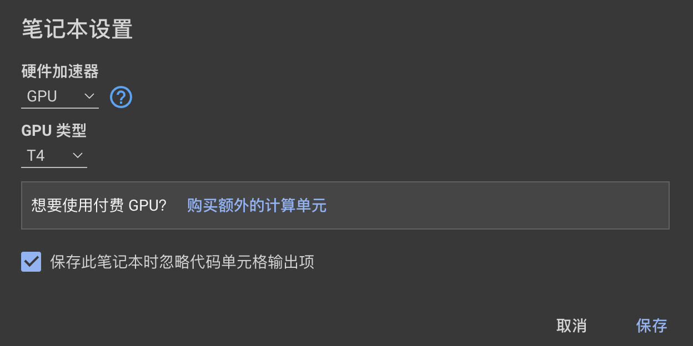

（2）然后点击菜单栏中的`全部运行`选项，即可执行整个安装过程。

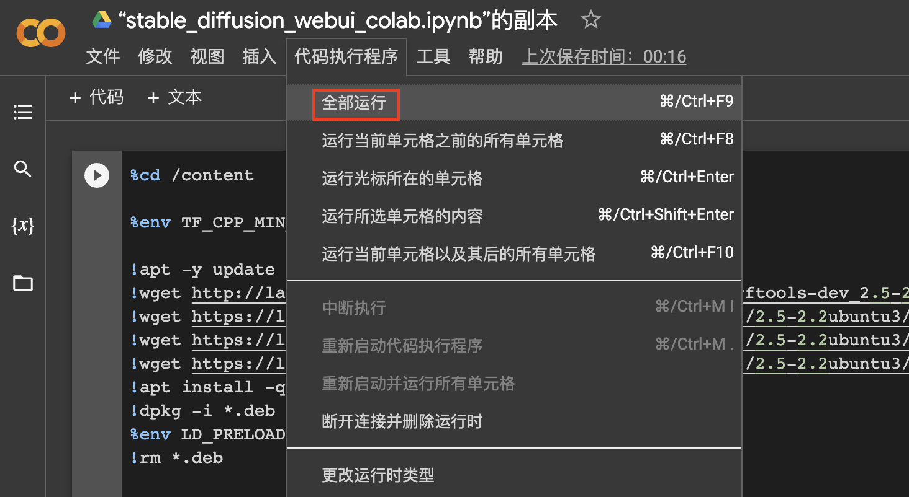

### 3.访问地址

大概10分钟就可以安装好，出现下图的访问地址，说明就安装成功了。

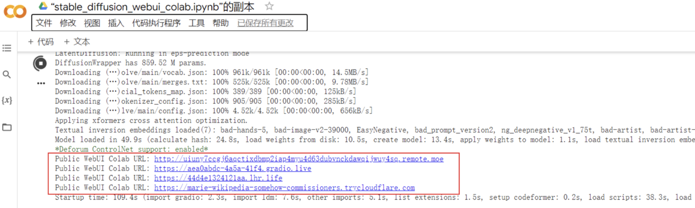

点击即可进入 sd 的 web-ui界面。

### 4.解决Colab断连问题

colab在如下情况时会断开连接。

- 网络异常
- 页面上过久没有交互（目前是10分钟）
- 达到12小时最长工作时间

在colab页面，可通过在浏览器 F12 调出开发者工具后，在consle控制台中执行如下命令，来使浏览器每隔10分钟执行一次点击操作。：

```js
function ConnectButton(){
    console.log("Connect pushed"); 
    document.querySelector("#top-toolbar > colab-connect-button").shadowRoot.querySelector("#connect").click() 
}
setInterval(ConnectButton,60000);
```

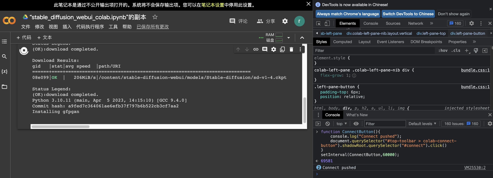

这段代码执行完毕后，会在控制台输出一串数字（即为intervalId），后面在控制台执行 `clearInterval(intervalId)` 即可停止这段定时任务。
