# JVM核心知识点图解

[toc]

## 前言

最近准备好好总结下 JVM 相关的一系列知识点，本文先总结主要的核心知识点：

> - 运行时数据区
> - 对象探秘
> - 类加载
> - 垃圾回收

本文完整的图，请参见 processon： https://www.processon.com/view/5d88b980e4b00c785f344a2e

## 推荐阅读

在这里记录下关于 JVM 的知识的来源：

> - [《深入理解 Java 虚拟机》](https://item.jd.com/11252778.html)：学习 JVM 的神书，JVM 的必看书籍，本文的总结也是基于此书的
> - [The Java® Virtual Machine Specification](https://docs.oracle.com/javase/specs/jvms/se13/html/index.html)：Oracle 官方 Jvm 虚拟机规范，最权威，建议在读完《深入理解 Java 虚拟机》这本书之后再阅读

## 一、JVM 的运行时数据区

### 概览

JVM 运行时数据区主要包括以下几个部分：程序计数器、虚拟机栈、本地方法栈、方法区、堆

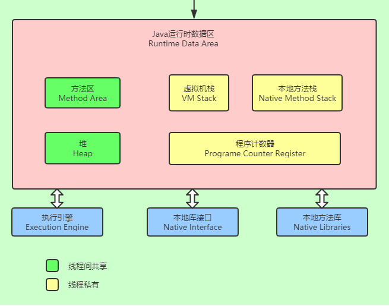

### 1.程序计数器

程序计数器可以看作是当前线程所执行的字节码的 **行号指示器**

- 字节码解释器工作时就是通过改变这个计数器的值来选取下一条需要执行的字节码指令，分支、循环、跳转、异常处理、线程恢复等基础功能都需要依赖这个计数器来完成。
- 如果线程正在执行的是一个 Java 方法，这个计数器记录的是正在执行的虚拟机**字节码指令的地址**。

### 2.虚拟机栈

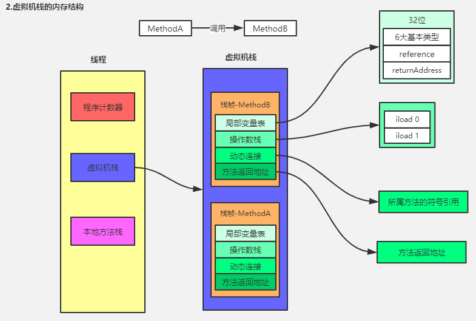

#### 2.1 虚拟机栈

虚拟机栈描述的是 **Java 方法执行的内存模型**：

> - 每个方法在执行的同时都会创建一个栈帧，用于存储局部变量表、操作数栈、动态链接、方法出口等信息。
> - 每一个方法从调用直至执行完成的过程，就对应着一个栈帧在虚拟机栈中入栈到出栈的过程。

栈帧（Stack Frame）是用于支持虚拟机进行方法调用和方法执行的数据结构，是虚拟机栈的栈元素。

> - 栈帧存储了方法的局部变量表、操作数栈、动态连接和方法返回地址等信息。
> - 每一个方法从调用开始至执行完成的过程，都对应着一个栈帧在虚拟机里从入栈到出栈的过程。

#### 2.2 局部变量表

局部变量表是一组**变量值存储空间**，用于存放**方法参数**和方法内部定义的**局部变量**：

（1）**编译时就确定最大容量**

> 在 Java 程序编译为 Class 文件时，就在 Class 文件的方法表的 Code 属性的 max_locals 数据项中确定了该方法所需要分配的局部变量表的最大容量。

（2）**局部变量表的容量以变量槽（Slot）为最小单位**

> - 一个 Slot 可以存放一个 32 位以内的数据类型，Java 中占用 32 位以内的数据类型有**8 种**： boolean 、byte、char、short、int、float、reference 和 returnAddress; 对于 64 位的数据类型（long/double），虚拟机会以**高位对齐**的方式分配两个连续的 Slot 空间

（3）**索引定位**

> - 虚拟机通过索引定位的方式使用局部变量表，索引值范围是从 0 至最大 Slot 数量
> - 对 32 位数据类型的变量来说，索引 n 就代表了使用第 n 个 Slot；而对 64 位数据类型的变量来说，则会同时使用 n 和 n+1 两个 Slot;

（4）**索引分配**

> - 在方法执行时，虚拟机是使用局部变量表来完成参数值到参数变量列表的传递过程的
> - 如果执行的是实例方法，则局部变量表中第 0 位索引的 Slot 默认是用于传递**方法所属对象实例的引用**，在方法中可以通过关键字“this”来访问到这个隐含的参数；其余参数按照**参数表**顺序排列，占用从 1 开始的局部变量 Slot；参数表分配完毕后，再根据**方法体内部定义的变量**顺序和作用域分配其余的 Slot

（5）**Slot 重用**

局部变量表中的 Slot 是可以重用的，如果当前字节码 PC 计数器的值，已经超过了某个变量的作用域，那这个变量对应的 Slot 就可以交给其他变量使用。

#### 2.3 操作数栈

在方法的执行过程中，会有各种字节码指令往操作数栈中写入和提取内容，这就是入栈和出栈。

操作数栈是为字节码指令服务的：

> 例如，虚拟机执行字节码指令 iload ,会将一个 int 类型的局部变量从局部变量表加载到操作数栈，iadd 会将操作栈顶的两个元素相加 ，并将相加后的结果入栈

#### 2.4 动态连接

动态连接就是指向常量池中该栈帧所属方法的引用

每个栈帧都包含一个指向运行时常量池中该栈帧所属方法的引用，持有这个引用是为了支持方法调用过程中的动态连接。

> - Class 文件的常量池中存有大量的符号引用，字节码中的方法调用指令就以常量池中指向方法的符号引用作为参数。
>
> - 这些符号引用一部分会在类加载阶段或者第一次使用的时候转化为直接引用，这种转化称为**静态解析**
> - 另一部分将在每一次运行期间转为直接引用，这部分称为**动态连接**

#### 2.5 方法返回地址

一个方法的退出方式有两种：

> - **正常完成出口**：执行引擎遇到任意一个方法返回的字节码指令
> - **异常完成出口**：在方法执行过程中遇到了异常，并且这个异常没有在方法体内得到处理，也就是在本方法的异常表中没有搜索到匹配的异常处理器，这时就会导致方法异常退出。

方法返回地址：

> - 一般来说，方法正常退出时，调用者的 PC 计数器的值可以作为返回地址，栈帧中很可能会保存这个计数器值。
> - 而方法异常退出时，返回地址是要通过异常处理器表来确定的，栈帧中一般不会保存这部分信息。

方法退出的过程实际上就等同于把当前栈帧出栈：

> 因此退出时可能执行的操作有：恢复上层方法的局部变量表和操作数栈，把返回值压入调用者栈帧的操作数栈中，调整 PC 计数器的值以指向方法调用指令后面的一条指令等

### 3.堆

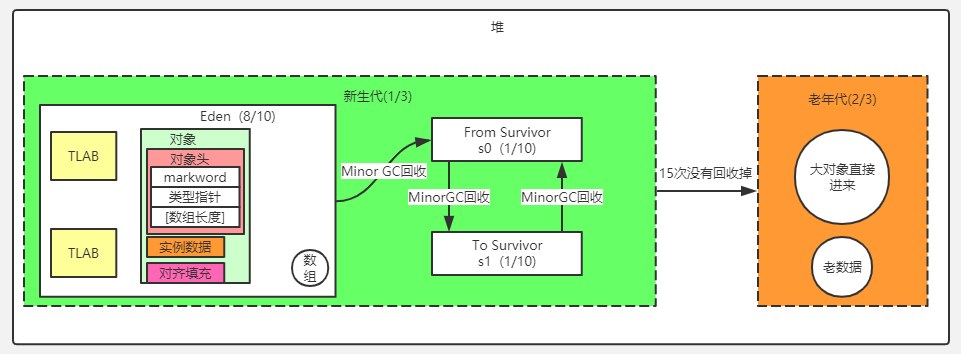

Java 堆在虚拟机启动时创建，唯一目的就是**存放对象实例** 以及 数组

（1）从内存回收的角度来看，Java 堆是垃圾收集器管理的主要区域：

> - 由于目前的垃圾收集器都采用分代收集算法，因此 Java 堆中还可细分为：新生代和老年代，默认占比为`Young:Old = 1:2`。
> - 同时新生代中采用复制算法，将新生代分为三个区域，默认占比为：`Eden:from:to=8:1:1`

（2）从内存分配的角度来看，线程共享的 Java 堆中可能划分出多个线程私有的分配缓冲区（Thread Local Allocation Buffer）

### 4.方法区

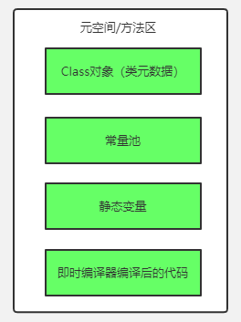

方法区用于存储已被虚拟机加载的类信息（即 Class 对象）、常量（位于常量池）、静态变量、即时编译器编译后的代码等数据。

对于 HotSpot 虚拟机来说，也称为“永久代”（Permanent Generation）

方法区的变化：

> - jdk1.6 及以前：有永久代，常量池在方法区中
> - jdk1.7：有永久代，但已逐步“去永久代”，常量池转移到堆中
> - jdk1.8 及之后：无永久代，常量池在元空间中

## 二、HotSpot 虚拟机对象探秘

### 1.对象的内存结构

在 HotSpot 虚拟机中，对象的内存布局可分为：对象头、实例数据、对齐填充

对象头分为：

> - `MarkWord`：存储对象自身的运行时数据，如哈希码、GC 分代年龄、锁状态标志、偏向线程 ID 等
> - 类型指针：即对象指向它的类元数据的指针，并不是所有的虚拟机实现都必须在对象数据上保留类型指针。
> - 数组长度：如果对象是数组，则对象头中还必须有一块用于记录数组长度的数据

实例数据，也即字段内容：

> - **存储顺序**：存储顺序会受到虚拟机分配策略参数（FieldsAllocationStyle）和字段在 Java 源码中定义顺序的影响
>   - 相同宽度的字段总是被分配在一起
>   - 在父类中定义的变量会出现在子类之前

对齐填充

> 仅仅起到占位符的作用：由于 HotSpot VM 的自动内存管理系统要求对象起始地址必须是 8 字节的整数倍，也即对象的大小必须是 8 字节的整数倍。而对象头正好是 8 字节的整数倍（1 倍或者 2 倍），因此对象实例数据部分没有对齐时，就需要通过对齐填充来补全。

### 2.对象的访问定位

Java 程序通过栈帧中局部变量表中的 reference 数据来操作堆上的具体对象。

由于**reference**类型在 Java 虚拟机规范中规定了一个**指向对象的引用**，并没有定义这个引用应该通过何种方式去定位、访问堆中的对象的具体位置，所以**对象访问方式也是取决于虚拟机实现而定的**。

目前主流的访问方式有使用句柄和直接指针两种：

（1）直接指针

如果使用直接指针访问，那么 Java 堆对象的布局中就必须考虑如何放置类型数据的相关信息（对 HotSpot 虚拟机而言，也即对象头中需要存放类型指针），而 reference 中存储的直接就是对象地址。

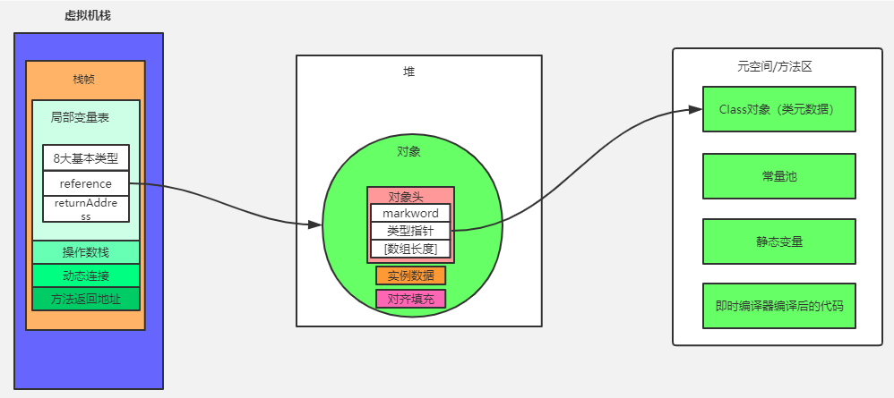

HotSpot 虚拟机就是使用此种方式，使用直接指针访问方式的最大好处就是速更快。

（2）使用句柄

如果使用句柄访问，那么 Java 堆中将会划分一块内存来作为句柄池，reference 中存储的就是对象的句柄地址，而句柄中包含了对象实例数据与类型数据各自的具体地址信息。

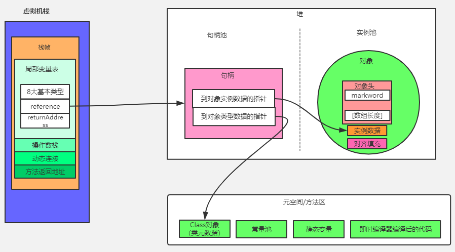

### 3.对象的创建

对象创建的流程如上图所示：

（1）new 指令

> 虚拟机遇到一条 new 指令时，会进行类加载检查

（2）类加载检查

> 首先检查这个指令的参数能否能在常量池中定位到一个类的符号引用，并且检查这个符号引用代表的类是否已被加载、解析和初始化过。如果没有，那必须先执行相应的类加载过程。

（3）对象堆内存分配

在类加载检查通过后，接下来虚拟机将为新生对象分配内存；

对象所需内存的大小在类加载完成后便可确定，为对象分配空间的任务等同于把一块确定大小的内存从 Java 堆中划分出来。

> - 有两种内存分配方式：
>   - **指针碰撞**：要求堆规整，也即要求垃圾收集器带有压缩整理的功能，具体有 Serial、ParNew
>   - **空闲列表**：不要求堆规整，像 CMS 这种基于 Mark-Sweep 算法的收集器，通常采用空闲列表
> - 线程安全问题的两种解决方案：
>   - **CAS+失败重试**：对分配内存空间的动作进行同步处理——实际上虚拟机采用 CAS 配上失败重试的方式保证更新操作的原子性
>   - **TLAB**：将内存分配的动作放在线程本地空间中进行，即每个线程在 Java 堆中预先分配一小块内存，称为本地线程分配缓冲（Thread Local Allocation Buffer）。哪个线程要分配内存，就在哪个线程的 TLAB 上分配，只有 TLAB 用完并分配新的 TLAB 时，才需要同步锁定。

（4）初始化为零值

> 将对象实例数据初始化为零值

（5）对象头设置

> 设置对象头，例如如何才能找到类的元数据信息（类型指针）、对象的哈希码（MarkWord）、对象的分代 GC 年龄（MarkWord）、是否启用偏向锁（MarkWord）等

（6）执行`<init>`方法

> 即执行对象的构造方法

## 三、类加载机制

虚拟机把描述类的数据从 Class 文件加载到内存，并对数据进行校验、转换解析和初始化，最终形成可以被虚拟机直接使用的 Java 类型，这就是虚拟机的类加载机制

### 1.类的生命周期

类的整个生命周期包括 7 个阶段：加载、验证、准备、解析、初始化、使用和卸载，其中验证、准备、解析 3 个部分统称为连接。

### 2.类加载的时机

虚拟机规范严格规定了有且只有 5 种情况必须立即对类进行“初始化“（而加载、验证、准备自然需要在此之前开始）：

（1）遇到 `new`、`getstatic`、`putstatic` 或 `invokestatic` 这 4 条字节码指令时，如果类没有进行过初始化，则需要先触发其初始化

（2）使用 `java.lang.reflect` 包的方法对类进行反射调用的时候，如果类没有进行过初始化，则需要先触发其初始化。

（3）当初始化一个类的时候，如果发现其父类还没有进行过初始化，则需要先触发其父类的初始化。

（4）当虚拟机启动时，用户需要指定一个要执行的主类（包含 main() 方法的那个类），虚拟机会先初始化这个主类。

（5）当使用 JDK 1.7 的动态语言支持时，如果一个 `java.lang.invoke.MethodHandle` 实例最后的解析结果 `REF_getStatic`、`REF_putStatic`、`REF_invokeStatic`的方法句柄，并且这个方法句柄所对应的类没有进行过初始化，则需要先触发其初始化。

### 3.类加载过程

#### 3.1 加载

在加载阶段，虚拟机需要完成以下 3 件事情：

1）通过一个类的全限定名来获取定义此类的二进制字节流。
2）将这个字节流所代表的静态存储结构转化为方法区的运行时数据结构。
3）在内存中生成一个代表这个类的 `java.lang.Class`对象（存在方法区），作为方法区这个类的各种数据的访问入口。

加载与连接阶段的部分内容是交叉进行的

这两个阶段的开始时间保持固定的先后顺序

#### 3.2 验证

验证的目的是：为了确保 Class 文件的字节流中包含的信息符合当前虚拟机的要求，并且不会危害虚拟机自身的安全

主要进行如下验证动作：文件格式验证、元数据验证、字节码验证、符号引用验证

#### 3.3 准备

在方法区中，为类变量分配内存，并设置类变量初始零值

#### 3.4 解析

解析阶段是虚拟机将常量池内的符号引用替换为直接引用的过程，

> 符号引用：如全类名、字段描述符、方法描述符
>
> 直接引用：直接指向目标的指针、相对偏移量或是一个能间接定位到目标的句柄

解析动作主要针对类或接口、字段、类方法、接口方法、方法类型、方法句柄和调用点限定符 7 类符号引用进

#### 3.5 初始化

初始化阶段是执行类构造器`<clinit>()`方法的过程

> - `<clinit>()`方法是由编译器自动收集类中的所有 **类变量的赋值动作** 和 **静态语句块**（`static{}`）中的语句合并产生的，编译器收集的顺序是由语句在源文件中出现的顺序所决定的，静态语句块中只能访问到定义在静态语句块之前的变量，定义在它之后的变量，在前面的静态语句块可以赋值，但是不能访问
> - 虚拟机会保证在子类的 `<clinit>()` 方法执行之前，父类的`<clinit>()` 方法已经执行完毕

### 4.类加载器的双亲委派模型

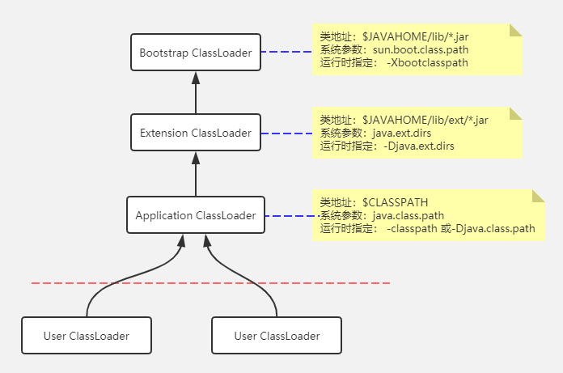

双亲委派模型的工作过程是：

> 如果一个类加载器收到了类加载的请求，它首先不会自己去尝试加载这个类，而是把这个请求委派给父类加载器去完成，每一个层次的类加载器都是如此，因此所有的加载请求最终都应该传送到顶层的启动类加载器中，只有当父加载器反馈自己无法完成这个加载请求（它的搜索范围中没有找到所需的类）时，子加载器才会尝试自己去加载。

## 四、垃圾回收机制

### 1.对象存活判定算法

#### 1.1 引用计数法

给对象中添加一个引用计数器，每当有一个地方引用它时，计数器值就加 1；当引用失效时，计数器值就减 1；任何时刻计数器为 0 的对象就是不可能再被使用

引用计数法判定效率高，但很难解决对象之间相互循环引用的问题。

#### 1.2 可达性分析法

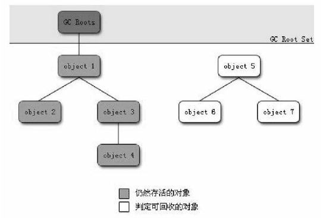

通过一系列的称为`GC Roots`的对象作为起始点，从这些节点开始向下搜索，搜索所走过的路径称为引用链（Reference Chain），当一个对象到 `GC Roots`没有任何引用链相连时，则证明此对象是不可用的

引用：

> 强引用：不回收
>
> 软引用：内存溢出前回收
>
> 弱引用：下一次垃圾收集时回收

### 2.垃圾收集算法

#### 2.1 标记-清除

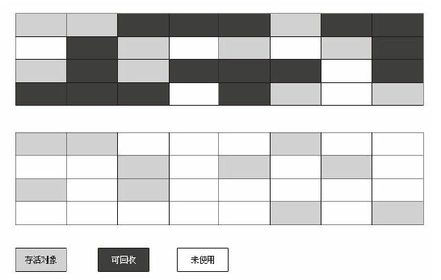

标记：标记出所有不可达的对象

清除：在标记完成后统一回收所有被标记的对象

不足：（1）效率低 （2）标记清除后产生大量空间碎片

#### 2.2 复制

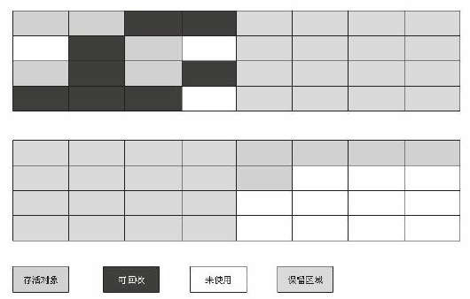

将可用内存按容量划分为大小相等的两块，每次只使用其中的一块。当这一块的内存用完了，就将还存活着的对象复制到另外一块上
面，然后再把已使用过的内存空间一次清理掉

#### 2.3 标记整理算法

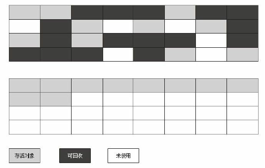

标记：标记出所有不可达的对象

整理：让所有存活对象向一端移动，然后直接清除掉端边界以外的内存

#### 2.4 分代收集算法

根据对象存活周期的不同将内存划分为几块。一般是把 Java 堆分为新生代和老年代，这样就可以根据各个年代的特点采用最适当的收集算法。

> - 在**新生代**中，每次垃圾收集时都发现有大批对象死去，只有少量存活，那就选用**复制算法**，只需要付出少量存活对象的复制成本就可以完成收集。
> - 而**老年代**中因为对象存活率高、没有额外空间对它进行分配担保，就必须使用**“标记—清理”**或者**“标记—整理”**算法来进行回收。

### 3.内存分配与回收策略

#### 3.1 内存分配与回收策略

对象的内存分配，往大方向讲，就是在堆上分配（例外：逃逸分析）。

同时还需记住一点：分配的规则并不是百分之百固定的，其细节取决于当前使用的是哪一种垃圾收集器组合，还有虚拟机中与内存相关的参数的设置。

（1）对象优先在 TLAB 上分配

> 如果启动了线程本地分配缓冲，将按线程优先在 TLAB 上分配

（2）对象优先在 Eden 分配

> 大多数情况下，对象在新生代 Eden 区中分配。当 Eden 区没有足够空间进行分配时，虚拟机将发起一次 MinorGC。

（3）大对象直接进入老年代

> 虚拟机提供了一个`-XX：PretenureSizeThreshold`参数，令大于这个设置值的对象直接在老年代分配。这样做的目的是避免在 Eden 区及两个 Survivor 区之间发生大量的内存复制

（4）长期存活的对象进入老年代

> - **年龄计数**：虚拟机给每个对象定义了一个对象年龄（Age）计数器，对象每经历一次`Minor GC` ，年龄就加 1，当它的年龄增加到一定程度（默认为 15 岁），就将会被晋升到老年代中。
> - **年龄阈值**：对象晋升老年代的年龄阈值，可以通过参数`-XX：MaxTenuringThreshold`设置。
> - **动态对象年龄判定**：如果在`Survivor`空间中相同年龄所有对象大小的总和大于`Survivor`空间的一半，年龄大于或等于该年龄的对象就可以直接进入老年代，无须等到`MaxTenuringThreshold`中要求的年龄。

（5）空间分配担保

生`Minor GC`在发之前，虚拟机会先检查**老年代最大可用的连续空间是否大于新生代所有对象总空间**；

> - 如果大于，那么`Minor GC` 可以确保是安全的。
> - 如果不成立，则虚拟机会 **查看 `HandlePromotionFailure` 设置值是否允许担保失败**。
>   - 如果允许，那么会继续检查 **老年代最大可用的连续空间是否大于历次晋升到老年代对象的平均大小**，如果大于，将尝试着进行一次`Minor GC`，尽管这次`Minor GC`是有风险的；
>   - 如果小于，或者`HandlePromotionFailure`设置不允许冒险，那这时也要改为进行一次`Full GC`

也就是说，如果`Minor GC`不安全，虚拟机就进行 `Full GC`

#### 3.2 Minor GC 与 Full GC 触发条件

> - 新生代 GC（`Minor GC`）：发生在新生代的垃圾收集动作。因为 Java 对象大多都具备朝生夕灭的特性，所以 Minor GC 非常频繁，一般回收速度也比较快。
> - 老年代 GC（`Major GC/Full GC`）：指发生在老年代的 GC，出现了 Major GC，经常会伴随至少一次的 Minor GC（但非绝对的，在`Parallel Scavenge`收集器的收集策略里就有直接进行 Major GC 的策略选择过程）。Major GC 的速度一般会比 Minor GC 慢 10 倍以上。

> 参考：[Minor GC ，Full GC 触发条件是什么？](https://www.jianshu.com/p/1196cf7cb8b8)

**Minor GC 触发条件：**

> 当 Eden 区满时，触发 Minor GC

**Full GC 触发条件：**

（1）System.gc()方法的调用

（2）老年代空间不足

（3）方法区空间不足

（4）通过 Minor GC 后进入老年代的平均大小大于老年代的可用内存

（5）由 Eden 区、From Space 区向 To Space 区复制时，对象大小大于 To Space 可用内存，则把该对象转存到老年代，且老年代的可用内存小于该对象大小

## 易混点

### 1.TLAB 的精确位置

引用 https://dzone.com/articles/thread-local-allocation-buffers 文中一句：

> TLAB stands for Thread Local Allocation Buffer and it is a region inside Eden, which is exclusively assigned to a thread

因此是在新生代 Eden 区

### 2.Class 对象位于方法区还是堆？

> - [JDK 1.8 下的 java.lang.Class 对象和 static 成员变量在堆还是方法区？](https://blog.csdn.net/Xu_JL1997/article/details/89433916)

`JDK 1.8` 中，static 成员变量位于`java.lang.Class` 对象内，而`java.lang.Class` 对象都位于堆（Heap）中。

### 3. major gc 和 full gc 有什么区别？

> https://plumbr.io/handbook/garbage-collection-in-java#metaspace

我们应该关注于当前 GC 是否 stop the world，而并不是字面意思

## 参考资料

### 书籍参考

> - [《深入理解 Java 虚拟机》](https://item.jd.com/11252778.html)

### 画图参考

1. https://www.processon.com/view/5c749debe4b0f9fba6921d15
2. https://www.processon.com/view/5c8860fbe4b02ce2e88bc422
3. https://www.processon.com/view/562eed2fe4b0f7ab0e7f7b4b
4. https://www.processon.com/view/5d28ab5ce4b0878e40b01dc5
5. https://www.processon.com/view/5d88eef8e4b00c785f348288
6. https://www.processon.com/view/57220a6de4b08d6d334dec42
7. https://www.processon.com/view/5be0fed2e4b0aadfb77c369c
8. https://www.processon.com/view/5d7eebade4b01cbe9933fd86
9. https://www.processon.com/view/5b7d123de4b015327abb63d9

类加载：

https://www.processon.com/view/5ac2343fe4b0cf24e96521c0

https://www.processon.com/view/5793117ee4b0d617ce2f8410

### 待读

- [The Java® Virtual Machine Specification](https://docs.oracle.com/javase/specs/jvms/se13/html/index.html)
- [Understanding JVM Internals](https://www.cubrid.org/blog/understanding-jvm-internals/)
