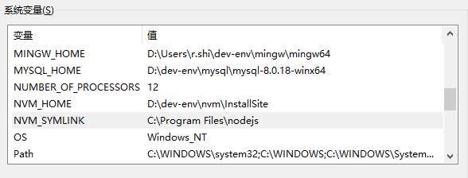

# NodeJs环境搭建

[toc]

## 推荐阅读

## 一、NodeJs环境搭建

首先先来弄懂几个概念：

> - npm (全称：node package manager) 是Node.js 的包管理工具；
> - nvm (全称：node versions manager) 是node版本管理工具，为了解决node各种版本存在不兼容现象；
> - nrm (全称：node registry manager) 主要是用来管理 npm中镜像地址的；
> - npx 主要是用来调用项目内部安装的模块;

要搭建NodeJS的开发环境，我们可以

> - （1）先安装nvm，然后通过nvm来安装NodeJs，通常安装NodeJs时便会自动安装npm和node
> - （2）再安装nrm，用于切换npm包的镜像源

### 1.安装 nvm  和  node

#### 1.1下载并安装 nvm

（1）前往GitHub [coreybutler/nvm-windows](https://github.com/coreybutler/nvm-windows) 下载最新版安装包。

（2）运行安装程序，除了设置个自定义安装目录，其余一路Next.

安装时，程序会自动配置环境变量，可以看到配置了两个环境变量



这两个目录，一个是 nvm 的安装目录，一个是node的版本库目录。

（3）然后检查是否安装完成：

```bash
$ nvm version
1.1.7
```

#### 1.2 安装 node

（1）执行如下命令：

```bash
nvm list available          # 列出nodejs的可用版本
nvm install v14.17.6        # 安装 指定版本的nodejs (v可要可不要，自己选一个版本进行安装)
nvm use v14.17.6   		  	# 使用指定版本的nodejs
nvm alias default v14.17.6  # 设置默认版本，macOS系统的use指令只是临时切换
nvm uninstall v14.17.6      # 删除指定版本的nodejs
nvm ls					  # 查看本地所有版本
```

这样我们就安装好了版本为 `14.17.0` 的 node.

（2）然后执行如下命令，验证当前使用的node版本

```bash
$ node -v
v14.17.6
```

#### 1.3 nvm 常用命令

```bash
nvm list available          # 列出nodejs的可用版本
nvm ls					  # 查看本地所有版本

nvm install latest          # 安装最新版本的nodejs
nvm install v14.17.6        # 安装 指定版本的nodejs (v可要可不要，自己选一个版本进行安装)
nvm uninstall v14.17.6      # 删除指定版本的nodejs

nvm use v14.17.6   		  	# 使用指定版本的nodejs
nvm alias default v14.17.6  # 设置默认版本，macOS系统的use指令只是临时切换
```

#### 1.4 切换node版本

如果想切换node版本，则需先通过mvn安装目标版本node，然后再使用目标版本node，对应如下命令：

```bash
nvm install 版本 
nvm use 版本
```

若安装后出现如下报错，则安装时可带上位数：

```bash
$ node -v
winpty: error: cannot start 'D:/Users/ray/dev-env/nodejs/install-site/node.exe -v': %1 不是有效的 Win32 应用程序。 (error 0xc1)
```

```bash
## 安装和使用的时候带上位数
nvm install v14.17.6 64
nvm use v14.17.6 64
```

### 2.安装nrm

在使用 npm 的过程中，可能插件安装速度比较慢，我们可能会使用淘宝源对插件进行下载安装。或者在公司内部，有一些私有的插件，需要使用公司的源才可以下载。这种情况，我们就需要设置不同的源来进行下载。通过nrm就可以方便在这些不同的源之间切换。

#### 2.1 安装nrm

```bash
# 全局安装 nrm
$ npm install nrm -g
```

然后验证下版本

```bash
$ nrm --version
1.2.5
```

#### 2.2 nrm常用命令

使用 `npm help` 可查看命令清单

```bash
nrm ls   			      # 列出本地所有镜像源（nrm自带的 + 自定义设置的）
nrm use <registry>         # 使用指定镜像源
nrm add <registry> <url>   # 添加自定义镜像源
nrm del <registry>         # 添加自定义镜像源
nrm test [registry]    	   # 显示特定或所有镜像源的响应时间,可以用来检测使用哪个镜像源快速下载安装包
```

#### 2.3 使用淘宝镜像源

```bash
# 列出本地所有镜像源（nrm自带的 + 自定义设置的）
$ nrm ls
  npm ---------- https://registry.npmjs.org/
  yarn --------- https://registry.yarnpkg.com/
  tencent ------ https://mirrors.cloud.tencent.com/npm/
  cnpm --------- https://r.cnpmjs.org/
* taobao ----- https://registry.npm.taobao.org/               # 其中 * 指示着当前使用的源
  npmMirror ---- https://skimdb.npmjs.com/registry/
  
# 切换镜像源
$ nrm use npm
```

添加自定义源：

```bash
# 我们先删除taobao镜像源，然后再添加taobao镜像源
$ nrm del taobao
 
# 添加自定义镜像源
$ nrm add taobao https://registry.npm.taobao.org/  

# 测试镜像源速度
$ nrm test taobao
```
