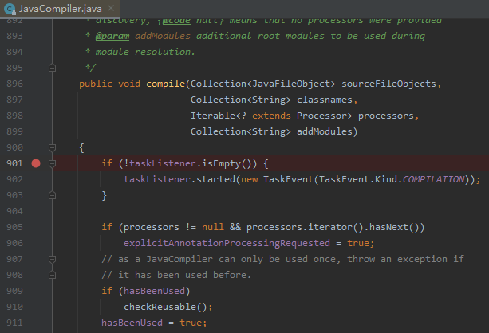
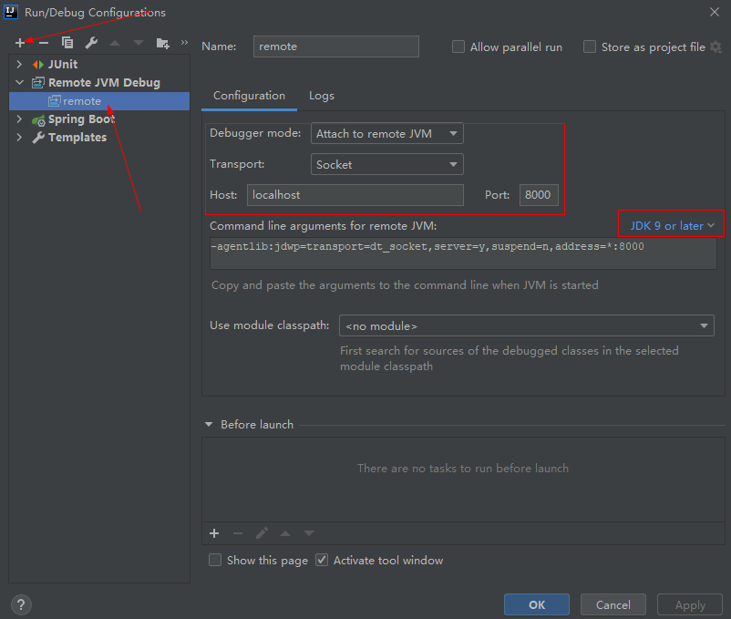
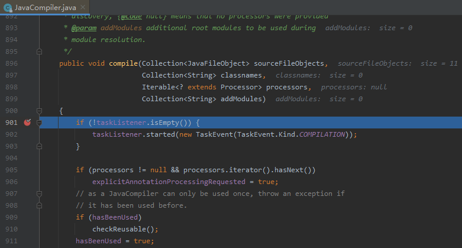
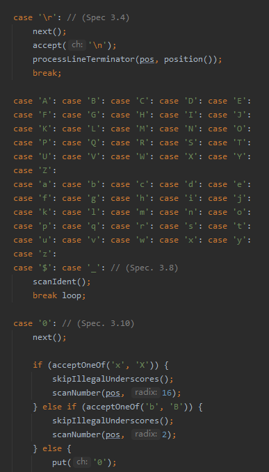
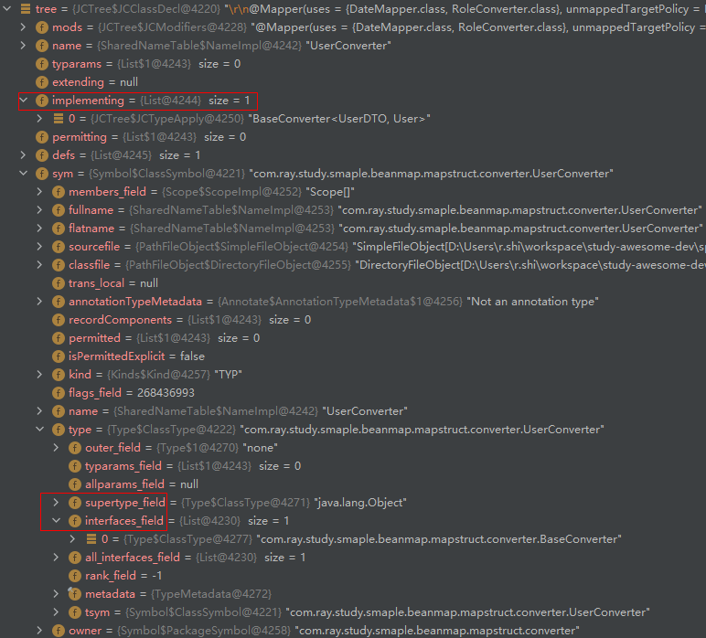

# Java编译器源码解析

[toc]

## 推荐阅读

> - [10 | Java 编译器（二）：语法分析之后，还要做些什么？](http://65.49.135.49/geek/geek/144-%E7%BC%96%E8%AF%91%E5%8E%9F%E7%90%86%E5%AE%9E%E6%88%98%E8%AF%BE/10%E4%B8%A8Java%E7%BC%96%E8%AF%91%E5%99%A8%EF%BC%88%E4%BA%8C%EF%BC%89%EF%BC%9A%E8%AF%AD%E6%B3%95%E5%88%86%E6%9E%90%E4%B9%8B%E5%90%8E%EF%BC%8C%E8%BF%98%E8%A6%81%E5%81%9A%E4%BA%9B%E4%BB%80%E4%B9%88%EF%BC%9F.html)
> - [《深入理解 JVM 虚拟机》](https://item.jd.com/1069428318.html)
> - [《深入解析 Java 编译器》](https://item.jd.com/12794094.html)

## 一、环境说明

> - jdk: open-jdk-16

最开始是用 JDK1.8，但是 Debug 的时候只能看到反编译后的代码，太痛苦了，而在 jdk9 模块化之后，tools.jar 包被放进了 java 的源码包下，所以为了方便看源码 Debug，后来又将 jdk 改成了 open-jdk-16。

## 二、JSR 269 入门示例

我们先来看两个 JSR269 插入式注解处理器的示例，因为插入式注解处理器是在编译时进行的，可以先又插入式注解处理器的使用过渡到编译流程分析。

推荐阅读：

> - [https://jcp.org/en/jsr/detail?id=269](https://jcp.org/en/jsr/detail?id=269)
> - [动手实现 Lombok](https://lilu.org.cn/2020/12/19/javaee/lombok/impl-simple-lombok/)
> - [Java-JSR-269-插入式注解处理器](https://liuyehcf.github.io/2018/02/02/Java-JSR-269-%E6%8F%92%E5%85%A5%E5%BC%8F%E6%B3%A8%E8%A7%A3%E5%A4%84%E7%90%86%E5%99%A8/)
> - [基于 APT(注解处理器)实现 Lombok 的@getter @setter @toString 功能](https://nicky-chin.cn/2019/05/03/apt_lombok_implement/)
> - [插入式注解处理 API（JSR269）介绍](https://mouse0w0.github.io/2018/11/28/Introduce-to-Pluggable-Annotation-Processing-API/)
> - [【JSR269 实战】之编译时操作 AST，修改字节码文件，以实现和 lombok 类似的功能](https://blog.csdn.net/justry_deng/article/details/106176181)
> - [动态的 Java - 无废话 JavaCompilerAPI 中文指南](http://pfmiles.github.io/blog/dynamic-java/)
> - [Javac 早期(编译期)](https://www.cnblogs.com/wade-luffy/p/6050331.html)

### 1.JSR 269 概述

Java 在 JDK1.5 版本中提供了对注解（Annotation）的支持，于是我们就可以先定义并使用注解，然后在运行期通过反射获取注解信息来进行注解处理。

而后在 JDK1.6 版本中又提供了插入式注解处理 API（PluggableAnnotationProcessingAPI）（JSR269），从此我们便可以先定义并使用注解，然后由 Java 编译器在编译期调用我们自定义的注解处理器来进行注解处理。

注解处理器相当于 Java 编译器留给我们的一个编译时的扩展点，相当于 Java 编译器的一个插件，因此称为插入式注解处理器，它是在编译期执行的，所以并不需要 Java 虚拟机的参与。

插入式注解处理器是在编译时通过 Java 提供的 `java.util.ServiceLoader`工具类来加载的。

ServiceLoader 会加载`resources/META-INF/services`目录下的接口文件，接口文件的文件名为接口全类名，文件内容是接口的实现类的全类名列表。例如：


插入式注解处理器的接口为`javax.annotation.processing.Processor`，而我们自定义的注解处理器`com.ray.study.sample.simple.lombok.annotation.processor.DataAnnotationProcessor`就实现了这个接口


### 2.通过插入式注解处理器实现简易的 Lombok

Lombok 就是借助插入式注解处理器来实现的，以下工程使用 JSR269 插入式注解实现了 Lombok 生成 Getter/Setter 方法的工具：

> 源码：[shirayner/jsr269-in-action](https://github.com/shirayner/jsr269-in-action)

### 3.MapStruct 使用入门

我们先来看一下 MapStruct 的使用入门，可见如下工程：

> - 源码：[shirayner/spring-boot-sample/sample-beanmap-mapstruct](https://github.com/shirayner/spring-boot-sample/tree/master/sample-beanmap/sample-beanmap-mapstruct)
> - 教程：

下文的 Java 编译器的源码分析就是基于 MapStruct 的使用入门的工程来进行的（这是由于当时正在进行 MapStruct 的源码分析，而这就自然而然地延伸到了 Java 编译器分析，于是就有了这两篇文章）。

## 三、Javac 编译概述

### 1.概述

```plantuml
@startuml
file ".java" as javaFile
file ".class" as classFile
file "二进制机器码" as MachineCodeFile
rectangle "前端编译器" as JavacCompiler {
    rectangle "解析与填充符号表" as ParseAndEnter
    rectangle "注解处理" as AnnotationProcessing
    rectangle "分析与字节码生产" as AnalyseAndGenerate
}
rectangle "即时编译器" as JITCompiler
rectangle "AOT编译器" as AOTCompiler
rectangle "解释器" as Interpreter


ParseAndEnter  --> AnnotationProcessing
AnnotationProcessing -> AnalyseAndGenerate

javaFile  --> JavacCompiler
JavacCompiler  --> classFile : 编译
classFile  --> JITCompiler
JITCompiler  --> MachineCodeFile: 编译

javaFile --> AOTCompiler
AOTCompiler --> MachineCodeFile

classFile --> Interpreter: 解释执行

@enduml
```

Java 语言的“编译期”其实是一段“不确定”的操作过程，因为它可能是指一个前端编译器（其实叫“编译器的前端”更准确一些）把*.java 文件转变成*.class 文件的过程；也可能是指虚拟机的后端运行期编译器（JIT 编译器，Just In Time Compiler）把字节码转变成机器码的过程；还可能是指使用静态提前编译器（AOT 编译器，Ahead Of Time Compiler）直接把\*.java 文件编译成本地机器代码的过程。

下面列举了这 3 类编译过程中一些比较有代表性的编译器。

> - 前端编译器：Sun 的 Javac、Eclipse JDT 中的增量式编译器（ECJ）。
> - JIT 编译器：HotSpot VM 的 C1、C2 编译器。
> - AOT 编译器：GNU Compiler for the Java（GCJ）、Excelsior JET。

Javac 编译器的编译过程大致如下：

```plantuml
@startuml

start
partition "解析与填充符号表" {
    :程序源码;
    ->词法分析;
    :单词流;
    ->语法分析;
    :抽象语法树;
    :填充符号表;
}

partition "注解处理" {
    :初始化插入式注解处理器;
    :获取注解;
    :调用注解处理器处理注解;
}

partition "语义分析与字节码生成" {
    :标注检查;
    :数据与流程控制分析;
    :解语法糖;
    :字节码生成;
}


@enduml
```

在枚举类`com.sun.tools.javac.comp.CompileStates`中定义了整个流程：

```java

 public enum CompileState {
        INIT(0),     //初始化
        PARSE(1),    //词法和语法分析
        ENTER(2),    //建立符号表
        PROCESS(3),  //处理注解
        ATTR(4),     //属性计算
        FLOW(5),     //数据流分析
        TRANSTYPES(6),    //去除语法糖：泛型处理
        TRANSPATTERNS(7), //去除语法糖：模式匹配处理
        UNLAMBDA(8),      //去除语法糖：Lambda表达式处理(转换成方法)
        LOWER(9),         //去除语法糖：内部类、foreach循环、断言等
        GENERATE(10);     //生成字节码
 }
```

### 2.编译的入口

（1）通过 `com.sun.tools.javac.Main` 来编译 java 文件

> - 参考： [程序员实用 JDK 小工具归纳，工作用得到](https://www.cnblogs.com/huaweiyun/p/13071560.html)

javac 命令是收录于 JDK 中的 Java 语言编译器，可以将后缀名为.java 的源文件编译为后缀名为.class 的可以运行于 Java 虚拟机的字节码文件。比如有如下 java 源文件：

```java
//Hello.java
public class Hello{
    public static void main(String[] args)throws Exception{
        while(true){
            test1();
            Thread.sleep(1000L);
        }
    }
    public static void test1(){
        test2();
    }
    public static void test2(){
        System.out.println("invoke test2");
    }
}
```

可以通过 javac 命令来编译.java 源文件文件得到.class 字节码文件：

```bash
javac Hello.java
```

而当我们在命令行使用 javac 命令来编译 Java 文件时，实际上内部是调用的 `%JAVA_HOME%/lib/tools.jar`（在 Java9 之后，直接被包含在 Java 的 src，而不是以扩展 jar 包的形式引用）的`com.sun.tools.javac.Main#main`方法来启动编译过程，所以我们也可以通过如下方法来编译源文件：

```bash
java -cp tools.jar com.sun.tools.javac.Main Hello.java
```

两者等效，都可以编译源文件

（2）编译的入口为 JavaCompiler

这里以 Javac 命令为例，程序首先会进入到 `com.sun.tools.javac.Main#main`

```java
// com.sun.tools.javac.Main
@Exported
public class Main {
    public Main() {
    }

    // 这就是一个正常的main方法
    public static void main(String[] var0) throws Exception {
        System.exit(compile(var0));
    }

    public static int compile(String[] var0) {
        com.sun.tools.javac.main.Main var1 = new com.sun.tools.javac.main.Main("javac");
        return var1.compile(var0).exitCode;
    }

    public static int compile(String[] var0, PrintWriter var1) {
        com.sun.tools.javac.main.Main var2 = new com.sun.tools.javac.main.Main("javac", var1);
        return var2.compile(var0).exitCode;
    }
}
```

然后会经过 `com.sun.tools.javac.main.Main#compile`方法，在此方法中会调用 `com.sun.tools.javac.main.JavaCompiler#compile`。

```java
    /**
     * Main method: compile a list of files, return all compiled classes
     *
     * @param sourceFileObjects file objects to be compiled
     * @param classnames class names to process for annotations
     * @param processors user provided annotation processors to bypass
     * discovery, {@code null} means that no processors were provided
     * @param addModules additional root modules to be used during
     * module resolution.
     */
    public void compile(Collection<JavaFileObject> sourceFileObjects,
                        Collection<String> classnames,
                        Iterable<? extends Processor> processors,
                        Collection<String> addModules)
    {
        ...
        // 准备过程：初始化插入式注解处理器，最终是通过ServiceLoader获取所有Processor.class的实现类
        initProcessAnnotations(processors, sourceFileObjects, classnames);

        // These method calls must be chained to avoid memory leaks
        // 2. 执行注解处理
        processAnnotations(
            // 1.2 填充符号表
            enterTrees(
                    stopIfError(CompileState.ENTER,
                            initModules(stopIfError(CompileState.ENTER,
                                // 1.1 词法分析、语法分析，从而构建出一棵AST抽象语法树，sourceFileObjects即为Java源文件在内存中的表示
                                parseFiles(sourceFileObjects))))
            ),
            classnames
        );
        ...

        if (!CompileState.ATTR.isAfter(shouldStopPolicyIfNoError)) {
            switch (compilePolicy) {
            ...
            case BY_TODO:
                while (!todo.isEmpty())
                    // 3.语义分析及字节码生成
                    generate(desugar(flow(attribute(todo.remove()))));
                break;
            ...
        }
```

若是在其他情况下，如 Maven、Idea、Eclipse 等的编译，可能会通过调用`com.sun.tools.javac.api.JavacTaskImpl`而最终进入到`com.sun.tools.javac.main.JavaCompiler#compile`，也就是说，JavaCompiler 就是编译的入口。

### 3.编译期 Debug

运行期的 Debug 我们都会，那么如何进行编译期的 Debug？可以借助 Maven 实现，如下所示：

（1）在指定项目下，执行 `mvnDebug clean compile`，这时maven会阻塞住，直到8000端口有连接进来

```bash
$ mvnDebug clean compile
Preparing to execute Maven in debug mode
Listening for transport dt_socket at address: 8000
```

（2）接着在`com.sun.tools.javac.main.JavaCompiler#compile`方法中打一个断点



（3）最后在 Idea 中, 创建一个 `Remote JVM Debug`, 并指定端口为前面的 `8000`



然后以 Debug 方式运行，程序便会停在断点处



## 四、JavaC 编译器源码分析

### 1.解析与填充符号表

#### 1.1 词法分析

词法分析是将源代码的字符流转变为 Token 集合，单个字符是程序编写过程的最小元素，而 Token 则是编译过程的最小元素，关键字、变量名、字面量、运算符都可以成为 Token。

词法、语法分析的入口为 parseFiles：

```java
   public List<JCCompilationUnit> parseFiles(Iterable<JavaFileObject> fileObjects, boolean force) {
       if (!force && shouldStop(CompileState.PARSE))
           return List.nil();

        // 解析所有java源文件，然后转换成AST先后向语法树, JCCompilationUnit继承自JCTree，即为抽象语法树
        //parse all files
        ListBuffer<JCCompilationUnit> trees = new ListBuffer<>();
        Set<JavaFileObject> filesSoFar = new HashSet<>();
        for (JavaFileObject fileObject : fileObjects) {
            if (!filesSoFar.contains(fileObject)) {
                filesSoFar.add(fileObject);
                // 解析源文件
                trees.append(parse(fileObject));
            }
        }
        return trees.toList();
    }

    public JCTree.JCCompilationUnit parse(JavaFileObject filename) {
        JavaFileObject prev = log.useSource(filename);
        try {
            // 此处 readSource 会获取源文件的源码内容
            JCTree.JCCompilationUnit t = parse(filename, readSource(filename));
            if (t.endPositions != null)
                log.setEndPosTable(filename, t.endPositions);
            return t;
        } finally {
            log.useSource(prev);
        }
    }

    protected JCCompilationUnit parse(JavaFileObject filename, CharSequence content) {
        long msec = now();
        JCCompilationUnit tree = make.TopLevel(List.nil());
        if (content != null) {
            if (verbose) {
                log.printVerbose("parsing.started", filename);
            }
            if (!taskListener.isEmpty()) {
                TaskEvent e = new TaskEvent(TaskEvent.Kind.PARSE, filename);
                taskListener.started(e);
                keepComments = true;
                genEndPos = true;
            }
            // 在构造 JavacParser 的时候会通过 com.sun.tools.javac.parser.Scanner 进行词法分析
            Parser parser = parserFactory.newParser(content, keepComments(), genEndPos,
                                lineDebugInfo, filename.isNameCompatible("module-info", Kind.SOURCE));
            // 语法分析：通过JavacParser进行语法分析，得到AST抽象语法树
            tree = parser.parseCompilationUnit();
            if (verbose) {
                log.printVerbose("parsing.done", Long.toString(elapsed(msec)));
            }
        }

        tree.sourcefile = filename;

        if (content != null && !taskListener.isEmpty()) {
            TaskEvent e = new TaskEvent(TaskEvent.Kind.PARSE, tree);
            taskListener.finished(e);
        }

        return tree;
    }

```

在构造 Parser 的时候会进行词法分析：

```java

public class ParserFactory {

    public JavacParser newParser(CharSequence input, boolean keepDocComments, boolean keepEndPos, boolean keepLineMap, boolean parseModuleInfo) {
        // 构造一个词法分析器Lexer，其实现类为`com.sun.tools.javac.parser.Scanner`
        Lexer lexer = scannerFactory.newScanner(input, keepDocComments);
        // 在 JavacParser 的构造方法中会进行词法分析
        return new JavacParser(this, lexer, keepDocComments, keepLineMap, keepEndPos, parseModuleInfo);
    }
}

```

先构造一个词法分析器 Lexer，其实现类为`com.sun.tools.javac.parser.Scanner`，其结构如下：

```java

public class Scanner implements Lexer {

    private Tokens tokens;

    /** The token, set by nextToken().
     */
    private Token token;

    /** The previous token, set by nextToken().
     */
    private Token prevToken;

    /** Buffer of saved tokens (used during lookahead)
     */
    private List<Token> savedTokens = new ArrayList<>();

    private JavaTokenizer tokenizer;


    public void nextToken() {
        prevToken = token;
        if (!savedTokens.isEmpty()) {
            token = savedTokens.remove(0);
        } else {
            token = tokenizer.readToken();
        }
    }
}

// 通过
public static class Token {

    /** tags constants **/
    enum Tag {
        DEFAULT,
        NAMED,
        STRING,
        NUMERIC;
    }

    /** The token kind */
    public final TokenKind kind;

    /** The start position of this token */
    public final int pos;

    /** The end position of this token */
    public final int endPos;

    /** Comment reader associated with this token */
    public final List<Comment> comments;
}

public class Tokens {

    private final Names names;

    /**
     * Keyword array. Maps name indices to Token.
     */
    private final TokenKind[] key;

    /**  The number of the last entered keyword.
     */
    private int maxKey = 0;

    /** The names of all tokens.
     */
    private Name[] tokenName = new Name[TokenKind.values().length];
}


```

在 JavacParser 的构造方法中，会使用 JavaTokenizer 进行词法分析，从而得到 Token 集合

```java
public class JavacParser implements Parser {

    protected JavacParser(ParserFactory fac,
                     Lexer S,
                     boolean keepDocComments,
                     boolean keepLineMap,
                     boolean keepEndPositions,
                     boolean parseModuleInfo) {
        this.S = S;
        nextToken(); // prime the pump
        ...
    }

    public void nextToken() {
        S.nextToken();
        token = S.token();
    }
}


public class Scanner implements Lexer {

    private Tokens tokens;

    /** The token, set by nextToken().
     */
    private Token token;

    /** The previous token, set by nextToken().
     */
    private Token prevToken;

    /** Buffer of saved tokens (used during lookahead)
     */
    private List<Token> savedTokens = new ArrayList<>();

    private JavaTokenizer tokenizer;


    public void nextToken() {
        prevToken = token;
        if (!savedTokens.isEmpty()) {
            token = savedTokens.remove(0);
        } else {
            // 词法分析，获取token集合
            token = tokenizer.readToken();
        }
    }
}

```

JavaTokenizer 中存储了源码的字符流，会挨个读取字符，判断其属于哪种 Token，在枚举类 TokenKind 中可以看到所有 Token 种类


词法分析的具体细节可见 `JavaTokenizer#readToken()`



#### 1.2 Javac 抽象语法树

（1） 抽象语法树的结构

```plantuml
@startuml

interface StatementTree extends Tree {}

abstract class JCTree implements Tree, Cloneable, DiagnosticPosition {

}

abstract class JCStatement extends JCTree implements StatementTree {

}

class JCCompilationUnit extends JCTree {

}

class JCPackageDecl extends JCTree  {
  List<JCAnnotation> annotations;
  JCExpression pid;
  PackageSymbol packge;
}

class JCImport extends JCTree {

}

class JCModifiers extends JCTree{

}

class JCClassDecl extends JCStatement  {
    JCModifiers mods; // 修饰符
    Name name;
    List<JCTypeParameter> typarams;
    JCExpression extending;
    List<JCExpression> implementing;
    List<JCExpression> permitting;
    List<JCTree> defs; // 方法和变量
    ClassSymbol sym;
}


@enduml
```

Java 源码在编译的时候，会被解析成一个语法树，这棵语法树就是 JCCompilationUnit，也就是一个编译单元。
其中这棵语法树根节点的子节点为包声明结点、Import 声明结点、类声明结点都是树的一级结点，例如：

```java
package com.ray.study.smaple.beanmap.mapstruct.dto; // 对应包声明结点 JCPackageDecl

import lombok.Data;  // 对应Import声明结点 JCImport

import java.util.List; // 对应Import声明结点 JCImport

/**
 * description
 *
 * @author r.shi 2021/5/26 15:37
 */

// 下面的所有代码对应JCClassDecl结点
@Data  // 注解 和 public 对应 修饰符结点 JCModifiers
public class UserDTO {
    private Long id;             // 对应变量声明结点 JCVariableDecl
    private String userName;     // 对应变量声明结点 JCVariableDecl
    private Boolean userStatus;  // 对应变量声明结点 JCVariableDecl
    private Long createTime;     // 对应变量声明结点 JCVariableDecl

    private List<RoleDTO> roles; // 对应变量声明结点 JCVariableDecl
}

```


（2）抽象语法树是如何生成的？

可以通过 `JCTree` 的工厂类 `com.sun.tools.javac.tree.TreeMaker` 生成

```java

public class TreeMaker implements JCTree.Factory {

    public JCClassDecl ClassDef(JCModifiers mods,
                                Name name,
                                List<JCTypeParameter> typarams,
                                JCExpression extending,
                                List<JCExpression> implementing,
                                List<JCExpression> permitting,
                                List<JCTree> defs)
    {
        JCClassDecl tree = new JCClassDecl(mods,
                                     name,
                                     typarams,
                                     extending,
                                     implementing,
                                     permitting,
                                     defs,
                                     null);
        tree.pos = pos;
        return tree;
    }

    public JCMethodDecl MethodDef(JCModifiers mods,
                               Name name,
                               JCExpression restype,
                               List<JCTypeParameter> typarams,
                               List<JCVariableDecl> params,
                               List<JCExpression> thrown,
                               JCBlock body,
                               JCExpression defaultValue) {
        return MethodDef(
                mods, name, restype, typarams, null, params,
                thrown, body, defaultValue);
    }
}
```

#### 1.3 语法分析

然后根据 Token 序列构造抽象语法树

```java

// JavacParser
public JCTree.JCCompilationUnit parseCompilationUnit() {

    Token firstToken = token;
    JCModifiers mods = null;
    boolean consumedToplevelDoc = false;
    boolean seenImport = false;
    boolean seenPackage = false;
    ListBuffer<JCTree> defs = new ListBuffer<>();
    if (token.kind == MONKEYS_AT)
        mods = modifiersOpt();

    // 1.包声明语法分析
    // PackageDeclaration = PACKAGE Ident { DOT [Annotations] Ident } ;
    if (token.kind == PACKAGE) {
        // 若遇到的 token 是 PACKAGE类型，
        int packagePos = token.pos;
        List<JCAnnotation> annotations = List.nil();
        seenPackage = true;
        if (mods != null) {
            checkNoMods(mods.flags & ~Flags.DEPRECATED);
            annotations = mods.annotations;
            mods = null;
        }
        nextToken();
        // 得到具体包名
        JCExpression pid = qualident(false);
        // 判断是否以 `;` 结尾，accept通过说明是正确的包声明语句
        accept(SEMI);
        // 构造包声明
        JCPackageDecl pd = toP(F.at(packagePos).PackageDecl(annotations, pid));
        attach(pd, firstToken.comment(CommentStyle.JAVADOC));
        consumedToplevelDoc = true;
        defs.append(pd);
    }

    boolean checkForImports = true;
    boolean firstTypeDecl = true;
    while (token.kind != EOF) {
        if (token.pos <= endPosTable.errorEndPos) {
            // error recovery
            skip(checkForImports, false, false, false);
            if (token.kind == EOF)
                break;
        }
        if (checkForImports && mods == null && token.kind == IMPORT) {
            // 2.import 声明语法分析
            // ImportDeclaration = IMPORT [ STATIC ] Ident { "." Ident } [ "." "*" ] ";"
            seenImport = true;
            defs.append(importDeclaration());
        } else {
            Comment docComment = token.comment(CommentStyle.JAVADOC);
            if (firstTypeDecl && !seenImport && !seenPackage) {
                docComment = firstToken.comment(CommentStyle.JAVADOC);
                consumedToplevelDoc = true;
            }
            if (mods != null || token.kind != SEMI)
                // 3.修饰符
                mods = modifiersOpt(mods);
            if (firstTypeDecl && token.kind == IDENTIFIER) {
                ModuleKind kind = ModuleKind.STRONG;
                if (token.name() == names.open) {
                    kind = ModuleKind.OPEN;
                    nextToken();
                }
                if (token.kind == IDENTIFIER && token.name() == names.module) {
                    if (mods != null) {
                        checkNoMods(mods.flags & ~Flags.DEPRECATED);
                    }
                    defs.append(moduleDecl(mods, kind, docComment));
                    consumedToplevelDoc = true;
                    break;
                } else if (kind != ModuleKind.STRONG) {
                    reportSyntaxError(token.pos, Errors.ExpectedModule);
                }
            }
            // 4.类型声明语法分析
            JCTree def = typeDeclaration(mods, docComment);
            if (def instanceof JCExpressionStatement)
                def = ((JCExpressionStatement)def).expr;
            defs.append(def);
            if (def instanceof JCClassDecl)
                checkForImports = false;
            mods = null;
            firstTypeDecl = false;
        }
    }

    // 构建toplevel根结点，并将包声明结点、Import声明结点、类型声明结点作为其子结点
    JCTree.JCCompilationUnit toplevel = F.at(firstToken.pos).TopLevel(defs.toList());
    if (!consumedToplevelDoc)
        attach(toplevel, firstToken.comment(CommentStyle.JAVADOC));
    if (defs.isEmpty())
        storeEnd(toplevel, S.prevToken().endPos);
    if (keepDocComments)
        toplevel.docComments = docComments;
    if (keepLineMap)
        toplevel.lineMap = S.getLineMap();
    this.endPosTable.setParser(null); // remove reference to parser
    toplevel.endPositions = this.endPosTable;
    return toplevel;
}

/** ClassOrInterfaceOrEnumDeclaration = ModifiersOpt
    *           (ClassDeclaration | InterfaceDeclaration | EnumDeclaration)
    *  @param mods     Any modifiers starting the class or interface declaration
    *  @param dc       The documentation comment for the class, or null.
    */
protected JCStatement classOrRecordOrInterfaceOrEnumDeclaration(JCModifiers mods, Comment dc) {
    if (token.kind == CLASS) {
        // 类声明语法分析
        return classDeclaration(mods, dc);
    } if (isRecordStart()) {
        return recordDeclaration(mods, dc);
    } else if (token.kind == INTERFACE) {
        // 接口声明语法分析
        return interfaceDeclaration(mods, dc);
    } else if (token.kind == ENUM) {
        // 枚举声明语法分析
        return enumDeclaration(mods, dc);
    } else {
        int pos = token.pos;
        List<JCTree> errs;
        if (token.kind == IDENTIFIER && token.name() == names.record) {
            checkSourceLevel(Feature.RECORDS);
            JCErroneous erroneousTree = syntaxError(token.pos, List.of(mods), Errors.RecordHeaderExpected);
            return toP(F.Exec(erroneousTree));
        } else {
            if (LAX_IDENTIFIER.accepts(token.kind)) {
                errs = List.of(mods, toP(F.at(pos).Ident(ident())));
                setErrorEndPos(token.pos);
            } else {
                errs = List.of(mods);
            }
            final JCErroneous erroneousTree;
            if (parseModuleInfo) {
                erroneousTree = syntaxError(pos, errs, Errors.ExpectedModuleOrOpen);
            } else {
                if (allowRecords) {
                    erroneousTree = syntaxError(pos, errs, Errors.Expected4(CLASS, INTERFACE, ENUM, "record"));
                } else {
                    erroneousTree = syntaxError(pos, errs, Errors.Expected3(CLASS, INTERFACE, ENUM));
                }
            }
            return toP(F.Exec(erroneousTree));
        }
    }
}

/** ClassDeclaration = CLASS Ident TypeParametersOpt [EXTENDS Type]
    *                     [IMPLEMENTS TypeList] ClassBody
    *  @param mods    The modifiers starting the class declaration
    *  @param dc       The documentation comment for the class, or null.
    */
protected JCClassDecl classDeclaration(JCModifiers mods, Comment dc) {
    int pos = token.pos;
    accept(CLASS);
    Name name = typeName();

    List<JCTypeParameter> typarams = typeParametersOpt();

    JCExpression extending = null;
    if (token.kind == EXTENDS) {
        nextToken();
        extending = parseType();
    }
    List<JCExpression> implementing = List.nil();
    if (token.kind == IMPLEMENTS) {
        nextToken();
        implementing = typeList();
    }
    List<JCExpression> permitting = permitsClause(mods, "class");
    List<JCTree> defs = classInterfaceOrRecordBody(name, false, false);
    JCClassDecl result = toP(F.at(pos).ClassDef(
        mods, name, typarams, extending, implementing, permitting, defs));
    attach(result, dc);
    return result;
}

```

#### 1.4 填充符号表

##### 1.4.1 符号表的数据结构

Javac 在编译过程中需要频繁查找被引用的符号，因此需要一定的结构来组织这些符号，这就是符号表。

符号一般都是与作用域关联的，Java 的作用域是嵌套的，这样 Javac 在实现过程中，可以通过 Scope 类来实现作用域的嵌套，然后将每个作用域中定义的符号分别保存到对应作用域的相关变量中，这样就可以通过遍历作用域的方式查找唯一的符号引用了。

作用域（Scope）大部分都以花括号分隔，同一个符号在不同的作用域中可能指向不同的实体。

Scope 类图如下：

```plantuml
@startuml
abstract class Scope {
    Symbol owner;
}

class WriteableScope extends Scope {

}

class ScopeImpl extends WriteableScope {
    int shared;
    ScopeImpl next; // 后继
    Entry[] table; // 符号表
    int hashMask;
    Entry elems; // 保存单链表中的首个Entry
    int nelems = 0; // 总数
}

class Entry {
    Symbol sym;
    Entry shadowed;
    Entry nextSibling;
    Entry prevSibling;
    ScopeImpl scope; // 所属作用域
}

@enduml

```

一个作用域内定义的多个符号存储在 table 数组中，由于 table 数组专门用来存储符号，因而也可以直接叫符号表。同一个作用域内定义的所有符号会形成单链表，elems 保存了这个单链表的首个 Entry 对象，nelems 保存了单链表中 Entry 对象的总数。

而符号的数据结构如下：

```plantuml
@startuml
class Symbol{
    Kind kind;
    Name name;
    Type type;
    Symbol owner;
    long flags_field; // 保存符号修饰符
    Completer completer;

}
abstract class TypeSymbol extends Symbol{}

class PackageSymbol extends TypeSymbol{}

class ClassSymbol extends TypeSymbol {}

class VarSymbol extends Symbol {}

class MethodSymbol extends Symbol {}

class OperatorSymbol extends MethodSymbol {}

@enduml
```

同时符号还会在`Symtab`中缓存起来：

```java
public class Symtab {
    ...
    private final Map<Name, Map<ModuleSymbol,ClassSymbol>> classes = new HashMap<>();
    private final Map<Name, Map<ModuleSymbol,PackageSymbol>> packages = new HashMap<>();
    ...

    /** Create a new toplevel or member class symbol with given name
     *  and owner and enter in `classes' unless already there.
     */
    public ClassSymbol enterClass(ModuleSymbol msym, Name name, TypeSymbol owner) {
        Assert.checkNonNull(msym);
        Name flatname = TypeSymbol.formFlatName(name, owner);
        ClassSymbol c = getClass(msym, flatname);
        if (c == null) {
            c = defineClass(name, owner);
            doEnterClass(msym, c);
        } else if ((c.name != name || c.owner != owner) && owner.kind == TYP && c.owner.kind == PCK) {
            // reassign fields of classes that might have been loaded with
            // their flat names.
            c.owner.members().remove(c);
            c.name = name;
            c.owner = owner;
            c.fullname = ClassSymbol.formFullName(name, owner);
        }
        return c;
    }
}


```

##### 1.4.2 符号表的填充过程

语法树除了包含前面已经填充好的语法树子节点 List，还包含作用域 Scope、包符号、Type 等属性，符号表的填充也就是填充语法树中的这些还未填充的属性


符号表填充的时序图如下：

```plantuml
@startuml

[-> JavaCompiler++: compile
JavaCompiler->JavaCompiler++:enterTrees
JavaCompiler->Enter++:main
Enter->Enter++: complete

' 向语法树中添加包或类符号
Enter->Enter++: 1.classEnter
Enter->JCCompilationUnit++: accept
JCCompilationUnit -> Enter++: visitTopLevel
' 递归创建包符号
Enter->Symtab++:enterPackage
return

' 填充
Enter->Symtab++:listPackageModules
Symtab->PackageSymbol++:members
PackageSymbol->PackageSymbol++:complete
PackageSymbol->ClassFinder++:complete
ClassFinder->ClassFinder++:fillIn
' 扫描用户目录下的类文件
ClassFinder->ClassFinder++:scanUserPaths
ClassFinder->ClassFinder++:fillIn
ClassFinder->ClassFinder++:includeClassFile
' 创建类符号
ClassFinder->Symtab++:enterClass
return
return
return
return
return
return
return
return
return


Enter->Enter++:classEnter
return
return
return

return

Enter->ClassSymbol++: 2.complete
ClassSymbol->TypeEnter++: complete
' 给语法树填充 ImportScope
TypeEnter ->ImportsPhase++: completeEnvs->runPhase
' 给语法树中的ClassSymbol填充 type 的 superType 和 interfaces
ImportsPhase->HierarchyPhase++: completeEnvs
HierarchyPhase->HeaderPhase++: completeEnvs
HeaderPhase->MembersPhase++: completeEnvs

return
return
return
return
return
return
return
return
return
return


@enduml
```

两个阶段

符号表的填充主要分为两个过程：

> - 填充包符号，并创建类符号本身，对于类符号内部的方法、成员属性，会在下一个阶段填充
> - 填充 ImportScope、type 和父类型以及接口、成员属性、成员方法

这两个过程主要由 `com.sun.tools.javac.comp.Enter`、`com.sun.tools.javac.comp.TypeEnter`、`com.sun.tools.javac.comp.MemberEnter`类来完成。

程序首先会进入到 `Enter#complete()`

```java

    /** Main method: enter classes from the list of toplevel trees, possibly
     *  skipping TypeEnter for all but 'c' by placing them on the uncompleted
     *  list.
     *  @param trees      The list of trees to be processed.
     *  @param c          The class symbol to be processed or null to process all.
     */
    public void complete(List<JCCompilationUnit> trees, ClassSymbol c) {
        annotate.blockAnnotations();
        ListBuffer<ClassSymbol> prevUncompleted = uncompleted;
        if (typeEnter.completionEnabled) uncompleted = new ListBuffer<>();

        try {
            // enter all classes, and construct uncompleted list
            // 阶段1
            classEnter(trees, null);

            // complete all uncompleted classes in memberEnter
            if (typeEnter.completionEnabled) {
                while (uncompleted.nonEmpty()) {
                    ClassSymbol clazz = uncompleted.next();
                    if (c == null || c == clazz || prevUncompleted == null)
                        // 阶段2
                        clazz.complete();
                    else
                        // defer
                        prevUncompleted.append(clazz);
                }

                if (!modules.modulesInitialized()) {
                    for (JCCompilationUnit cut : trees) {
                        if (cut.getModuleDecl() != null) {
                            unfinishedModules.append(cut);
                        } else {
                            typeEnter.ensureImportsChecked(List.of(cut));
                        }
                    }
                } else {
                    typeEnter.ensureImportsChecked(unfinishedModules.toList());
                    unfinishedModules.clear();
                    typeEnter.ensureImportsChecked(trees);
                }
            }
        } finally {
            uncompleted = prevUncompleted;
            annotate.unblockAnnotations();
        }
    }

```

进行阶段 1 前，语法树填充情况如下：


进行阶段 2 前，语法树填充情况如下：


完成阶段 2 后，语法树填充情况如下：


（1）阶段 1：创建包或类符号

```java
public class Enter extends JCTree.Visitor {
        @Override
    public void visitTopLevel(JCCompilationUnit tree) {
        // Assert.checkNonNull(tree.modle, tree.sourcefile.toString());

        JavaFileObject prev = log.useSource(tree.sourcefile);
        boolean addEnv = false;
        boolean isPkgInfo = tree.sourcefile.isNameCompatible("package-info",
                                                             JavaFileObject.Kind.SOURCE);
        if (TreeInfo.isModuleInfo(tree)) {
            JCPackageDecl pd = tree.getPackage();
            if (pd != null) {
                log.error(pd.pos(), Errors.NoPkgInModuleInfoJava);
            }
            tree.packge = syms.rootPackage;
            Env<AttrContext> topEnv = topLevelEnv(tree);
            classEnter(tree.defs, topEnv);
            tree.modle.usesProvidesCompleter = modules.getUsesProvidesCompleter();
        } else {
            JCPackageDecl pd = tree.getPackage();
            if (pd != null) {
                // 1.递归创建包符号
                tree.packge = pd.packge = syms.enterPackage(tree.modle, TreeInfo.fullName(pd.pid));
                if (   pd.annotations.nonEmpty()
                    || pkginfoOpt == PkgInfo.ALWAYS
                    || tree.docComments != null) {
                    if (isPkgInfo) {
                        addEnv = true;
                    } else if (pd.annotations.nonEmpty()) {
                        log.error(pd.annotations.head.pos(),
                                  Errors.PkgAnnotationsSbInPackageInfoJava);
                    }
                }
            } else {
                tree.packge = tree.modle.unnamedPackage;
            }

            Map<Name, PackageSymbol> visiblePackages = tree.modle.visiblePackages;
            Optional<ModuleSymbol> dependencyWithPackage =
                // 2.扫描包下的所有Java源文件，挨个创建类符号，并形成一个类符号列表作为包符号的成员属性(members_field)
                syms.listPackageModules(tree.packge.fullname)
                    .stream()
                    .filter(m -> m != tree.modle)
                    .filter(cand -> visiblePackages.get(tree.packge.fullname) == syms.getPackage(cand, tree.packge.fullname))
                    .findAny();

            if (dependencyWithPackage.isPresent()) {
                log.error(pd, Errors.PackageInOtherModule(dependencyWithPackage.get()));
            }

            tree.packge.complete(); // Find all classes in package.

            Env<AttrContext> topEnv = topLevelEnv(tree);
            Env<AttrContext> packageEnv = isPkgInfo ? topEnv.dup(pd) : null;

            // Save environment of package-info.java file.
            if (isPkgInfo) {
                Env<AttrContext> env0 = typeEnvs.get(tree.packge);
                if (env0 != null) {
                    JCCompilationUnit tree0 = env0.toplevel;
                    if (!fileManager.isSameFile(tree.sourcefile, tree0.sourcefile)) {
                        log.warning(pd != null ? pd.pid.pos() : null,
                                    Warnings.PkgInfoAlreadySeen(tree.packge));
                    }
                }
                typeEnvs.put(tree.packge, packageEnv);

                for (Symbol q = tree.packge; q != null && q.kind == PCK; q = q.owner)
                    q.flags_field |= EXISTS;

                Name name = names.package_info;
                ClassSymbol c = syms.enterClass(tree.modle, name, tree.packge);
                c.flatname = names.fromString(tree.packge + "." + name);
                c.sourcefile = tree.sourcefile;
            c.completer = Completer.NULL_COMPLETER;
                c.members_field = WriteableScope.create(c);
                tree.packge.package_info = c;
                tree.packge.sourcefile = tree.sourcefile;
            }
            classEnter(tree.defs, topEnv);
            if (addEnv) {
                todo.append(packageEnv);
            }
        }
        log.useSource(prev);
        result = null;
    }
}

```

创建包符号和类符号的创建都是由`Symtab`完成的:

```java
public class Symtab {
    private final Map<Name, Map<ModuleSymbol,ClassSymbol>> classes = new HashMap<>();
    private final Map<Name, Map<ModuleSymbol,PackageSymbol>> packages = new HashMap<>();

    /** Make a package, given its fully qualified name.
     */
    public PackageSymbol enterPackage(ModuleSymbol currModule, Name fullname) {
        Assert.checkNonNull(currModule);
        PackageSymbol p = getPackage(currModule, fullname);
        if (p == null) {
            // 若没有创建过，则创建并放入到缓存中
            Assert.check(!fullname.isEmpty(), () -> "rootPackage missing!; currModule: " + currModule);
            p = new PackageSymbol(
                    // shortName当前包简称， packagePart为当前包的父级包名，也就是说创建当前包符号的时候会递归创建其父包符号
                    // 当此包为一级包时，其父包为 rootPackage，packagePart值为空串
                    Convert.shortName(fullname),
                    enterPackage(currModule, Convert.packagePart(fullname)));
            p.completer = initialCompleter;
            p.modle = currModule;
            doEnterPackage(currModule, p);
        }
        return p;
    }

    private void doEnterPackage(ModuleSymbol msym, PackageSymbol pack) {
        packages.computeIfAbsent(pack.fullname, n -> new HashMap<>()).put(msym, pack);
        msym.enclosedPackages = msym.enclosedPackages.prepend(pack);
    }

    public PackageSymbol getPackage(ModuleSymbol module, Name fullname) {
        return packages.getOrDefault(fullname, Collections.emptyMap()).get(module);
    }


    /** Create a new toplevel or member class symbol with given name
     *  and owner and enter in `classes' unless already there.
     */
    public ClassSymbol enterClass(ModuleSymbol msym, Name name, TypeSymbol owner) {
        Assert.checkNonNull(msym);
        Name flatname = TypeSymbol.formFlatName(name, owner);
        ClassSymbol c = getClass(msym, flatname);
        if (c == null) {
            // 若没有创建过，则创建并放入到缓存中
            // 创建类符号的时候，此类符号的Owner为包符号
            c = defineClass(name, owner);
            doEnterClass(msym, c);
        } else if ((c.name != name || c.owner != owner) && owner.kind == TYP && c.owner.kind == PCK) {
            // reassign fields of classes that might have been loaded with
            // their flat names.
            c.owner.members().remove(c);
            c.name = name;
            c.owner = owner;
            c.fullname = ClassSymbol.formFullName(name, owner);
        }
        return c;
    }

    private void doEnterClass(ModuleSymbol msym, ClassSymbol cs) {
        classes.computeIfAbsent(cs.flatname, n -> new HashMap<>()).put(msym, cs);
    }

    public ClassSymbol defineClass(Name name, Symbol owner) {
        ClassSymbol c = new ClassSymbol(0, name, owner);
        c.completer = initialCompleter;
        return c;
    }

}
```

创建好包符号之后，会填充包符号的 `members_field` 属性，包符号的 Member 即为类符号。

```java
public class Symtab {
    public List<ModuleSymbol> listPackageModules(Name packageName) {
        if (packageName.isEmpty())
            return List.nil();

        List<ModuleSymbol> result = List.nil();
        Map<ModuleSymbol,PackageSymbol> map = packages.get(packageName);
        if (map != null) {
            for (Map.Entry<ModuleSymbol, PackageSymbol> e: map.entrySet()) {
                // 调用PackageSymbol#members() 会填充包符号的Member
                if (!e.getValue().members().isEmpty()) {
                    result = result.prepend(e.getKey());
                }
            }
        }
        return result;
    }

}

public abstract class Symbol extends AnnoConstruct implements PoolConstant, Element {

    public WriteableScope members() {
        complete();
        return members_field;
    }

    /** Complete the elaboration of this symbol's definition.
     */
    public void complete() throws CompletionFailure {
        if (completer != Completer.NULL_COMPLETER) {
            Completer c = completer;
            completer = Completer.NULL_COMPLETER;
            // completer 为 ClassFinder
            c.complete(this);
        }
    }
}
```

进入到`ClassFinder#complete()`之后，由于 sym 是 PackageSymbol，因此会进入到`ClassFinder#fillIn(PackageSymbol p)`，在此方法中，会在用户目录下扫描指定包下的 Java 源文件

```java
public class ClassFinder {
    /** Completion for classes to be loaded. Before a class is loaded
     *  we make sure its enclosing class (if any) is loaded.
     */
    private void complete(Symbol sym) throws CompletionFailure {
        if (sym.kind == TYP) {
            // 填充类符号
            try {
                ClassSymbol c = (ClassSymbol) sym;
                dependencies.push(c, CompletionCause.CLASS_READER);
                annotate.blockAnnotations();
                c.members_field = new Scope.ErrorScope(c); // make sure it's always defined
                completeOwners(c.owner);
                completeEnclosing(c);
                fillIn(c);
            } finally {
                annotate.unblockAnnotationsNoFlush();
                dependencies.pop();
            }
        } else if (sym.kind == PCK) {
            PackageSymbol p = (PackageSymbol)sym;
            try {
                fillIn(p);
            } catch (IOException ex) {
                throw new CompletionFailure(
                        sym,
                        () -> diagFactory.fragment(
                            Fragments.ExceptionMessage(ex.getLocalizedMessage())),
                        dcfh)
                    .initCause(ex);
            }
        }
        if (!reader.filling)
            annotate.flush(); // finish attaching annotations
    }

    /** Load directory of package into members scope.
     */
    private void fillIn(PackageSymbol p) throws IOException {
        if (p.members_field == null)
            p.members_field = WriteableScope.create(p);

        ModuleSymbol msym = p.modle;

        Assert.checkNonNull(msym, p::toString);

        msym.complete();

        if (msym == syms.noModule) {
            preferCurrent = false;
            if (userPathsFirst) {
                scanUserPaths(p, true);
                preferCurrent = true;
                scanPlatformPath(p);
            } else {
                scanPlatformPath(p);
                scanUserPaths(p, true);
            }
        } else if (msym.classLocation == StandardLocation.CLASS_PATH) {
            // 在用户目录下扫描指定包下的Java源文件
            scanUserPaths(p, msym.sourceLocation == StandardLocation.SOURCE_PATH);
        } else {
            scanModulePaths(p, msym);
        }
    }

        /**
     * Scans class path and source path for files in given package.
     */
    private void scanUserPaths(PackageSymbol p, boolean includeSourcePath) throws IOException {
        ...
        if (wantSourceFiles)
            // 根据源文件创建类符号并填充至包符号
            fillIn(p, SOURCE_PATH,
                    // 获取包路径下的所有Java源文件
                    list(SOURCE_PATH,
                        p,
                        packageName,
                        sourceKinds));
        ...
    }

    private void fillIn(PackageSymbol p,
                            Location location,
                            Iterable<JavaFileObject> files){
            currentLoc = location;
            for (JavaFileObject fo : files) {
                switch (fo.getKind()) {
                case OTHER:
                    extraFileActions(p, fo);
                    break;
                case CLASS:
                case SOURCE: {
                    // TODO pass binaryName to includeClassFile
                    String binaryName = fileManager.inferBinaryName(currentLoc, fo);
                    String simpleName = binaryName.substring(binaryName.lastIndexOf(".") + 1);
                    if (SourceVersion.isIdentifier(simpleName) ||
                        simpleName.equals("package-info"))
                        // 根据源文件创建类符号并填充至包符号
                        includeClassFile(p, fo);
                    break;
                }
                default:
                    extraFileActions(p, fo);
                    break;
                }
            }
    }

    protected void includeClassFile(PackageSymbol p, JavaFileObject file) {
        ...
        Name classname = names.fromString(binaryName.substring(lastDot + 1));
        boolean isPkgInfo = classname == names.package_info;
        ClassSymbol c = isPkgInfo
            ? p.package_info
            : (ClassSymbol) p.members_field.findFirst(classname);
        if (c == null) {
            // 创建类符号
            c = syms.enterClass(p.modle, classname, p);
            if (c.classfile == null) // only update the file if's it's newly created
                c.classfile = file;
            if (isPkgInfo) {
                p.package_info = c;
            } else {
                if (c.owner == p)  // it might be an inner class
                    // 将类符号填充进包符号的 members_field
                    p.members_field.enter(c);
            }
        }
        ...
    }
}
```

（2）阶段 2：填充类符号下的属性

给语法树填充好了包符号，和类符号本身之后，还需要继续填充类符号的属性
此阶段主要是由`TypeEnter#complete()`开始，并会经历一系列阶段

```java
// 进入类型作用域
public class TypeEnter implements Completer {
    private final ImportsPhase completeClass = new ImportsPhase();

    @Override
    public void complete(Symbol sym) throws CompletionFailure {
        ...
        List<Env<AttrContext>> queue;

        dependencies.push((ClassSymbol) sym, CompletionCause.MEMBER_ENTER);
        try {
            // 开始分阶段填充类符号的 extend/implement/typeParam/member 等属性
            queue = completeClass.completeEnvs(List.of(typeEnvs.get((ClassSymbol) sym)));
        } finally {
            dependencies.pop();
        }
        ...
    }
}

```

TypeEnter 的阶段由`Phase`表示，使用单链表作为其数据结构即可将一系列阶段串联起来：

```java
abstract class Phase {
    private final ListBuffer<Env<AttrContext>> queue = new ListBuffer<>();
    private final Phase next;
    private final CompletionCause phaseName;

    Phase(CompletionCause phaseName, Phase next) {
        this.phaseName = phaseName;
        this.next = next;
    }

    public final List<Env<AttrContext>> completeEnvs(List<Env<AttrContext>> envs) {
        boolean firstToComplete = queue.isEmpty();

        Phase prevTopLevelPhase = topLevelPhase;
        boolean success = false;

        try {
            topLevelPhase = this;
            // 执行当前节点代表的阶段
            doCompleteEnvs(envs);
            success = true;
        } finally {
            topLevelPhase = prevTopLevelPhase;
            if (!success && firstToComplete) {
                //an exception was thrown, e.g. BreakAttr:
                //the queue would become stale, clear it:
                queue.clear();
            }
        }

        if (firstToComplete) {
            List<Env<AttrContext>> out = queue.toList();

            queue.clear();
            // 执行后继节点代表的阶段，也即下一个阶段
            return next != null ? next.completeEnvs(out) : out;
        } else {
            return List.nil();
        }
    }

    protected void doCompleteEnvs(List<Env<AttrContext>> envs) {
        for (Env<AttrContext> env : envs) {
            JCClassDecl tree = (JCClassDecl)env.tree;

            queue.add(env);

            JavaFileObject prev = log.useSource(env.toplevel.sourcefile);
            DiagnosticPosition prevLintPos = deferredLintHandler.setPos(tree.pos());
            try {
                dependencies.push(env.enclClass.sym, phaseName);
                // 执行此阶段的具体任务
                runPhase(env);
            } catch (CompletionFailure ex) {
                chk.completionError(tree.pos(), ex);
            } finally {
                dependencies.pop();
                deferredLintHandler.setPos(prevLintPos);
                log.useSource(prev);
            }
        }
    }

    protected abstract void runPhase(Env<AttrContext> env);
}
```

主要的阶段有：

> - ImportsPhase: 补充 import 信息，填充编译单元的 namedImportScope 和 starImportScope 属性，同时填充子节点 JCImport 的 importScope 属性
> - HierarchyPhase: 补充类层级信息，填充 JCClassDecl 的 extending 和 implementing 以及 sym 属性的 supertype_field（父类）、interfaces_field（接口）
> - HeaderPhase: 填充 JCModifiers 下的注解
> - MembersPhase: 填充 JCVariableDecl 下的

ImportsPhase：

```java
private final class ImportsPhase extends Phase {
    @Override
    protected void runPhase(Env<AttrContext> env) {
        ...
        resolveImports(env.toplevel, env.enclosing(TOPLEVEL));
        ...
    }

    private void resolveImports(JCCompilationUnit tree, Env<AttrContext> env) {
        ....
        // 使用 java.Lang 包来填充编译单元的startImportScope
        importAll(make.at(tree.pos()).Import(make.QualIdent(javaLang), false), javaLang, env);

        JCModuleDecl decl = tree.getModuleDecl();

        // Process the package def and all import clauses.
        if (tree.getPackage() != null && decl == null)
            checkClassPackageClash(tree.getPackage());

        for (JCImport imp : tree.getImports()) {
            // 使用类中的Import语句来填充编译单元的namedImport，同时也会填充其子节点JCImport的ImportScope
            doImport(imp);
        }
        ...
    }

    private void doImport(JCImport tree) {
        ...
        // Named type import.
        if (tree.staticImport) {
            importNamedStatic(tree, p, name, localEnv);
            chk.checkCanonical(imp.selected);
        } else {
            Type importedType = attribImportType(imp, localEnv);
            Type originalType = importedType.getOriginalType();
            TypeSymbol c = originalType.hasTag(CLASS) ? originalType.tsym : importedType.tsym;
            chk.checkCanonical(imp);
            importNamed(tree.pos(), c, env, tree);
        }
        ...
    }

    // 向语法树中填充import信息
    private void importNamed(DiagnosticPosition pos, final Symbol tsym, Env<AttrContext> env, JCImport imp) {
        if (tsym.kind == TYP)
            imp.importScope = env.toplevel.namedImportScope.importType(tsym.owner.members(), tsym.owner.members(), tsym);
    }
}
```

如下图：


HierarchyPhase：



HeaderPhase：


MembersPhase：填充成员属性：


### 2.注解处理

#### 2.1 注解处理时序图

```plantuml
@startuml
[-> javac.Main++: main
javac.Main-> javac.main.Main++: compile
javac.main.Main -> JavaCompiler++: compile

' 1. initProcessAnnotations
JavaCompiler -> JavaCompiler++: 1.initProcessAnnotations
JavaCompiler -> JavacProcessingEnvironment++: setProcessors
JavacProcessingEnvironment -> JavacProcessingEnvironment++: initProcessorIterator
JavacProcessingEnvironment -> JavacProcessingEnvironment.ServiceIterator++: constructor
JavacProcessingEnvironment.ServiceIterator -> ServiceLoader++: load
return
return
return
return
return

' 2. processAnnotations
JavaCompiler -> JavaCompiler++: 2.processAnnotations
JavaCompiler -> JavacProcessingEnvironment++: doProcessing
JavacProcessingEnvironment -> JavacProcessingEnvironment.Round++: 2.1 constructor
JavacProcessingEnvironment.Round -> JavacProcessingEnvironment.Round++: findAnnotationsPresent
JavacProcessingEnvironment.Round -> JavacProcessingEnvironment.ComputeAnnotationSet++: scan
JavacProcessingEnvironment.ComputeAnnotationSet -> JavacProcessingEnvironment.ComputeAnnotationSet++: addAnnotations
JavacProcessingEnvironment.ComputeAnnotationSet -> JavacElements++: getAllAnnotationMirrors
JavacElements -> Symbol++: getAllAnnotationMirrors
Symbol -> Symbol++: getRawAttributes

return
return
return
return
return
return
return


JavacProcessingEnvironment -> JavacProcessingEnvironment.Round++: 2.2 run
JavacProcessingEnvironment.Round -> JavacProcessingEnvironment++: discoverAndRunProcs
JavacProcessingEnvironment -> JavacProcessingEnvironment++: callProcessor
JavacProcessingEnvironment -> Processor++: process
return
return
return
return
return

' 3. compile2
JavaCompiler -> JavaCompiler++: compile2
return


@enduml
```

注解处理的入口：

```java
public class JavaCompiler {
 /**
     * Main method: compile a list of files, return all compiled classes
     *
     * @param sourceFileObjects file objects to be compiled
     * @param classnames class names to process for annotations
     * @param processors user provided annotation processors to bypass
     * discovery, {@code null} means that no processors were provided
     * @param addModules additional root modules to be used during
     * module resolution.
     */
    public void compile(Collection<JavaFileObject> sourceFileObjects,
                        Collection<String> classnames,
                        Iterable<? extends Processor> processors,
                        Collection<String> addModules)
    {
        ...
        // 准备过程：初始化插入式注解处理器，最终是通过ServiceLoader获取所有Processor.class的实现类
        initProcessAnnotations(processors, sourceFileObjects, classnames);

        // These method calls must be chained to avoid memory leaks
        // 2. 执行注解处理
        processAnnotations(
            // 1.2 填充符号表
            enterTrees(
                    stopIfError(CompileState.ENTER,
                            initModules(stopIfError(CompileState.ENTER,
                                // 1.1 词法分析、语法分析，从而构建出一棵AST抽象语法树，sourceFileObjects即为Java源文件在内存中的表示
                                parseFiles(sourceFileObjects))))
            ),
            classnames
        );
        ...

        if (!CompileState.ATTR.isAfter(shouldStopPolicyIfNoError)) {
            switch (compilePolicy) {
            ...
            case BY_TODO:
                while (!todo.isEmpty())
                    // 3.语义分析及字节码生成
                    generate(desugar(flow(attribute(todo.remove()))));
                break;
            ...
        }
}
```

#### 2.2 获取注解处理器

（1）通过 ServiceLoader 来加载 Processor.class 的实现类

如上述流程图所示，在`JavacProcessingEnvironment.ServiceIterator`的构造方法中，会通过 ServiceLoader 来加载 Processor.class 的实现类，这样就可以获取到所有的注解处理器。

```java
private class ServiceIterator implements Iterator<Processor> {
    private Iterator<Processor> iterator;
    private Log log;
    private ServiceLoader<Processor> loader;

    ServiceIterator(ClassLoader var2, Log var3) {
        this.log = var3;

        try {
            try {
                // 通过 ServiceLoader 来加载 Processor.class 的实现类
                this.loader = ServiceLoader.load(Processor.class, var2);
                this.iterator = this.loader.iterator();
            } catch (Exception var5) {
                this.iterator = JavacProcessingEnvironment.this.handleServiceLoaderUnavailability("proc.no.service", (Exception)null);
            }

        } catch (Throwable var6) {
            var3.error("proc.service.problem", new Object[0]);
            throw new Abort(var6);
        }
    }
}

```

（2）`ServiceLoader.load` 根据`resources/META-INF/services/`目录下的接口文件来反射创建具体的实现类列表

#### 2.3 获取注解与处理注解

获取注解：

> - 首先会从语法树中获取所有的类符号
> - 然后挨个获取每个类符号里的所有的注解
> - 获取注解的时候是从 ClassSymbol.metadata.attributes 中获取

处理注解：

> - 遍历注解处理器，对于每一个注解处理器，遍历注解列表，若有注解匹配此注解处理器，则注解处理器来处理注解

```java
public class JavacProcessingEnvironment implements ProcessingEnvironment, Closeable {

    public boolean doProcessing(List<JCCompilationUnit> roots,
                                List<ClassSymbol> classSymbols,
                                Iterable<? extends PackageSymbol> pckSymbols,
                                Log.DeferredDiagnosticHandler deferredDiagnosticHandler) {
        // 1.root 即为语法树列表，这里会根据JCTree 列表中的所有的类符号获取所有注解
        Round round = new Round(roots, classSymbols, treesToClean, deferredDiagnosticHandler);
        boolean errorStatus;
        boolean moreToDo;
        do {
            // Run processors for round n
            // 2.获取到注解之后，就可以执行注解处理器
            round.run(false, false);

            // Processors for round n have run to completion.
            // Check for errors and whether there is more work to do.
            errorStatus = round.unrecoverableError();
            moreToDo = moreToDo();
        } while (moreToDo && !errorStatus);


    }

    class Round {
        List<JCCompilationUnit> roots;
        Set<TypeElement> annotationsPresent;
        List<ClassSymbol> topLevelClasses;

        /** Create the first round. */
        Round(List<JCCompilationUnit> roots,
              List<ClassSymbol> classSymbols,
              Set<JCCompilationUnit> treesToClean,
              Log.DeferredDiagnosticHandler deferredDiagnosticHandler) {
            this(1, treesToClean, deferredDiagnosticHandler);
            this.roots = roots;
            genClassFiles = new HashMap<>();

            // The reverse() in the following line is to maintain behavioural
            // compatibility with the previous revision of the code. Strictly speaking,
            // it should not be necessary, but a javah golden file test fails without it.
             // 通过语法树获取所有的类符号
            topLevelClasses =
                getTopLevelClasses(roots).prependList(classSymbols.reverse());

            packageInfoFiles = getPackageInfoFiles(roots);

            moduleInfoFiles = getModuleInfoFiles(roots);
      // 获取所有注解
            findAnnotationsPresent();
        }

        /** Find the set of annotations present in the set of top level
         *  classes and package info files to be processed this round. */
        void findAnnotationsPresent() {
            ComputeAnnotationSet annotationComputer = new ComputeAnnotationSet(elementUtils);
            // Use annotation processing to compute the set of annotations present
            annotationsPresent = new LinkedHashSet<>();
            for (ClassSymbol classSym : topLevelClasses)
                 // 挨个扫描每个类符号，找出其中的注解，最终是获取了 ClassSymbol.metadata.attributes, 这就是注解，这也就从侧面说明了注解是一种元数据
                annotationComputer.scan(classSym, annotationsPresent);
            for (PackageSymbol pkgSym : packageInfoFiles)
                // 遍历每一个 package-info.java 文件，解析所有的包注释
                annotationComputer.scan(pkgSym, annotationsPresent);
            for (ModuleSymbol mdlSym : moduleInfoFiles)
                annotationComputer.scan(mdlSym, annotationsPresent);
        }

        /** Run a processing round. */
        void run(boolean lastRound, boolean errorStatus) {
            ...
            // 获取并运行注解处理器
            // annotationsPresent 中包含了所有注解
            discoverAndRunProcs(annotationsPresent, topLevelClasses, packageInfoFiles, moduleInfoFiles);
            ...
        }
    }

    private void discoverAndRunProcs(Set<TypeElement> annotationsPresent,
                                     List<ClassSymbol> topLevelClasses,
                                     List<PackageSymbol> packageInfoFiles,
                                     List<ModuleSymbol> moduleInfoFiles) {
        // 待匹配的注解列表
        Map<String, TypeElement> unmatchedAnnotations = new HashMap<>(annotationsPresent.size());
        // 注解处理器的迭代器
        DiscoveredProcessors.ProcessorStateIterator psi = discoveredProcs.iterator();
        ...
        // 遍历注解处理器
        while(unmatchedAnnotations.size() > 0 && psi.hasNext() ) {
            ProcessorState ps = psi.next();
            Set<String>  matchedNames = new HashSet<>();
            Set<TypeElement> typeElements = new LinkedHashSet<>();

             // 遍历注解列表
            for (Map.Entry<String, TypeElement> entry: unmatchedAnnotations.entrySet()) {
                String unmatchedAnnotationName = entry.getKey();
                // 判断注解处理器是否支持此注解
                if (ps.annotationSupported(unmatchedAnnotationName) ) {
                    matchedNames.add(unmatchedAnnotationName);
                    TypeElement te = entry.getValue();
                    if (te != null)
                        typeElements.add(te);
                }
             }

             if (matchedNames.size() > 0 || ps.contributed) {
                 // 若有匹配的注解，则调用注解处理器去处理注解
                boolean processingResult = callProcessor(ps.processor, typeElements, renv);
                ps.contributed = true;
                ps.removeSupportedOptions(unmatchedProcessorOptions);
                ...
             }
        }
    }

    private boolean callProcessor(Processor proc,
                                         Set<? extends TypeElement> tes,
                                         RoundEnvironment renv) {
        ...
        return proc.process(tes, renv);
        ...
    }

}
```

### 3. 语义分析与字节码生成

```java
                    case BY_FILE: {
                        Queue<Queue<Env<AttrContext>>> q = todo.groupByFile();
                        while (!q.isEmpty() && !shouldStop(CompileState.ATTR)) {
                            generate(desugar(flow(attribute(q.remove()))));
                        }
                    }
                    break;
```
