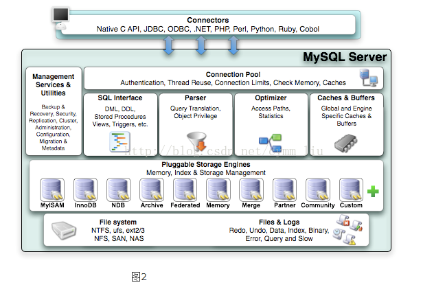
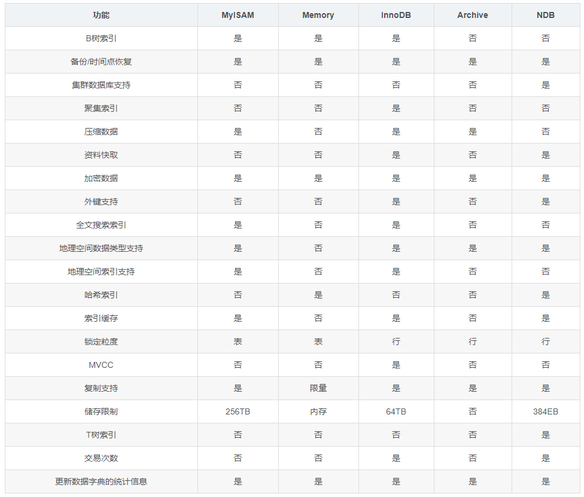
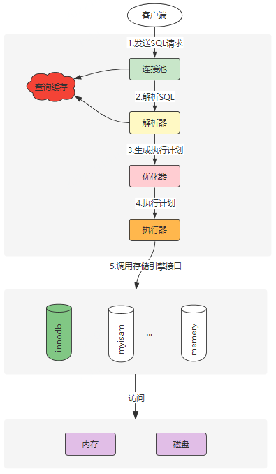
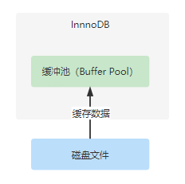
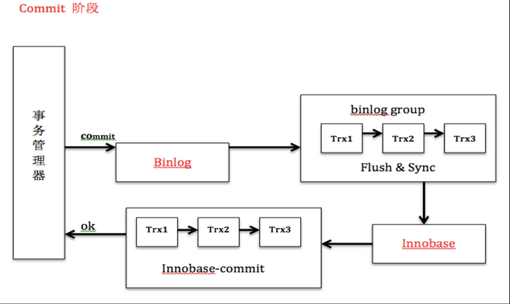
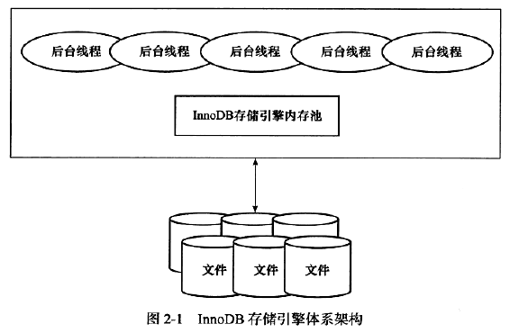
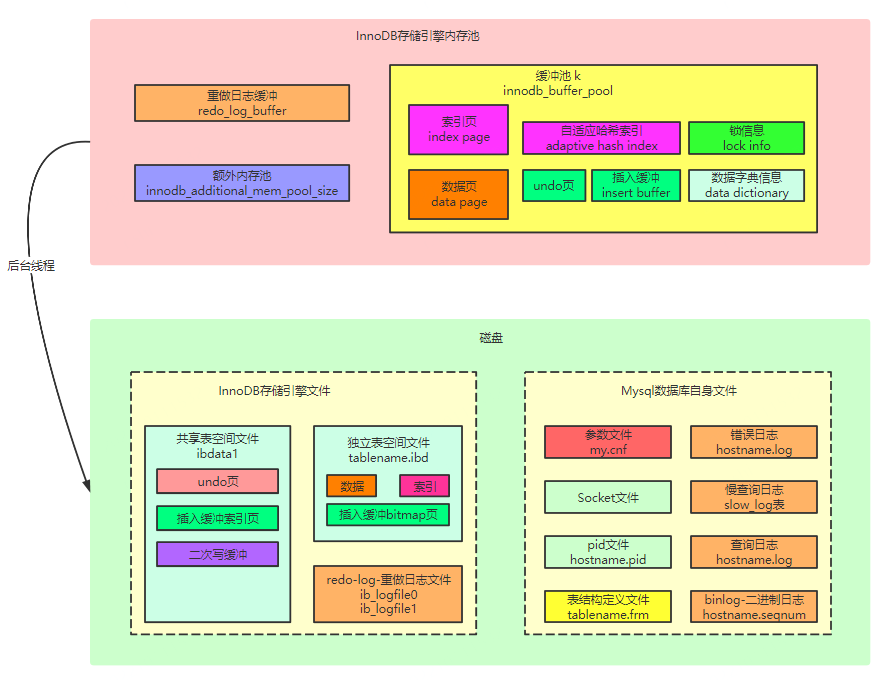

# Mysql与InnoDB体系架构

[toc]

## 推荐阅读

文章：

> - [MySQL架构原理(详解)](https://blog.csdn.net/hguisu/article/details/7106342)
> - [8张图，5大组件！了解MySQL查询语句执行过程](https://www.51cto.com/article/648245.html)
> - [一条 sql 的执行过程详解](https://www.cnblogs.com/mengxinJ/p/14045520.html)
> - [MySQL 的 crash-safe 原理解析](https://zhuanlan.zhihu.com/p/142491549)

流程图：

> - [MYSQL底层剖析](https://www.processon.com/view/625ed5d607912907047b8c74?fromnew=1)
> - [Mysql体系结构、innodb、redolog、事务、双写等Mysql 体系结构、innodb、redolog、事务、双写等](https://www.processon.com/view/5f3cdb807d9c0806d4216ad0?fromnew=1)
> - [MySQL底层执行原理](https://www.processon.com/view/5f1998bbe0b34d54dac69f4a?fromnew=1)

存储引擎对比：

> * [mysql学习--MySQL存储引擎对比总结](https://www.cnblogs.com/pengpengdeyuan/p/15001739.html)

InnoDB数据存储结构

> * [MySQL系列（2）— InnoDB数据存储结构](https://juejin.cn/post/6968264298208428046)

Mysql日志：

> * [彻底搞懂MySQL的redo log，binlog，undo log](https://juejin.cn/post/6987557227074846733)
> * [MySQL · 引擎特性 · 庖丁解InnoDB之UNDO LOG](http://mysql.taobao.org/monthly/2021/10/01/)
> * [MySQL 2PC &amp; Group Commit](https://segmentfault.com/a/1190000014810628)
> * [数据库中常说的steal和force到底是什么](https://blog.csdn.net/Singularinty/article/details/80747290)
> * [数据库的读取问题in steal/no force?](https://www.zhihu.com/question/377360399)
> * [undo log为什么需要持久化？](https://cloud.tencent.com/developer/article/1905278)

SQL 解析：

> * [SQL解析在美团的应用](https://tech.meituan.com/2018/05/20/sql-parser-used-in-mtdp.html)
> * [SQL解析器详解](https://www.cnblogs.com/smartloli/p/15857369.html)
> * [MySQL内核源码解读-SQL解析之解析器浅析](https://www.jiqizhixin.com/articles/2018-12-12-17)

SQL 优化：

> * [深入解析：从源码窥探MySQL优化器](https://developer.aliyun.com/article/679873)
> * [MySQL · 源码分析 · 子查询优化源码分析](http://mysql.taobao.org/monthly/2020/10/01/)
> * [MySQL 查询优化（四）：深入了解 MySQL查询优化处理过程](https://juejin.cn/post/6954708924738043911)
> * [[玩转MySQL之六]MySQL查询优化器](https://zhuanlan.zhihu.com/p/56790651)
> * [98%的人不知道的MySQL优化器原理](https://cloud.tencent.com/developer/article/1678069)

InnoDB三大特性：

> * [【mysql】Innodb三大特性之insert buffer](https://www.cnblogs.com/chenpingzhao/p/4883884.html)
> * [全网最清楚的：MySQL的insert buffer和change buffer 串讲](https://www.cnblogs.com/ZhuChangwu/p/14683528.html)
> * [InnoDB三大特性(DoubleWrite, InsertBuffer, Adaptive Hash Index](https://cheng-dp.github.io/2019/05/05/innodb-three-feature/)

MVCC：

> * [MySQL · 源码分析 · InnoDB的read view，回滚段和purge过程简介](http://mysql.taobao.org/monthly/2018/03/01/)
> * [从ReadView深入理解MySql MVCC原理](https://blog.csdn.net/qq_42651904/article/details/110622818)
> * [【MySQL笔记】正确的理解MySQL的MVCC及实现原理](https://www.helloworld.net/p/3668975309)
> * [MySQL InnoDB MVCC实现](https://zhuanlan.zhihu.com/p/40208895)
> * [MySQL · 引擎特性 · InnoDB 事务系统](http://mysql.taobao.org/monthly/2017/12/01/)

## 前言

## 一、Mysql体系结构

### 1.1 数据库与实例

- 数据库：

  > 数据库是文件的集合，这些文件可能存在于内存中或磁盘上。
  >
- 数据库实例

  > 数据库实例是程序，用户通过数据库实例来操作数据库数据。数据库实例是位于用户和操作系统之间的一层数据管理软件，用户对数据库数据的任何操作，包括数据库定义、数据查询、数据维护等都是在数据库实例下进行的。
  >
  > Mysql数据库实例由后台线程以及一个共享内存区组成。
  >

### 1.2 Mysql体系结构

Mysql 整体的体系结构大致可分为：连接层、核心服务层、存储引擎层、数据存储层。


更详细的结构如下：



MySQL的架构自顶向下大致可以分为客户端连接层、数据库服务层、存储引擎层和系统文件层四大部分：

(1) 客户端连接层

提供Mysql客户端与服务端建立连接的能力，几乎提供了所有主流服务端语言的SDK。

(2) 数据库服务层

数据库服务层是整个数据库服务器的核心，主要包含了以下组件

> - 管理服务和工具
> - 连接池
> - SQL接口
> - 解析器
> - 查询优化器
> - 缓存与缓冲

管理服务和工具：

> 提供对数据库服务的管理能力，例如提供数据备份与恢复、安全管理、复制、集群、配置、迁移等能力

连接池：

> 主要负责存储和管理客户端与数据库的连接信息，连接池里的一个线程负责管理一个客户端到数据库的连接信息

SQL接口：

> 主要负责接收客户端发送过来的各种SQL命令，并将SQL命令发送到其他部分，并接收其他部分返回的结果数据，将结果数据返回给客户端。

解析器：

> 负责将请求的SQL解析生成一个"解析树"。然后根据一些MySQL规则进一步检查解析树是否合法。

查询优化器：

> 在MySQL中，如果“解析树”通过了解析器的语法检查，此时就会由优化器将其转化为执行计划，然后与存储引擎进行交互，通过存储引擎与底层的数据文件进行交互。

缓存与缓冲:

> 如果查询缓存有命中的查询结果，查询语句就可以直接去查询缓存中取数据。这个缓存机制是由一系列小缓存组成的。比如表缓存，记录缓存，key缓存，权限缓存等。主要功能是将客户端提交 给MySQL 的 Select 类 query 请求的返回结果集 cache 到内存中，与该 query 的一个 hash 值 做一个对应。该 Query 所取数据的基表发生任何数据的变化之后， MySQL 会自动使该 query 的Cache 失效。在读写比例非常高的应用系统中， Query Cache 对性能的提高是非常显著的。当然它对内存的消耗也是非常大的。

（3）存储引擎层

> 提供内存、索引、存储管理，负责数据的写入和读取，与底层的文件进行交互。MySQL中的存储引擎是插件式的，服务器中的查询执行引擎通过相关的接口与存储引擎进行通信，同时，接口屏蔽了不同存储引擎之间的差异。

（4）系统文件层

系统文件层主要包括MySQL中存储数据的底层文件，与上层的存储引擎进行交互，是文件的物理存储层。其存储的文件主要有：pid文件、套接字文件、日志文件、数据文件、配置文件等。

### 1.3 Mysql存储引擎对比

通过 `show engines` 命令可以查看 mysql 提供了哪些引擎：

```sql
show engines;
+--------------------+---------+----------------------------------------------------------------+--------------+------+------------+
| Engine             | Support | Comment                                                        | Transactions | XA   | Savepoints |
+--------------------+---------+----------------------------------------------------------------+--------------+------+------------+
| InnoDB             | DEFAULT | Supports transactions, row-level locking, and foreign keys     | YES          | YES  | YES        |
| MRG_MYISAM         | YES     | Collection of identical MyISAM tables                          | NO           | NO   | NO         |
| MEMORY             | YES     | Hash based, stored in memory, useful for temporary tables      | NO           | NO   | NO         |
| BLACKHOLE          | YES     | /dev/null storage engine (anything you write to it disappears) | NO           | NO   | NO         |
| MyISAM             | YES     | MyISAM storage engine                                          | NO           | NO   | NO         |
| CSV                | YES     | CSV storage engine                                             | NO           | NO   | NO         |
| ARCHIVE            | YES     | Archive storage engine                                         | NO           | NO   | NO         |
| PERFORMANCE_SCHEMA | YES     | Performance Schema                                             | NO           | NO   | NO         |
| FEDERATED          | NO      | Federated MySQL storage engine                                 | NULL         | NULL | NULL       |
+--------------------+---------+----------------------------------------------------------------+--------------+------+------------+
9 rows in set (0.00 sec)
```

每个储存引擎支持的功能如下表所示：



## 二、SQL语句执行过程

#### 3.1 查询语句执行过程



MySQL 整个查询执行过程，总的来说分为 6 个步骤 :

> SQL执行步骤：请求、缓存、SQL解析、优化SQL查询、调用引擎执行，返回结果
> 1、连接：客户端与服务端端建立连接，并向服务端发送查询请求，这里涉及到连接池、认证等相关处理。
> 2、缓存：服务器首先检查查询缓存，如果命中缓存，则立刻返回存储在缓存中的结果，否则进入下一阶段。Mysql 8.0 移除此功能。
> 3、解析：解析SQL语句(词法分析、语法分析、预处理)，生成SQL语法树。
> 4、优化：优化器会生成相应的执行计划，比如使用哪个索引，或者选择表的连接顺序。
> 5、执行：执行器根据执行计划，调用存储引擎API去执行查询。
> 6、结果：将结果返回给客户端，同时缓存查询结果。

#### 3.2 更新语句执行过程

以最常用的Innodb为例，首先假设我们有一条SQL语句：

```sql
update users set name='xxx' where id=10;
```

执行更新语句的过程大体上与查询相同，如下图所示：


执行器会根据执行计划，调用存储引擎API去完成磁盘和内存层面的数据更新操作，会经历如下八个步骤：

> 1. 从磁盘中读取数据，并写入缓冲池
> 2. 将旧值写入Undo日志文件，以便回滚
> 3. 更新内存数据
> 4. 写Redo日志到Redo日志缓冲
> 5. Rdeo日志缓冲数据刷入磁盘
> 6. Binlog日志写入磁盘
> 7. Redo日志文件中写入Binlog文件名和位置以及Commit标记
> 8. 后台IO线程将缓冲区中的数据刷入磁盘

这八个步骤中，前七个步骤都是由执行器来完成的。

（1）从磁盘中读取数据，并写入缓冲池

InnoDB存储引擎内存中有一个非常重要组件，就是缓冲池（Buffer Pool），用于缓存一些磁盘数据。这样，当查询命中缓存时，就无需再去读磁盘了。



InnoDB执行更新语句的时候，比如对 `id=10` 这一行数据，它首先会看 `id=10` 这一行数据是否在缓冲池中，如果不在的话，那么会直接从磁盘里加载数据到缓冲池里来，而且还会对这行记录加独占锁。

（2）将旧值写入Undo日志文件，以便回滚

undo 存放在undo段（undo segment） 中，undo 段位于共享表空间。

undo log有两个最主要的作用：多版本并发控制（MVCC） 和 故障恢复。

MVCC：在InnoDB存储引擎中MVCC的实现是通过 undo 日志来完成的。当用户读取一行记录时，若该记录已经别其他事务占用，当前事务可以通过undo读取之前的行版本信息，以此实现非锁定读。

故障恢复：

- 由于Undo log中记录了上一个版本的数据，因此如果用户执行的事务或语句由于某种原因失败了，又或者用户用一条ROLLBACK语句请求回滚，就可以利用这些信息将数据回滚到修改之前的样子。
- undo 是逻辑日志，因此只是将数据库逻辑地恢复到原来的样子。所有修改都被逻辑地取消了，但是数据结构和页本身在回滚之后可能大不相同。数据库的主要任务就是协调对数据记录的并发访问。比如，一个事务在修改前一个页中某几条记录，同时还有别的事务在对同一个页中另外几条记录进行修改。因此，不能讲一个页回滚到事务开始的样子，因为这样会影响其他事务正在进行的工作。
- 用户执行ROLLBACK时，会将插入的事务进行回滚，但是表空间的大小并不会因此而收缩。
- 回滚执行的是逆向操作：每当InnoDB中需要修改某个Record时，都会将其历史版本写入一个Undo Log中，这种Undo Record是Update类型。当插入新的Record时，还没有一个历史版本，但为了方便事务回滚时做逆向（Delete）操作，这里还是会写入一个Insert类型的Undo Record。对于每个Insert ，InnoDB会执行一个Delete。对于每个Update，InnoDB会执行一个相反的Update.

Undo log 会产生 redo log，也就是 undo log 的产生会伴随着 redo log 的产生，这是因为 undo log 也需要持久性的保护。

Undo Log 用于保证事务的一致性。

（3）更新 Buffer pool 中的缓存数据

当我们把要更新的那行记录从磁盘文件加载到缓冲池，同时对他加锁之后，而且还把更新前的旧值写入undo日志文件。
之后，我们就可以正式开始更新这行记录了，更新的时候，先是会更新缓冲池中的记录，此时这个数据就是脏数据
了。这里所谓的更新内存缓冲池里的数据，意思就是把内存里的“id=10”这行数据的name字段修改为“xxx”。

（4）写 Redo Log Buffer

当缓冲池中的数据完成修改之后，需要将内存中的数据刷新到磁盘，但是在刷新前，会先把本次对内存所做的修改写入到一个 Redo Log Buffer 里去，这也是内存里的一个缓冲区，是用来存放Redo日志。

所谓的redo日志，就是记录下来你对数据做了什么修改，比如对“id=10这行记录修改了name字段的值为xxx”，这就是一个日志。到这一步的时候，Mysql如果宕机了，是不会有问题的。

redo log 和 undo log：

* redo 和 undo 的作用都可以视为一种恢复操作，一个向前，一个向后。 redo恢复提交事务修改的页操作，而undo 回滚行记录到某个特定版本。因此两者记录的内容不同，redo 通常是物理日志，记录的是页的物理修改操作。undo是逻辑日志，根据每行记录进行记录。
* redo log 用来保证事务的持久性，undo log 用来帮助事务回滚及MVCC的功能。
* redo log 基本都是顺序写的，在数据库运行时不需要对redo log文件进行读取操作。而undo log 是需要进行随机读写的。

InnoDB 通过 Force Log at Commit 机制实现事务的持久性，即当事务提交时，必须先将该事务的所有日志写入到 重做日志文件进行持久化，待事务的Commit 操作完成才算完成。

在每次将重做日志缓冲写入重做日志文件后，InnoDB存储引擎都需要调用一次 fsync 操作。

> fsync 是 Unix系统的一个系统调用，能确保写磁盘操作结束后才返回。

（6）提交事务的时候，将redo日志写入磁盘

接着我们想要提交一个事务了，此时就会根据一定的策略把redo日志从redo log buffer里刷入到磁盘文件里去。

此时这个策略是通过 innodb_flush_log_at_trx_commit 来控制的，可取以下值，默认为1：

> - 0：事务提交时，redo log不刷盘。刷盘仅在 master thread 中完成，而master thread 中每1秒会进行一次Redo日志文件的fsync操作。采用此策略，会存在事务已提交，但数据丢失的情况。比如事务提交成功后，Mysql宕机，内存中数据和redo日志丢失。
> - 1：事务提交时，必须调用一次 fsync操作。采用此策略，只要提交事务成功，redo log 就必然在磁盘里。此时，事务提交成功后，就算宕机，Mysql也能根据redo  log 重新恢复数据，可以严格保证数据不丢失。
> - 2：提交事务时，redo log写入磁盘文件对应 os cache 缓存中去，而不进行fsync，可能1秒后才会把 os cache里的数据写入到磁盘文件里去（sync）。采用此策略，在提交事务后，redo log可能仅仅停留在os cache内存缓存里，没实际写入磁盘文件，此时，如果Mysql宕机而操作系统没宕机，则并不会导致事务丢失。而如果操作系统宕机了，那么os cache里的redo log就会丢失，从而导致事务丢失。

一般建议 redo 日志刷盘策略设置为1，保证事务提交之后，数据不丢失。

（7）binlog日志写入磁盘

在Mysql数据库中还有一种二进制日志 binlog，其用来进行 point-in-time-recovery（时间点恢复，是指恢复到给定时间点的数据更改） 及主从复制（Replication）环境的建立。

binlog是Mysql 自己的日志文件，他里面记录的是偏向于逻辑性的日志，类似于“对users表中的id=10的一行数据做了更新操作，更新以后的值是什么”

Redo log 和 Binlog：

* 层面不同：Redo log 是InnoDB存储引擎上的日志，而 Binlog 是在Mysql 数据库上层产生的，任务存储引擎都会产生Binlog。
* 内容形式不同：Binlog 是一种逻辑日志，其记录的是对应的SQL语句。而Redo log 是物理格式的日志，其记录的是对于每个页的修改。
* 刷盘时机不同：Binlog 只在事务提交完成后，进行一次写入。而Redo log 在事务进行中不断地被写入，这表现为日志并不是随事务提交的顺序进行写入的。

对于 Binlog 日志，有一个参数 sync_binlog 可以控制BInlog的刷盘策略，取值如下，默认为0：

> * 0：不直接写入磁盘文件，而是写入到 os cache 内存缓存。
> * 1：先把binlog 写入到磁盘文件，再提交事务。

（8）基于Binlog 和 Redo log 完成事务的提交

当我们把binlog写入磁盘文件之后，接着就会完成最终的事务提交，此时会把本次更新对应的binlog文件名称和这次
更新的binlog日志在文件里的位置，都写入到redo log日志文件里去，同时在redo log日志文件里写入一个commit标记，在完成这个事情之后，才算最终完成了事务的提交。

Mysql 两阶段提交引出：

> 当MySQL开启binlog的时候，会存在一个内部XA的问题：事务在存储引擎层（redo）commit的顺序和在binlog中提交的顺序不一致的问题。如果不使用两阶段提交，那么数据库的状态有可能用它的日志恢复出来的库的状态不一致。

Mysql的两阶段提交：

> 1.prepare阶段：redo持久化到磁盘（redo group commit），并将回滚段置为 prepared 状态，此时binlog 不做操作。
>
> 
>
> 2.commit阶段：innodb释放锁，释放回滚段，设置提交状态，binlog持久化到磁盘，然后存储引擎层提交
>
> 

## 三、InnoDB体系结构

### 1. 体系结构概览



 InnoDB 存储引擎体系结构，可分为如下三个部分：

（1）内存池

> InnoDB存储引擎有多个内存块，可以认为这些内存块组成了一个大的内存池，负责如下工作：
>
> - 维护所有进程/线程需要访问的内部数据结构
> - 缓存磁盘上的数据
> - 重做日志（redo log）缓冲
> - ......

（2）后台线程

> - 主要负责刷新内存池中的数据，保证内存池缓存的数据是最新的
> - 此外，将已修改的数据文件刷新到磁盘文件
> - 同时，保证在数据库发生异常的情况下InnoDB能恢复到正常运行状态

（3）文件

InnoDB会将相关数据持久化到这些磁盘文件中

### 2. 体系结构图

在InnoDB的体系结构中涉及的内存区域和磁盘文件如下图所示



### 3. 内存池

#### 3.1 缓冲池

（1）内存中可以有多个缓冲池实例，每个页根据哈希值平均分配到不同缓冲池实例中。（2）缓冲池中索引页和数据页占了很大一部分。
（3）缓冲池是通过 LRU 算法来进行管理的，即最频繁使用的页在LRU列表的前端，而最少使用的页LRU列表的尾端。当缓冲池不能存放新读取到的页时，将首先释放LRU列表中的尾端的页。

（4）在InnoDB中，缓冲池中的页大小默认为16KB。同样使用LRU算法，不过加入了 midpoint insertion strategy。

（5）LUR列表中的页被修改后，称该页为脏页，即缓冲池中的页和磁盘上的页的数据产生了不一致。这时，数据库会通过CheckPoint机制将脏页刷新回磁盘。

#### 3.2 Redo Log Buffer

（1）InnoDB存储引擎首先将重做日志信息先放入到这个缓冲区，然后分情况将其刷新到重做日志文件：

- Master Thread 每一秒，会将Redo log buffer 刷盘
- 每个事务提交时，会将Redo log buffer 刷盘
- 当 Redo log buffer 剩余空间小于 1/2 时，会将Redo log buffer 刷盘

#### 3.3 额外的内存池

对于一些数据结构本身的内存进行分配时，需要从额外的内存池中进行申请，当该区域的内存不够时，会从缓冲池中进行申请。

### 4.Check Point

(1) Check Point（检查点）技术的目的是解决以下几个问题：

- 缩短数据库的恢复时间；
- 缓冲池不够用时，将脏页刷新到磁盘；
- 重做日志不可用时，刷新脏页；

基于Check Point 的宕机恢复：只需要对 CheckPoint 之后的Redo log 进行恢复。

LRU脏页刷盘：当缓冲池不够用时，根据LRU算法会溢出最近最少使用的页，若此页为脏页，那么需要强制执行CheckPoint，将脏页刷盘。

重做日志不可用：是因为因为重做日志是循环写的，并不是让其无限增大的。而重做日志可以被重用的部分是指这些重做日志已经不再需要了。

（2）LSN：InnoDB是通过 LSN( Log Sequence Number) 来标记版本的。LSN是8字节的数字。每个页都有 LSN，重做日志中也有LSN，CheckPoint 也有LSN。

（3）Check Point 所做的事就是将缓冲池中的脏页刷回磁盘。不同之处在于，每次刷新多少页到磁盘，每次从哪里取脏页，以及什么时间触发CheckPoint。InnoDB中有两种CheckPoint：

Sharp Checkpoint： 在数据库关闭时，将所有的脏页刷回磁盘，这是默认的工作方式。

Fuzzy Checkpoint：在数据库运行时，只对部分脏页刷盘。

在InnnoDB中可能会发生如下几种 Fuzzy Checkpoint：

- Master Thread Checkpoint： 差不多以每秒或每十秒的速度从将脏页刷盘
- FLUSH_LRU_LIST Checkpoint：若LRU中没有100个可用空闲页，那么InnoDB会将LRU尾端的页移除，如果这些页是脏页，那么需要进行CheckPoint。5.6 开始，这个检查被放在单独的 Page Clearner 线程中进行。
- Async/Sync Flush Checkpoint
- Dirty Page too much Checkpoint

### 5.文件

#### 5.1 表空间文件

（1）共享表空间：InnoDB采用将存储的数据按表空间（TableSpace）进行存放的设计。在默认配置下会有一个初始大小为10M，名为 ibdata1 的文件，该文件就是默认的表空间文件，用户可以通过参数 innodb_data_file_path 进行设置。设置好这个参数后，所有基于InnoDB的表的数据都会记录到该共享表空间。

（2）用户可以通过多个文件组成一个表空间，同时设置文件属性。

（3）独立表空间：若设置了参数 Innodb_file_per_table，则用户可以将每个基于InnoDB的表产生一个独立表空间（tablename.ibd）。独立表空间仅存储该表的索引、数据、插入缓冲 BitMap等信息。

#### 5.2 redo log

（1）redo log 记录了对于InnoDB的事务日志，可用于宕机恢复、MVCC。

（2）每个InnoDB至少有1个重做日志组（group），每个文件组下至少有2个重做日志文件，如默认的 ib_logfile0 和 ib_logfile1。为了得到更多的可靠性，用户可以设置多个镜像日志组，将不同的文件组放到不同的磁盘上，以此提高重做日志的高可用性。

三、InnoDB三大特性

change buffer，其实在之前版本是插入缓冲(insert buffer)，后续版本变成了 change buffer(参考：内幕 2.4.1 章节)。这一块区域就是 Change Buffer。5.5 之前叫 Insert Buffer 插入缓冲，现在也能支持 delete 和 update，最后把 Change Buffer 记录到数据页的操作叫做 merge。

插入缓冲：对于辅助索引或非唯一索引，InnoDB会使用Insert Buffer，对于插入或更新操作，不是每一次都直接插入到索引页中，而是先判断插入的非聚集索引页是否在缓冲池中，若在，则直接插入；若不在，则先放到一个InsertBuffer 对象中。然后再以一定频率和情况进行Insert Buffer 和辅助索引页子节点的 merge （合并操作），这时通常能将多个插入合并到一个操作中，能大大提高非聚集索引插入的性能。

DoubleWrite：在应用（apply） redo log时，用户需要一个页的副本，当写入失效时，先通过页的副本来还原该页，再进行重做。

# 参考资料

1. [【MySQL】漫谈MySQL体系结构](https://blog.csdn.net/da_guo_li/article/details/80280289)
2. [MySQL基础架构与日志详解](https://blog.csdn.net/qq_40378034/article/details/90758268)
3.
