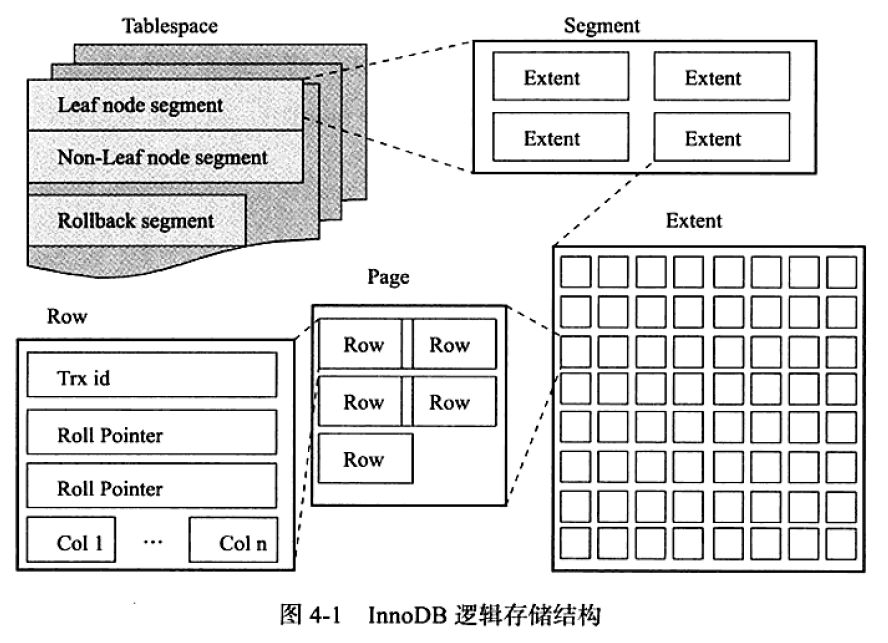

---
tags:
  - InnoDB
---

# 逻辑存储与物理存储

[toc]

## 推荐阅读

> * [MySQL · 引擎特性 · InnoDB 文件系统之文件物理结构_数据库内核月报_淘宝](http://mysql.taobao.org/monthly/2016/02/01/)
> * [MySQL的磁盘存储](https://blog.csdn.net/jiang18238032891/article/details/108475393)
> * [MySQL之InnoDB物理存储结构](https://blog.csdn.net/qq_40276626/article/details/109802650)
> * [InnoDB逻辑存储结构](https://www.jianshu.com/p/1573c4dcecd6)
> * [InnoDB存储引擎文件](.)
> * [InnoDB（三）：InnoDB表的逻辑和物理存储](https://blog.csdn.net/MOU_IT/article/details/120936508)

## 一、InnoDB逻辑存储结构

从InnoDB存储引擎的逻辑存储结构看，所有数据都被逻辑地存放在一个空间中，称之为表空间（TableSpace）。表空间又由段（Segment）、区（extent）、页（page）组成。InnoDB逻辑存储存储结构如下图：

### 1.表空间
