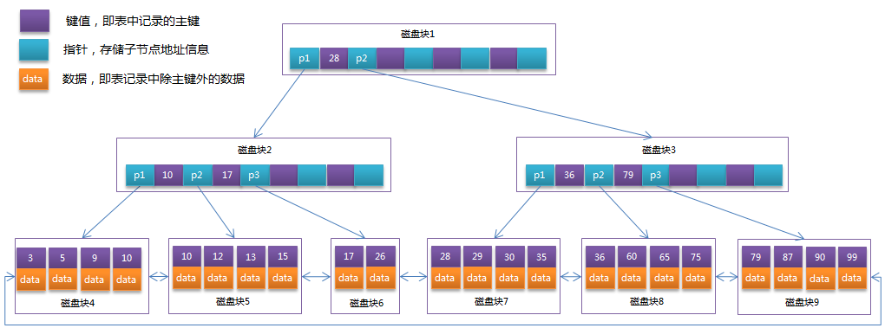

# Mysql索引原理

[toc]

## 精选资料

> - [MySQL索引背后的数据结构及算法原理](https://blog.codinglabs.org/articles/theory-of-mysql-index.html)
> - [一文读懂MySQL的索引结构及查询优化](https://www.cnblogs.com/bytesfly/p/mysql-index-theory-and-best-practice.html)

## 推荐阅读

索引原理：

> - [Data Structure Visualizations](https://www.cs.usfca.edu/~galles/visualization/Algorithms.html)
> - [干货：mysql索引的数据结构](https://www.jianshu.com/p/1775b4ff123a)
> - [性能调优-Mysql索引数据结构详解与索引优化](https://zhuanlan.zhihu.com/p/79772455)
> - [MySQL索引原理及慢查询优化_美团技术团队](https://tech.meituan.com/2014/06/30/mysql-index.html)
> - [万字总结：学习MySQL优化原理，这一篇就够了！](https://dbaplus.cn/news-155-1531-1.html)
> - [MySQL优化/面试，看这一篇就够了](https://juejin.cn/post/6844903750839058446)
> - [聊一聊 InnoDB 引擎中的索引类型](https://zhuanlan.zhihu.com/p/104254055)
> - [MySQL数据库中innodb引擎的B+Tree的底部到底时单向链表还是双向链表？](https://blog.csdn.net/weixin_43155866/article/details/108791358?spm=1001.2101.3001.6661.1&utm_medium=distribute.pc_relevant_t0.none-task-blog-2%7Edefault%7ECTRLIST%7ERate-1-108791358-blog-113462079.pc_relevant_default&depth_1-utm_source=distribute.pc_relevant_t0.none-task-blog-2%7Edefault%7ECTRLIST%7ERate-1-108791358-blog-113462079.pc_relevant_default&utm_relevant_index=1)
> - [数据库索引——B+树索引（为什么使用B+树作为MySql的索引结构，用什么好处？）](https://blog.csdn.net/qq_35655602/article/details/116722926?utm_medium=distribute.pc_relevant.none-task-blog-2~default~baidujs_baidulandingword~default-0-116722926-blog-108791358.t5_layer_eslanding_A_4&spm=1001.2101.3001.4242.1&utm_relevant_index=2)
> - [MySQL：InnoDB一棵B+树可以存放多少行数据？](https://juejin.cn/post/6904293886626103309)
> - [为什么生产环境中B+树的高度总是3-4层？](https://zhuanlan.zhihu.com/p/86137284)

索引使用原则：

> - [MySQL数据库：SQL优化与索引优化](https://blog.csdn.net/a745233700/article/details/84455241)
> - [MySQL索引如何优化？二十条铁则送给你！](https://www.51cto.com/article/625199.html)
> - [MySQL索引优化看这篇文章就够了！](https://zhuanlan.zhihu.com/p/61687047)
> - [MySQL 索引优化全攻略](https://www.runoob.com/w3cnote/mysql-index.html)

扫描方法：

> - [MySQL · 源码阅读 · 数据库的扫描方法](http://mysql.taobao.org/monthly/2022/04/01/)

## 一、初始索引

### 1.什么是索引

索引（Index）是帮助MySQL高效获取数据的数据结构，目的在于提高检索效率。

**数据库最主要的操作就是读写操作，因此提高数据查询效率尤为重要**。数据库系统的设计者会从查询算法的角度进行优化，而最基本的查询算法当然是顺序查找，这种复杂度为O(n)的算法在数据量很大时显然是糟糕的，好在计算机科学的发展提供了很多更优秀的查找算法，例如二分查找、二叉树查找等。如果稍微分析一下会发现，**每种查找算法都只能应用于特定的数据结构之上**，例如二分查找要求被检索数据有序，而二叉树查找只能应用于二叉查找树上，**但是数据本身的组织结构不可能完全满足各种数据结构**（例如，理论上不可能同时将两列都按顺序进行组织），所以，**在数据之外，数据库系统还维护着满足特定查找算法的数据结构，这些数据结构以某种方式引用（指向）数据，这样就可以在这些数据结构上实现高级查找算法。这种数据结构，就是索引**。

### 2.索引分类


- 按数据结构可分为： B+ 树索引、 Hash索引、FullText索引
- 按字段类型可分为： 主键索引、二级索引（辅助索引）
- 按字段特性可分为： 主键索引、唯一索引、普通索引、联合索引、前缀索引
- 按数据存储和索引键值逻辑关系可分为：聚簇索引（聚集索引）、非聚簇索引（非聚集索引）

### 3.索引基本语法

## 二、为什么使用 B+Tree 索引

在MySQL中，索引属于存储引擎级别的概念，不同存储引擎对索引的实现方式是不同的。

| -             | InnoDB          | MyISAM |
| ------------- | --------------- | ------ |
| B+tree索引    | √              | √     |
| Hash索引      | √              | ×     |
| Full-text索引 | √（MySQL5.6+） | √     |

Mysql 的默认存储引擎是 `InnoDB`， InnoDB 的默认索引是 B+tree索引，那么为什么使用 B+Tree 索引呢？

一般来说，索引本身也很大，不可能全部存储在内存中，因此索引往往以索引文件的形式存储的磁盘上。这样的话，索引查找过程中就要产生磁盘I/O消耗，相对于内存存取，I/O存取的消耗要高几个数量级，所以评价一个数据结构作为索引的优劣最重要的指标就是在查找过程中磁盘I/O操作次数的渐进复杂度。换句话说，索引的结构组织要尽量减少查找过程中磁盘I/O的存取次数。下面先介绍内存和磁盘存取原理，然后再结合这些原理分析B-/+Tree作为索引的效率。

### 1. 主存存取原理

目前计算机使用的主存基本都是随机读写存储器（RAM），其存取模型如下：


抽象角度看，主存是一系列的存储单元(晶体管)组成的矩阵，通过行地址和列地址可以定位唯一存储单元。

> - 读主存：当系统需要读取主存时，将地址信号放到地址总线，主存读到地址信号后，解析信号并定位指定存储单元，然后将此存储单元数据放到数据总线，供其它部件读取；
> - 写主存：系统将要写入单元地址和数据分别放在地址总线和数据总线，主存读取两个总线的内容，做相应的写操作

可以看到，主存是随机存取的，与存储单元的物理位置无关。

### 2. 磁盘存取原理

磁盘整体结构示意图：


一个磁盘整体上由如下结构组成：

> - 大小相同且同轴的圆形盘片：各个圆形盘片可以同步转动
> - 在磁盘一侧的磁头支架
> - 磁头支架上固定的一组磁头：磁头沿磁盘半径方向运动（寻道）

磁盘结构的示意图：


盘片被划分成一系列同心环，圆心是盘片中心，每个同心环叫做一个**磁道**，所有半径相同的磁道组成一个**柱面**。磁道被沿半径线划分成一个个小的段，每个段叫做一个**扇区**，每个扇区是磁盘的最小存储单元。

当需要从磁盘读取数据时，系统会将数据逻辑地址传给磁盘，磁盘的控制电路按照寻址逻辑将逻辑地址翻译成物理地址，即确定要读的数据在哪个磁道，哪个扇区。为了读取这个扇区的数据，需要将磁头放到这个扇区上方，为了实现这一点，磁头需要移动对准相应磁道，这个过程叫做**寻道**，所耗费时间叫做**寻道时间**，然后磁盘旋转将目标扇区**旋转**到磁头下，这个过程耗费的时间叫做**旋转时间**。

### 3. 局部性原理与磁盘预读

由于存储介质的特性，磁盘本身存取就比主存慢很多，再加上机械运动耗费，磁盘的存取速度往往是主存的几百分分之一，因此为了提高效率，要尽量减少磁盘I/O。为了达到这个目的，磁盘往往不是严格按需读取，而是每次都会**预读**，即使只需要一个字节，磁盘也会从这个位置开始，顺序向后读取一定长度的数据放入内存。

这样做的理论依据是计算机科学中著名的**局部性原理**：

> 当一个数据被用到时，其附近的数据也通常会马上被使用。

考虑到磁盘IO是非常高昂的操作，因此在计算机中，磁盘读取时往往不是严格按需读取，而是每次都会预读：

> 即使只需要一个字节，磁盘也会从这个位置开始，顺序向后读取一定长度的数据放入内存。

这样做的理论依据是计算机科学中著名的 `局部性原理`：

> 当一个数据被用到时，其附近的数据也通常会马上被使用。

由于磁盘顺序读取的效率很高（不需要寻道时间，只需很少的旋转时间），因此对于具有局部性的程序来说，预读可以提高I/O效率。预读的长度一般为页(`page`)的整数倍：

> `页`是计算机管理存储器的逻辑块，硬件及操作系统往往将主存和磁盘存储区分割为连续的大小相等的块，每个存储块称为一页(许多操作系统的页默认大小为 `4KB`)，主存和磁盘以页为单位交换数据。当程序要读取的数据不在主存中时，会触发一个缺页异常，此时操作系统会向磁盘发出读盘信号，磁盘会找到数据的起始位置并向后连续读取一页或几页载入内存中，然后异常返回，程序继续运行。(如下命令可以查看操作系统的默认页大小)
>
> ```sh
> $ getconf PAGE_SIZE
> 4096
> ```

### 4. 常见索引结构选型

(1) 哈希表

哈希虽然能够提供 `O(1)`的单数据行的 equals 查询性能，但是对于 `范围查询`和 `排序`却无法很好支持，需全表扫描。

(2) 红黑树

红黑树(`Red Black Tree`)是一种自平衡二叉查找树，在进行插入和删除操作时通过特定操作保持二叉查找树的平衡，从而获得较高的查找性能。

一般来说，索引本身也很大，往往不可能全部存储在内存中，因此索引往往以索引文件的形式存储的磁盘上。这样的话，索引查找过程中就要产生磁盘I/O消耗，相对于内存存取，I/O存取的消耗远远高于内存，所以评价一个数据结构作为索引的优劣最重要的指标就是查找过程中磁盘I/O次数。换句话说，`索引的结构组织要尽量减少查找过程中磁盘I/O的次数。`

在这里，磁盘I/O的次数取决于树的高度，所以，在数据量较大时，`红黑树会因树的高度较大而造成磁盘IO较多`，从而影响查询效率。

(3) B-Tree
B树中的B代表平衡(`Balance`)，而不是二叉(`Binary`)，B树是从平衡二叉树演化而来的。

为了降低树的高度(也就是减少磁盘I/O次数)，把原来 `瘦高`的树结构变得 `矮胖`，B树会在 `每个节点存储多个元素`(红黑树每个节点只会存储一个元素)，并且节点中的元素从左到右递增排列。如下图所示：

[](https://img2020.cnblogs.com/blog/1546632/202008/1546632-20200830195348368-1304078258.png)

`B-Tree`在查询的时候比较次数其实不比二叉查找树少，但在内存中的大小比较、二分查找的耗时相比磁盘IO耗时几乎可以忽略。 `B-Tree大大降低了树的高度`，所以也就极大地提升了查找性能。

(4) B+Tree
`B+Tree`是在 `B-Tree`基础上进一步优化，使其更适合实现存储索引结构。InnoDB存储引擎就是用 `B+Tree`实现其索引结构。

`B-Tree`结构图中可以看到每个节点中不仅包含数据的 `key`值，还有 `data`值。而每一个节点的存储空间是有限的，如果 `data`值较大时将会导致每个节点能存储的 `key`的数量很小，这样会导致B-Tree的高度变大，增加了查询时的磁盘I/O次数，进而影响查询性能。在 `B+Tree`中，所有 `data`值都是按照键值大小顺序存放在同一层的叶子节点上，而 `非叶子节点上只存储key值信息`，这样可以增大每个非叶子节点存储的 `key`值数量，降低B+Tree的高度，提高效率。

[](https://img2020.cnblogs.com/blog/1546632/202008/1546632-20200830201413134-394816073.png)

数据库系统的设计者巧妙利用了磁盘预读原理，将一个节点的大小设为操作系统的页大小的整数倍，这样每个节点只需要一次I/O就可以完全载入。

`InnoDB`存储引擎中也有页(`Page`)的概念，页是其磁盘管理的最小单位。InnoDB存储引擎中默认每个页的大小为16KB。

```sh
mysql> show variables like 'innodb_page_size';
+------------------+-------+
| Variable_name    | Value |
+------------------+-------+
| innodb_page_size | 16384 |
+------------------+-------+
1 row in set (0.01 sec)
```

一般表的主键类型为 `INT`（占4个字节）或 `BIGINT`（占8个字节），指针类型也一般为4或8个字节，也就是说一个页（B+Tree中的一个节点）中大概存储 `16KB/(8B+8B)=1K`个键值（因为是估值，为方便计算，这里的K取值为 `10^3`）。也就是说一个深度为3的B+Tree索引可以维护 `10^3 * 10^3 * 10^3 = 10亿`条记录。

`B+Tree`的高度一般都在2到4层。mysql的InnoDB存储引擎在设计时是将根节点常驻内存的，也就是说查找某一键值的行记录时最多只需要1到3次磁盘I/O操作。

随机I/O对于MySQL的查询性能影响会非常大，而顺序读取磁盘中的数据会很快，由此我们也应该尽量减少随机I/O的次数，这样才能提高性能。在 `B-Tree`中由于所有的节点都可能包含目标数据，我们总是要从根节点向下遍历子树查找满足条件的数据行，这会带来大量的随机I/O，而 `B+Tree`所有的数据行都存储在叶子节点中，而这些叶子节点通过 `双向链表`依次按顺序连接，当我们在B+树遍历数据(比如说 `范围查询`)时可以直接在多个叶子节点之间进行跳转，保证 `顺序`、`倒序`遍历的性能。

另外，对以上提到的数据结构不熟悉的朋友，这里推荐一个在线数据结构可视化演示工具，有助于快速理解这些数据结构的机制：`https://www.cs.usfca.edu/~galles/visualization/Algorithms.html`

## 三、MySQL索引实现

在MySQL中，索引属于存储引擎级别的概念，不同存储引擎对索引的实现方式是不同的，本文主要讨论MyISAM和InnoDB两个存储引擎的索引实现方式。

### 1.MyISAM索引实现

MyISAM引擎使用B+Tree作为索引结构，叶节点的data域存放了数据记录的地址，此时：

> - 如果以表的主键为Key来构建B+树，即为主键索引（Primary key）。
> - 如果以表的非主键列为Key来构建B+树，即为二级索引（Secondary key），也叫辅助索引。

MyISAM主键索引的原理图如下：


MyISAM二级索引的原理图如下：


数据查找过程：

> 首先按照B+Tree搜索算法搜索索引，如果指定的Key存在，则取出其data域的值，然后以data域的值为地址，读取相应数据记录

MyISAM索引文件和数据文件是分离的，索引文件仅保存数据记录的地址，因此MyISAM的索引方式也叫做 `非聚集`的，之所以这么称呼是为了与InnoDB的 `聚集索引`区分。

### 2.InnoDB索引实现

#### 2.1 B+树索引结构


采用了多叉树的结构，降低了树的高度，减少了磁盘IO次数，通过对所有叶子节点通过指针双向链接，方便的提供了遍历所有数据的特性，同时数据也是严格有序的，方便范围查询，查询效率的稳定性也非常好

选择B+树而不是B树的优点：

> - （1）磁盘读取代价低：B+树非叶子节点没有data域，因此节点更小。如果非叶子节点的关键字存放在同一盘块中，那么盘块所能容纳的关键字数量也越多，一次性读入内存的需要查找的关键字也就越多，磁盘IO次数会更少。
> - （2）方便范围查询：B+树叶子节点通过双向指针链接，方便范围查询；比如where条件中 age >=3 and age < 20，那么当找到3时就可以顺着指针找到20,而B树是不可以的。
> - （3）查询效率稳定性更好：在B+树中，由于分支节点并不是最终指向文件内容的节点，分支节点只是叶子节点的索引，所以对于任意关键字的查找都必须从根节点走到分支节点，所有关键字查询路径长度相同，每个数据查询效率相当。而对于B树而言，其分支节点上也保存有数据，对于每一个数据的查询所走的路径长度是不一样的，效率也不一样，B树稳定性不如B+树好

InnoDB一棵三层B+树可以存放多少行数据?

> 根页可以存放1170个指针，然后第二层的每个页也可以存放1170个指针。这样一共可以存放 `1170*1170`个指针，也就是一共可以存放 `1170*1170*16=21902400` 行记录。也就是说一个三层的B+树可以存放千万级别的数据了。

为什么生产环境 一棵 InnoDB B+树的树高通常都是 3-4 层？

#### 2.2 主键索引

InnoDB引擎使用B+Tree作为索引结构，其主键索引的叶节点的data域存放了完整的数据记录，这种索引也叫聚集索引。


因为InnoDB的数据文件本身要按主键聚集，所以InnoDB要求表必须有主键。如果没有显式指定，则MySQL系统会自动选择一个可以唯一标识数据记录的列作为主键，如果不存在这种列，则MySQL自动为InnoDB表生成一个隐含字段作为主键，这个字段长度为6个字节，类型为长整形。

#### 2.3 二级索引

InnoDB的二级索引的data域存放了相应记录主键的值。


聚集索引这种实现方式使得按主键的搜索十分高效，但是二级索引搜索需要检索两遍索引：首先检索二级索引获得主键，然后用主键到主键索引中检索获得记录。

## 四、索引使用原则

## 五、索引失效原理

推荐阅读：

> - [索引失效底层原理分析，这么多年终于有人讲清楚](https://segmentfault.com/a/1190000037495198)
> - [MySQL索引失效原理是什么？](https://www.zhihu.com/question/421944348)
> - [MySQL索引失效的9种场景](https://juejin.cn/post/7083520386498822158#heading-1)
> - [一张图搞懂MySQL的索引失效](https://segmentfault.com/a/1190000021464570)
