# Explain执行计划详解

[[toc]]

[toc]

## 推荐阅读

- [MySQL 8.0 Reference Manual/.../EXPLAIN Output Format](https://dev.mysql.com/doc/refman/8.0/en/explain-output.html)
- [MySQL 高级 之 explain 执行计划详解](https://blog.csdn.net/wuseyukui/article/details/71512793)
- [【Explain】mysql 之 explain 详解（分析索引的最佳使用）](https://www.cnblogs.com/qlqwjy/p/7767479.html)
- [mysql 执行计划 explain 详解](https://blog.csdn.net/u012410733/article/details/66472157)
- [MySQL 执行计划解读](https://www.cnblogs.com/ggjucheng/archive/2012/11/11/2765237.html)

## 一、Explain 执行计划详解

### 1.什么是执行计划

对于一条 SQL 语句，查询优化器对其进行分析，并找出最优的查询方案，这个查询方案就是执行计划。

执行计划通常用于 SQL 性能分析、优化等场景。

MySQL 为我们提供了 EXPLAIN 语句，来获取执行计划的相关信息。通过 explain 的结果，可以了解到如数据表的查询顺序、数据查询操作的操作类型、哪些索引可以被命中、哪些索引实际会命中、每个数据表有多少行记录被查询等信息。

### 2.Explain 语法

```sql
EXPLAIN  select_statement
-- MySQL8.0 新增  EXPLAIN ANALYZE
EXPLAIN ANALYZE select_statement
```

### 3.Explain 输出格式

| Column                                                                                               | Meaning                                        |
| :--------------------------------------------------------------------------------------------------- | :--------------------------------------------- |
| [`id`](https://dev.mysql.com/doc/refman/8.0/en/explain-output.html#explain_id)                       | The identifier`SELECT`                         |
| [`select_type`](https://dev.mysql.com/doc/refman/8.0/en/explain-output.html#explain_select_type)     | The type`SELECT`                               |
| [`table`](https://dev.mysql.com/doc/refman/8.0/en/explain-output.html#explain_table)                 | The table for the output row                   |
| [`partitions`](https://dev.mysql.com/doc/refman/8.0/en/explain-output.html#explain_partitions)       | The matching partitions                        |
| [`type`](https://dev.mysql.com/doc/refman/8.0/en/explain-output.html#explain_type)                   | The join type                                  |
| [`possible_keys`](https://dev.mysql.com/doc/refman/8.0/en/explain-output.html#explain_possible_keys) | The possible indexes to choose                 |
| [`key`](https://dev.mysql.com/doc/refman/8.0/en/explain-output.html#explain_key)                     | The index actually chosen                      |
| [`key_len`](https://dev.mysql.com/doc/refman/8.0/en/explain-output.html#explain_key_len)             | The length of the chosen key                   |
| [`ref`](https://dev.mysql.com/doc/refman/8.0/en/explain-output.html#explain_ref)                     | The columns compared to the index              |
| [`rows`](https://dev.mysql.com/doc/refman/8.0/en/explain-output.html#explain_rows)                   | Estimate of rows to be examined                |
| [`filtered`](https://dev.mysql.com/doc/refman/8.0/en/explain-output.html#explain_filtered)           | Percentage of rows filtered by table condition |
| [`Extra`](https://dev.mysql.com/doc/refman/8.0/en/explain-output.html#explain_extra)                 | Additional information                         |

#### 3.1 id

`select` 查询的序号，表示查询中执行 select 子句或操作表的顺序

`select` 子句的执行顺序：

> （1） **id 相同**：执行顺序由上至下
> 
>
> （2）**id 不同**：如果是子查询，id 的序号会递增，id 值越大优先级越高，越先被执行
> 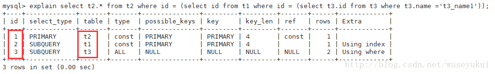
>
> （3）**id 相同又不同（两种情况同时存在）**：id 如果相同，可以认为是一组，从上往下顺序执行；在所有组中，id 值越大，优先级越高，越先执行
> 

#### 3.2 select_type

查询的类型，主要是用于区分普通查询、联合查询、子查询等复杂的查询

| `select_type` Value                                                                                 | Meaning                                                                    |
| :-------------------------------------------------------------------------------------------------- | :------------------------------------------------------------------------- |
| `SIMPLE`                                                                                            | 简单 select 查询（不包含 union 或 子查询）                                 |
| `PRIMARY`                                                                                           | 最外层查询（查询中若包含任何复杂的子部分，则最外层查询则被标记为 primary） |
| [`UNION`](https://dev.mysql.com/doc/refman/8.0/en/union.html)                                       | UNION 中的第二个或后面的 SELECT 语句                                       |
| `DEPENDENT UNION`                                                                                   | UNION 中的第二个或后面的 SELECT 语句，依赖于外面的查询                     |
| `UNION RESULT`                                                                                      | UNION 的结果                                                               |
| [`SUBQUERY`](https://dev.mysql.com/doc/refman/8.0/en/optimizer-hints.html#optimizer-hints-subquery) | 子查询中的第一个 select                                                    |
| `DEPENDENT SUBQUERY`                                                                                | 子查询中的第一个 select，依赖于外面的查询                                  |
| `DERIVED`                                                                                           | 派生表                                                                     |
| `DEPENDENT DERIVED`                                                                                 | 依赖于另一张表的派生表                                                     |
| `MATERIALIZED`                                                                                      | 具体化子查询                                                               |
| `UNCACHEABLE SUBQUERY`                                                                              | 无法缓存其结果且必须为外部查询的每一行重新评估的子查询                     |
| `UNCACHEABLE UNION`                                                                                 | UNION 中的第二个或后面的 SELECT 语句属于不可缓存的子查询                   |

示例如下：

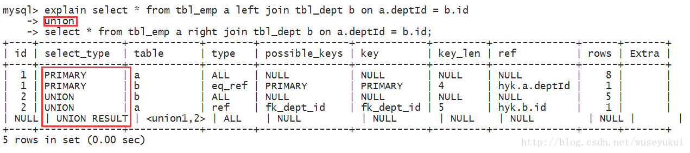

#### 3.3 table

用于查询的表名

> - 如果查询使用了别名，那么这里显示的是别名。
> - 如果不涉及对数据表的操作，那么这显示为 null
> - 如果显示为尖括号括起来的`<derived N>`就表示这个是临时表，后边的 N 就是执行计划中的 id，表示结果来自于这个查询产生。
> - 如果是尖括号括起来的`<union M,N>`，与`<derived N>`类似，也是一个临时表，表示这个结果来自于 union 查询的 id 为 M,N 的结果集。

#### 3.4 type

访问类型，sql 查询优化中一个很重要的指标，结果值从好到坏依次是：

```sql
system > const > eq_ref > ref > fulltext > ref_or_null > index_merge > unique_subquery > index_subquery > range > index > ALL
```

一般来说，**好的 sql 查询至少达到 range 级别，最好能达到 ref**

（1）**system**：表只有一行记录（等于系统表），这是 const 类型的特例，平时不会出现，可以忽略不计

（2）**const**：表示通过索引一次就找到了，const 用于比较 primary key 或者 unique 索引。因为只需匹配一行数据，所有很快。如果将主键置于 where 列表中，mysql 就能将该查询转换为一个 const


（3）**eq_ref**：唯一性索引扫描，对于每个索引键，表中只有一条记录与之匹配。常见于主键 或 唯一索引扫描。

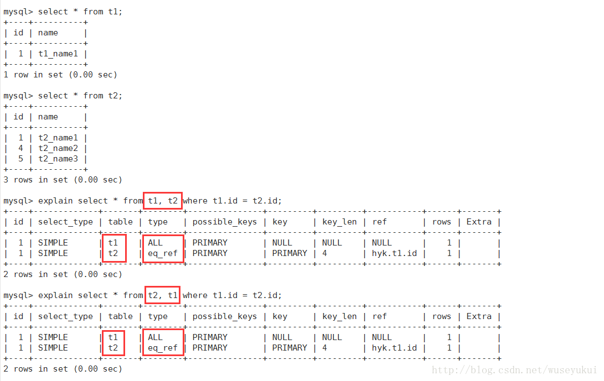

（4）**ref**：非唯一性索引扫描，返回匹配某个单独值的所有行。本质是也是一种索引访问，它返回所有匹配某个单独值的行，然而他可能会找到多个符合条件的行，所以它应该属于查找和扫描的混合体

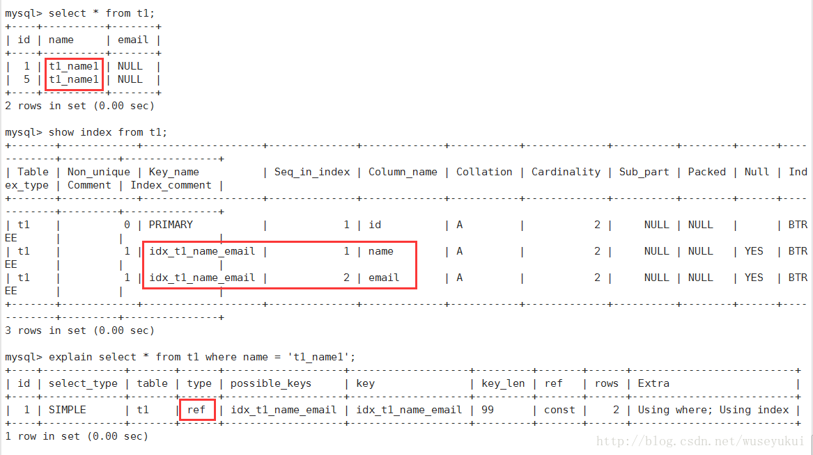

（5）**range**：只检索给定范围的行，使用一个索引来选择行。key 列显示使用了那个索引。一般就是在 where 语句中出现了 bettween、<、>、in 等的查询。这种索引列上的范围扫描比全索引扫描要好。只需要开始于某个点，结束于另一个点，不用扫描全部索引


（6）**index**：Full Index Scan，index 与 ALL 区别为 index 类型只遍历索引树。这通常为 ALL 块，应为索引文件通常比数据文件小。（Index 与 ALL 虽然都是读全表，但 index 是从索引中读取，而 ALL 是从硬盘读取）

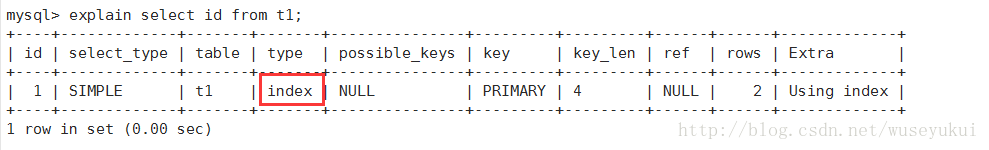

（7）**ALL**：Full Table Scan，遍历全表以找到匹配的行


#### 3.5 possible_keys

可能用到的索引，查询涉及到的字段上存在索引，则该索引将被列出，但不一定被查询实际使用

#### 3.6 keys

实际使用的索引

> - 如果为 NULL，则没有使用索引。
> - **查询中如果使用了覆盖索引，则该索引仅出现在 key 列表中**
> - 要想强制 MySQL 使用或忽视 possible_keys 列中的索引，在查询中使用 FORCE INDEX、USE INDEX 或者 IGNORE INDEX。

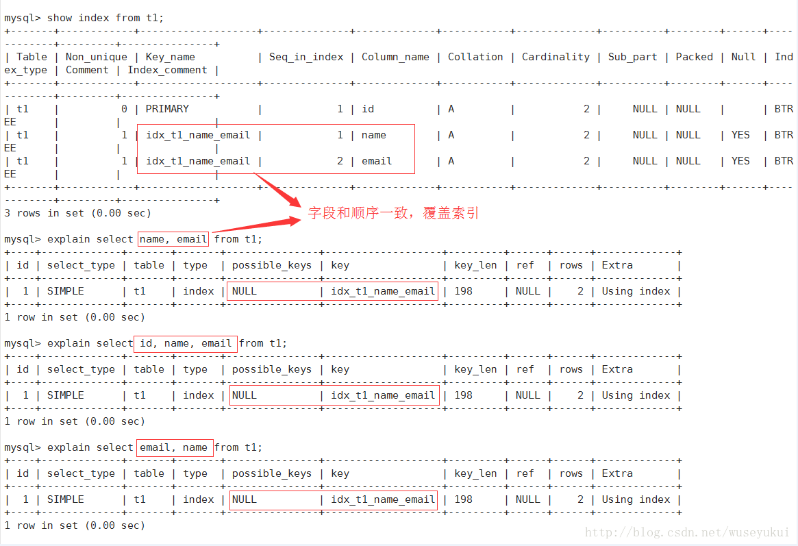


#### 3.7 key_len

索引中使用的字节数

> - 可通过该列计算查询中使用的索引的长度（key_len 显示的值为索引字段的最大可能长度，并非实际使用长度，即 key_len 是根据表定义计算而得，不是通过表内检索出的）
> - 不损失精确性的情况下，长度越短越好

#### 3.8 ref

表示上述表的连接匹配条件，即哪些列或常量被用于查找索引列上的值

#### 3.9 rows

根据表统计信息及索引选用情况，大致估算出找到所需的记录所需要读取的行数

#### 3.10 filtered

表示存储引擎返回的数据在 server 层过滤后，剩下多少满足查询的记录数量的比例，注意是百分比，不是具体记录数。

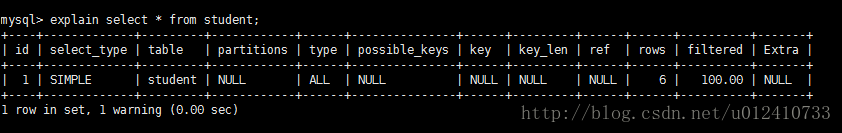

#### 3.11 Extra

不适合在其他字段中显示，但是十分重要的额外信息

（1） **Using filesort**
mysql 对数据使用一个外部的索引排序，而不是按照表内的索引进行排序读取。也就是说 mysql 无法利用索引完成的排序操作成为“文件排序”

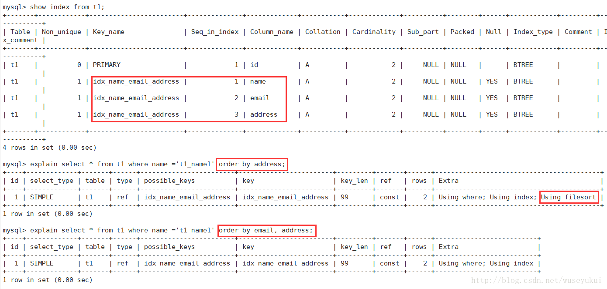

由于索引是先按 email 排序、再按 address 排序，所以查询时如果直接按 address 排序，索引就不能满足要求了，mysql 内部必须再实现一次“文件排序”

（2）**Using temporary**
使用临时表保存中间结果，也就是说 mysql 在对查询结果排序时使用了临时表，常见于 order by 和 group by
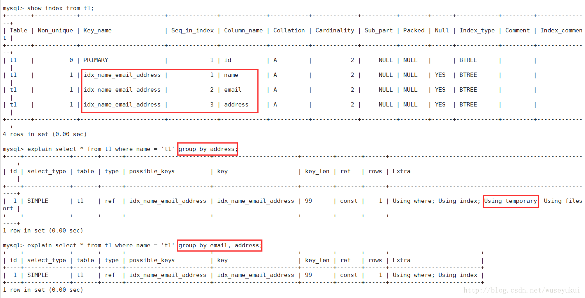

（3）**Using index**
表示相应的 select 操作中使用了覆盖索引（Covering Index），避免了访问表的数据行，效率高。

如果同时出现 Using where，表明索引被用来执行索引键值的查找（参考上图）

如果没用同时出现 Using where，表明索引用来读取数据而非执行查找动作

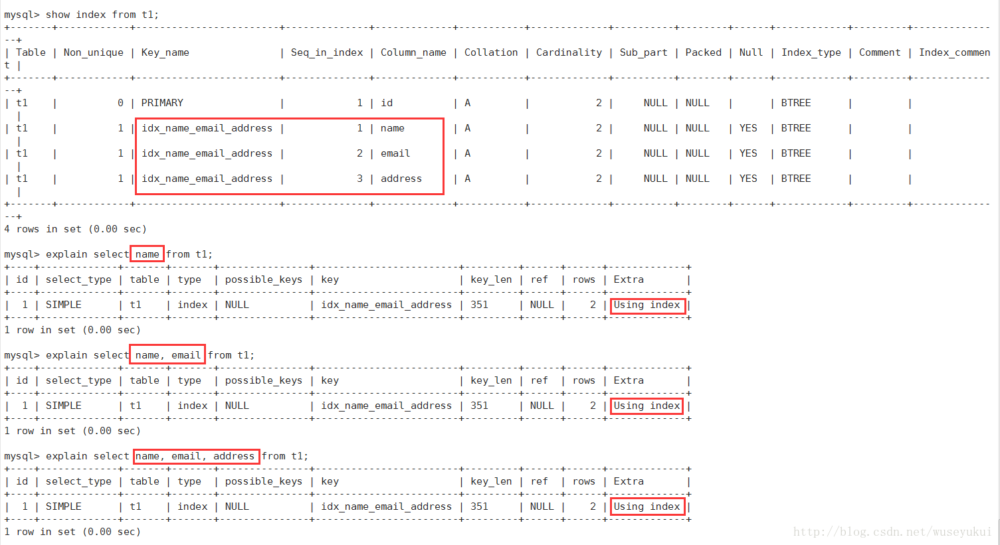

覆盖索引（Covering Index）：也叫索引覆盖。就是 select 列表中的字段，只用从索引中就能获取，不必根据索引再次读取数据文件，换句话说查询列要被所建的索引覆盖。

注意：

> a、如需使用覆盖索引，select 列表中的字段只取出需要的列，不要使用 `select *`
> b、如果将所有字段都建索引会导致索引文件过大，反而降低 crud 性能

（4）**Using where**

使用了 where 过滤

（5）**Using join buffer**

使用了 Join 缓存

（6）**Impossible WHERE**

where 子句的值总是 false，不能用来获取任何元祖

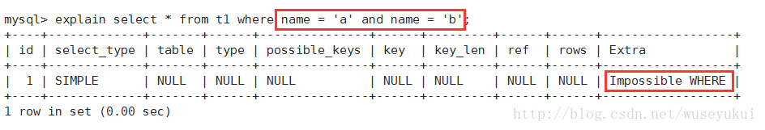

（7）**select tables optimized away**

在没有 group by 子句的情况下，基于索引优化 MIN/MAX 操作或者对于 MyISAM 存储引擎优化 COUNT（\*）操作，不必等到执行阶段在进行计算，查询执行计划生的阶段即可完成优化

（8）**distinct**

优化 distinct 操作，在找到第一个匹配的元祖后即停止找同样值得动作

#### 3.12 综合 Case


执行顺序：

> - 1（id = 4）、【select id, name from t2】：select_type 为 union，说明 id=4 的 select 是 union 里面的第二个 select。
> - 2（id = 3）、【select id, name from t1 where address = ‘11’】：因为是在 from 语句中包含的子查询所以被标记为 DERIVED（衍生），where address = ‘11’ 通过复合索引 idx_name_email_address 就能检索到，所以 type 为 index。
> - 3（id = 2）、【select id from t3】：因为是在 select 中包含的子查询所以被标记为 SUBQUERY。
> - 4（id = 1）、【select d1.name, … d2 from … d1】：select_type 为 PRIMARY 表示该查询为最外层查询，table 列被标记为 “derived3”表示查询结果来自于一个衍生表（id = 3 的 select 结果）。
> - 5（id = NULL）、【 … union … 】：代表从 union 的临时表中读取行的阶段，table 列的 “union 1, 4”表示用 id=1 和 id=4 的 select 结果进行 union 操作。
