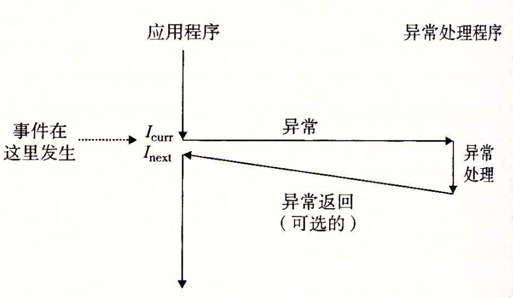

# 异常控制流

## 推荐阅读

> - [第 8 章：异常控制流_CSAPP](https://hansimov.gitbook.io/csapp/part2/ch08-exceptional-control-flow)
> - [理解用户模式和内核模式(译)](https://blog.csdn.net/qq_35191331/article/details/75557567)
> - [用户模式和内核模式](https://www.cnblogs.com/zjuhaohaoxuexi/p/16210847.html)

## 前言

n2
从给处理器加电开始，直到你断电为止，程序计数器假设一个值的序列  a0, a1 , ... , an-1 , 其中，每个  ak 是某个相应的指令  Ik 的地址。每次从

ak 到 ak+1的过渡称为**控制转移**（control transfer）。这样的控制转移序列叫做处理器的**控制流**（flow of control 或 control flow）。

最简单的一种控制流是一个“平滑的”序列，其中每个  Ik 和  Ik+1 在内存中都是相邻的。这种平滑流的突变（也就是 Ik+1 和  Ik不相邻）通常是由诸如跳转、调用和返回这样一些熟悉的程序指令造成的。这样一些指令都是必要的机制，使得程序能够对由程序变量表示的内部程序状态中的变化做出反应。

但是系统也必须能够对系统状态的变化做出反应，这些系统状态不是被内部程序变量捕获的，而且也不一定要和程序的执行相关。比如，一个硬件定时器定期产生信号，这个事件必须得到处理。包到达网络适配器后，必须存放在内存中。程序向磁盘请求数据，然后休眠，直到被通知说数据已就绪。当子进程终止时，创造这些子进程的父进程必须得到通知。

**现代系统通过使控制流发生突变来对这些情况做出反应**。一般而言，我们把这些**突变**称为**异常控制流**（Exceptional Control Flow，ECF）。异常控制流发生在计算机系统的各个层次。比如，在硬件层，硬件检测到的事件会触发控制突然转移到异常处理程序。在操作系统层，内核通过上下文切换将控制从一个用户进程转移到另一个用户进程。在应用层，一个进程可以发送信号到另一个进程，而接收者会将控制突然转移到它的一个信号处理程序。—个程序可以通过回避通常的栈规则，并执行到其他函数中任意位置的非本地跳转来对错误做出反应。

作为程序员，理解 ECF 很重要，这有很多原因：

- **理解 ECF 将帮助你理解重要的系统概念。**ECF 是操作系统用来实现 I/O、进程和虚拟内存的基本机制。在能够真正理解这些重要概念之前，你必须理解 ECF。
- **理解 ECF 将帮助你理解应用程序是如何与操作系统交互的。**应用程序通过使用一个叫做**陷阱**（trap）或者**系统调用**（system call）的 ECF 形式，向操作系统请求服务。比如，向磁盘写数据、从网络读取数据、创建一个新进程，以及终止当前进程，都是通过应用程序调用系统调用来实现的。理解基本的系统调用机制将帮助你理解这些服务是如何提供给应用的。
- **理解 ECF 将帮助你编写有趣的新应用程序。**操作系统为应用程序提供了强大的 ECF 机制，用来创建新进程、等待进程终止、通知其他进程系统中的异常事件，以及检测和响应这些事件。如果理解了这些 ECF 机制，那么你就能用它们来编写诸如 Unix shell 和 Web 服务器之类的有趣程序了。
- **理解 ECF 将帮助你理解并发。**ECF 是计算机系统中实现并发的基本机制。在运行中的并发的例子有：中断应用程序执行的异常处理程序，在时间上重叠执行的进程和线程，以及中断应用程序执行的信号处理程序。理解 ECF 是理解并发的第一步。我们会在第 12 章中更详细地研究并发。
- **理解 ECF 将帮助你理解软件异常如何工作。**像 C++ 和 Java 这样的语言通过 try、catch 以及 throw 语句来提供软件异常机制。软件异常允许程序进行非本地跳转（即违反通常的调用/返回栈规则的跳转）来响应错误情况。非本地跳转是一种应用层 ECF，在 C 中是通过 setjmp 和 longjmp 函数提供的。理解这些低级函数将帮助你理解高级软件异常如何得以实现。

对系统的学习，到目前为止你已经了解了应用是如何与硬件交互的。本章的重要性在于你将开始学习应用是如何与操作系统交互的。有趣的是，这些交互都是围绕着 ECF 的。我们将描述存在于一个计算机系统中所有层次上的各种形式的 ECF。从异常开始，异常位于硬件和操作系统交界的部分。我们还会讨论系统调用，它们是为应用程序提供到操作系统的入口点的异常。然后，我们会提升抽象的层次，描述进程和信号，它们位于应用和操作系统的交界之处。最后讨论非本地跳转，这是 ECF 的一种应用层形式。

## 一、异常

异常是异常控制流的一种形式，它一部分由硬件实现，一部分由操作系统实现。因为它们有一部分是由硬件实现的，所以具体细节将随系统的不同而有所不同。然而，对于每个系统而言，基本的思想都是相同的。

**异常**（exception）就是控制流中的突变，用来响应处理器状态中的某些变化。图 8-1 展示了基本的思想。

> 图 8-1 异常的剖析。处理器状态中的变化（事件）触发从应用程序到异常处理程序的突发的控制转移（异常）。在异常处理程序完成处理后，它将控制返回给被中断的程序或者终止

在图中，当处理器状态中发生一个重要的变化时，处理器正在执行某个当前指令 I~curr~ 。在处理器中，状态被编码为不同的位和信号。状态变化称为**事件**（event）. 事件可能和当前指令的执行直接相关。比如，发生虚拟内存缺页、算术溢出，或者一条指令试图除以零。另一方面，事件也可能和当前指令的执行没有关系。比如，一个系统定时器产生信号或者一个 I/O 请求完成。

## 二、进程

异常是允许操作系统内核提供进程（process）概念的基本构造块，进程是计算机科学中最深刻、最成功的概念之一。

> 在现代系统上运行一个程序时，我们会得到一个假象，就好像我们的程序是系统中当前运行的唯一的程序一样。我们的程序好像是独占地使用处理器和内存。处理器就好像是无间断地一条接一条地执行我们程序中的指令。最后，我们程序中的代码和数据好像是系统内存中唯一的对象。这些假象都是通过进程的概念提供给我们的。

进程的经典定义就是一个执行中程序的实例。系统中的每个程序都运行在某个进程的上下文（context）中。

进程提供给应用程序的关键抽象：

- 一个独立的逻辑控制流：它提供一个假象，好像我们的程序独占地使用处理器。
- 一个私有的地址空间：它提供一个假象，好像我们的程序独占地使用内存系统。让我们更深入地看看这些抽象。

### 1.逻辑控制流

 程序计数器（PC）值的序列叫做逻辑控制流，简称逻辑流。如下图所示，处理器的一个物理控制流分成了三个逻辑流，每个进程一个。下图中的每个竖直的条表示一个进程的逻辑流的一部分。

> 图 8-12 逻辑控制流。上图的关键点在于进程是轮流使用处理器的。每个进程执行它的流的一部分，然后被**抢占**（preempted）（暂时挂起），然后轮到其他进程。对于一个运行在这些进程之一的上下文中的程序，它看上去就像是在独占地使用处理器。

### 2.并发流

计算机系统中逻辑流有许多不同的形式。异常处理程序、进程、信号处理程序、线程和 Java 进程都是逻辑流的例子。

一个逻辑流的执行在时间上与另一个流重叠，称为**并发流**（concurrent flow），这两个流被称为**并发地运行**。

> 更准确地说，流 X 和 Y 互相并发，当且仅当 X 在 Y 开始之后和 Y 结束之前开始，或者 Y 在 X 开始之后和 X 结束之前开始。例如，图 8-12 中，进程 A 和 B 并发地运行，A 和 C 也一样。另一方面，B 和 C 没有并发地运行，因为 B 的最后一条指令在 C 的第一条指令之前执行。

多个流并发地执行的一般现象被称为**并发**（concurrency）。一个进程和其他进程轮流运行的概念称为**多任务**（multitasking）。 一个进程执行它的控制流的一部分的每一时间段叫做**时间片**（time slice）。因此，多任务也叫做**时间分片**（timeslicing）。例如，图 8-12 中，进程 A 的流由两个时间片组成。

注意，并发流的思想与流运行的处理器核数或者计算机数无关。如果两个流在时间上重叠，那么它们就是并发的，即使它们是运行在同一个处理器上。不过，有时我们会发现确认并行流是很有帮助的，它是并发流的一个真子集。如果两个流并发地运行在不同的处理器核或者计算机上，那么我们称它们为**并行流**（parallel flow），它们**并行地运行**（running in parallel），且**并行地执行**（parallel execution）。

总结：

- 一个逻辑流的执行在时间上与另一个流重叠，称为**并发流**（concurrent flow），这两个流被称为**并发地运行**，这种多个流并发地执行的现象被称为**并发**。
- 如果两个流并发地运行在不同的处理器核或者计算机上，那么我们称它们为**并行流**，这两个流被称为**并行地运行**，这种多个流并行地执行的现象被称为**并行**。
- 并行流是并发流的一个真子集。

### 3.私有地址空间

进程也为每个程序提供一种假象，好像它独占地使用系统地址空间。在一台 n 位地址的机器上，地址空间是 2n 个可能地址的集合，0，1，⋯，2n-1 。进程为每个程序提供它自己的**私有地址空间**。一般而言，和这个空间中某个地址相关联的那个内存字节是不能被其他进程读或者写的，从这个意义上说，这个地址空间是私有的。

尽管和每个私有地址空间相关联的内存的内容一般是不同的，但是每个这样的空间都有相同的通用结构。比如，图 8-13 展示了一个 x86-64 Linux 进程的地址空间的组织结构。

> 图 8-13 进程地址空间

地址空间底部是保留给用户程序的，包括通常的代码、数据、堆和栈段。代码段总是从地址 0x400000 开始。地址空间顶部保留给内核（操作系统常驻内存的部分）。地址空间的这个部分包含内核在代表进程执行指令时（比如当应用程序执行系统调用时）使用的代码、数据和栈。

### 4.用户模式和内核模式

区分用户模式和内核模式的目的：限制一个应用可以执行的指令以及它可以访问的地址空间范围

模式位：处理器通常是用某个控制寄存器中的一个模式位（mode bit）来实现用户模式和内核模式的；当设置了模式位时，进程就运行在内核模式中；没有设置模式位时，进程就运行在用户模式中；

内核空间和用户空间：

- 内核空间存放的是操作系统内核代码和数据，是被所有程序共享的，在程序中修改内核空间中的数据不仅会影响操作系统本身的稳定性，还会影响其他程序，这是非常危险的行为，所以操作系统禁止用户程序直接访问内核空间。
- 用户空间保存的是应用程序的代码和数据，是程序私有的，其他程序一般无法访问。

用户模式与内核模式：

- 内核模式就是执行内核代码，访问内核空间（当然也有权限访问用户空间）。在内核模式下，代码具有对硬件的所有控制权限，进程可以执行指令集中的任何指令，并且可以访问系统中的任何内存位置。
- 用户模式就是执行应用程度代码，访问用户空间。在用户模式下，代码没有对硬件的直接控制权限，用户模式中的进程不允许执行**特权指令**（privileged instruction），比如停止处理器、改变模式位，或者发起一个 I/O 操作。也不允许用户模式中的进程直接引用地址空间中内核区内的代码和数据。任何这样的尝试都会导致致命的保护故障。**用户程序必须通过系统调用接口间接地访问内核代码和数据**。

系统调用接口：

> 内核最主要的任务是管理硬件，包括显示器、键盘、鼠标、内存、硬盘等，并且内核也提供了接口（也就是函数），供上层程序使用，这就是系统调用接口。当程序想进行输入输出、分配内存、响应鼠标等与硬件有关的操作时，必须要使用内核提供的接口。

用户模式与内核模式的切换：

> （1）运行应用程序代码的进程初始时是在用户模式中的。**进程从用户模式变为内核模式的唯一方法**是通过诸如中断、故障或者陷入系统调用这样的异常。（2）当异常发生时，控制传递到异常处理程序，处理器将模式从用户模式变为内核模式。（3）处理程序运行在内核模式中，当它返回到应用程序代码时，处理器就把模式从内核模式改回到用户模式。

### 5.上下文切换

操作系统内核使用一种称为**上下文切换**（context switch）的较高层形式的异常控制流来实现多任务。上下文切换机制是建立在前面已经讨论过的那些较低层异常机制之上的。

内核为每个进程维持一个**上下文（context）**。上下文就是内核重新启动一个被抢占的进程所需的状态。它由一些对象的值组成，这些对象包括通用目的寄存器、浮点寄存器、程序计数器、用户栈、状态寄存器、内核栈和各种内核数据结构，比如描述地址空间的页表、包含有关当前进程信息的进程表，以及包含进程已打开文件的信息的文件表。

在进程执行的某些时刻，内核可以决定抢占当前进程，并重新开始一个先前被抢占了的进程。这种决策就叫做**调度**（scheduling），是由内核中称为**调度器**（scheduler）的代码处理的。当内核选择一个新的进程运行时，我们说内核调度了这个进程。在内核调度了一个新的进程运行后，它就抢占当前进程，并使用一种称为上下文切换的机制来将控制转移到新的进程。

**上下文切换机制**：

> 1. 保存当前进程的上下文
> 2. 恢复某个先前被抢占的进程被保存的上下文
> 3. 将控制传递给这个新恢复的进程。

发生上下文切换的场景：

> - **系统调用**：当内核代表用户执行系统调用时，可能会发生上下文切换。如果系统调用因为等待某个事件发生而阻塞，那么内核可以让当前进程休眠，切换到另一个进程。比如，如果一个 read 系统调用需要访问磁盘，内核可以选择执行上下文切换，运行另外一个进程，而不是等待数据从磁盘到达。另一个示例是 sleep 系统调用，它显式地请求让调用进程休眠。一般而言，即使系统调用没有阻塞，内核也可以决定执行上下文切换，而不是将控制返回给调用进程。
> - **中断**：中断也可能引发上下文切换。比如，所有的系统都有某种产生周期性定时器中断的机制，通常为每 1 毫秒或每 10 毫秒。每次发生定时器中断时，内核就能判定当前进程已经运行了足够长的时间，并切换到一个新的进程。

进程上下文切换实例分析：

图 8-14 展示了一对进程 A 和 B 之间上下文切换的示例。在这个例子中，进程 A 初始运行在用户模式中，直到它通过执行系统调用 read 陷入到内核。内核中的陷阱处理程序请求来自磁盘控制器的 DMA 传输，并且安排在磁盘控制器完成从磁盘到内存的数据传输后，磁盘中断处理器。

图 8-14 进程上下文切换的剖析

磁盘取数据要用一段相对较长的时间（数量级为几十毫秒），所以内核执行从进程 A 到进程 B 的上下文切换，而不是在这个间歇时间内等待，什么都不做。注意在切换之前，内核正代表进程 A 在用户模式下执行指令（即没有单独的内核进程）。在切换的第一部分中，内核代表进程 A 在内核模式下执行指令。然后在某一时刻，它开始代表进程 B（仍然是内核模式下）执行指令。在切换之后，内核代表进程 B 在用户模式下执行指令。

随后，进程 B 在用户模式下运行一会儿，直到磁盘发出一个中断信号，表示数据已经从磁盘传送到了内存。内核判定进程 B 已经运行了足够长的时间，就执行一个从进程 B 到进程 A 的上下文切换，将控制返回给进程 A 中紧随在系统调用 read 之后的那条指令。进程 A 继续运行，直到下一次异常发生，依此类推。
